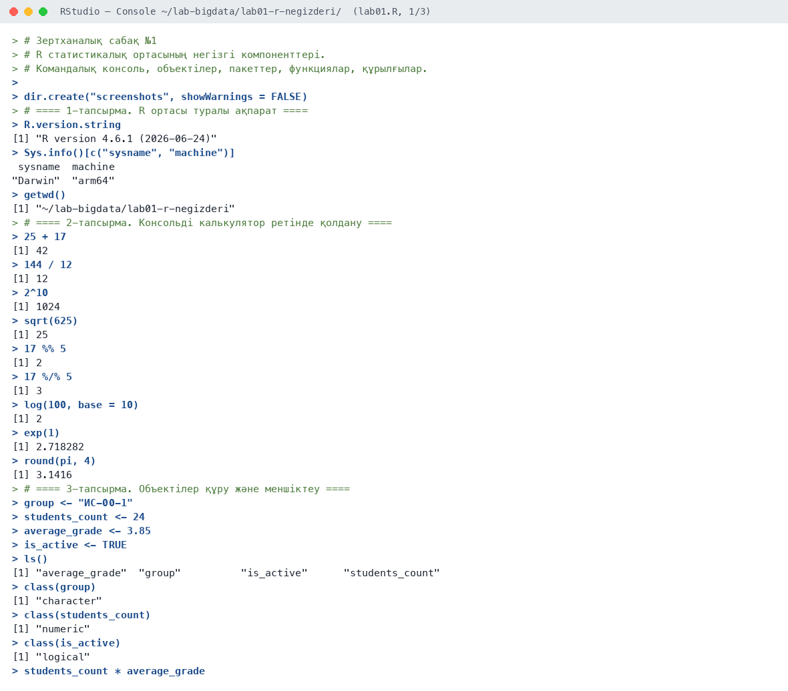
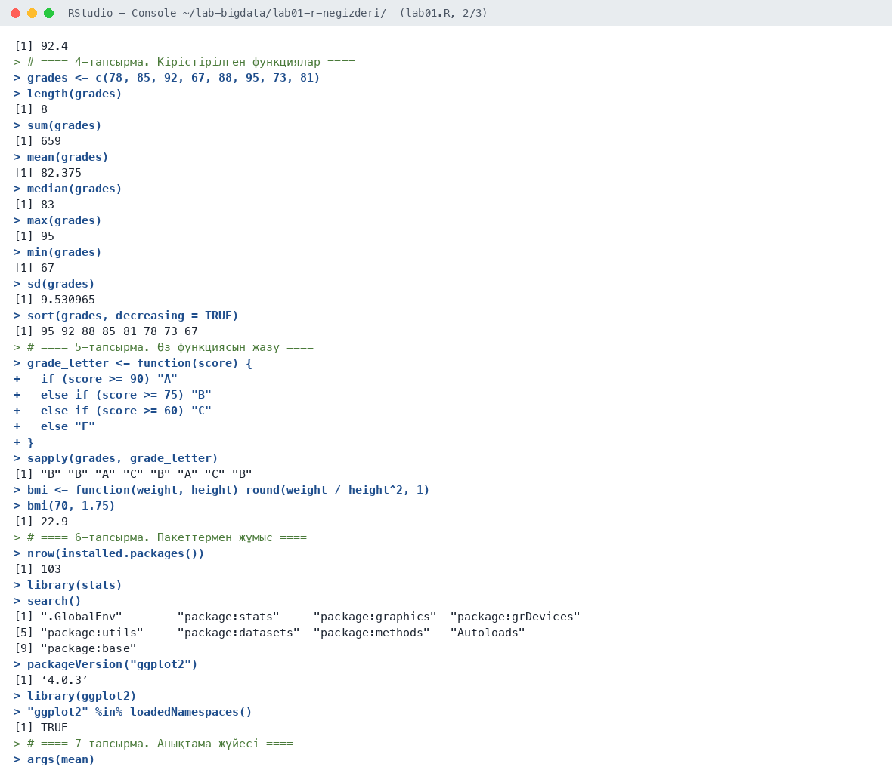
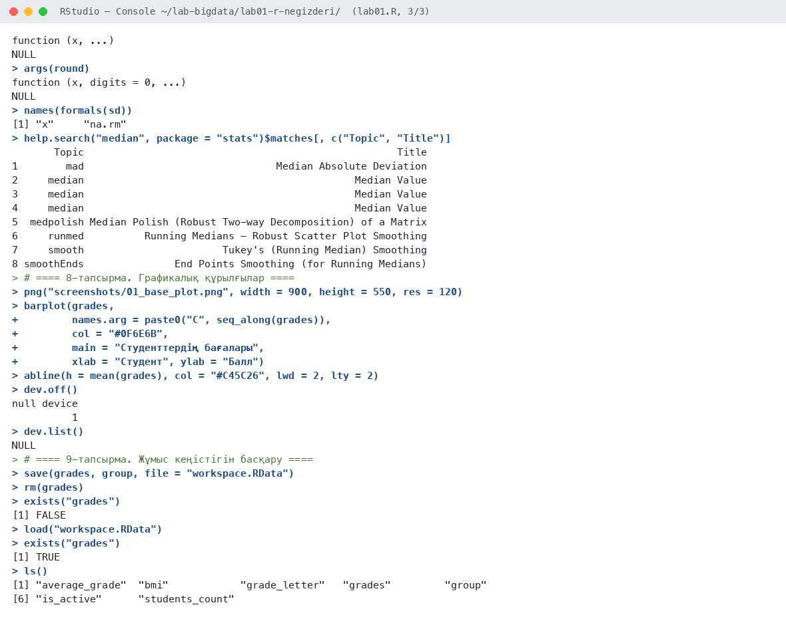
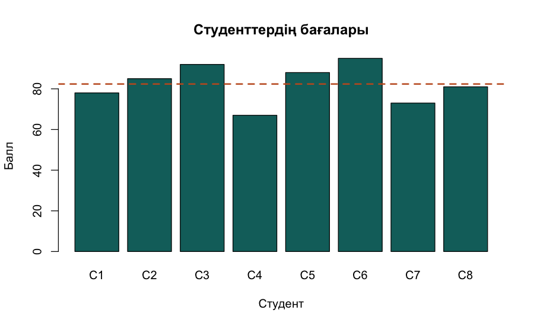

# Зертханалық сабақ №1

**Тақырыбы:** R статистикалық ортасының негізгі компоненттері. R ортасын ұйымдастырудың тарихы мен негізгі принциптері. R интерфейсінің командалық консолімен жұмыс. Объектілер, пакеттер, функциялар, құрылғылар

**Пәні:** Үлкен деректерді талдау  
**ББ:** <білім беру бағдарламасы, курс, топ>  
**Оқытушы:** <оқытушының аты-жөні>  
**Орындаушы:** <студенттің аты-жөні>  
**Күні:** 2026-10-05

---

## 1. Жұмыстың мақсаты

R ортасының құрылымымен танысу, командалық консольде есептеулер жүргізу, объектілерді құру, кірістірілген және өз функцияларын қолдану, пакеттерді қосу, анықтама жүйесін және графикалық құрылғыларды пайдалану.

## 2. Теориялық бөлім

R — статистикалық есептеулер мен графикаға арналған тегін бағдарламалау тілі және орта. Оны 1993 жылы Окленд университетінде Росс Айхака мен Роберт Джентлмен S тілінің негізінде жасаған. Қазір R-ды R Core Team дамытады, ал CRAN репозиторийінде 20 мыңнан астам пакет бар.

R ортасының негізгі компоненттері: командалық консоль (команданы енгізу және нәтижені көру), объектілер (айнымалылар, векторлар, кестелер), функциялар (кірістірілген және пайдаланушы жазған), пакеттер (функциялар жиыны: `install.packages()`, `library()`), графикалық құрылғылар (экран, `png()`, `pdf()`). RStudio — R-мен жұмыс істеуге арналған IDE: Console, Source, Environment және Plots терезелері бар.

Объектіге мән `<-` операторымен меншіктеледі. Барлық объектілер жұмыс кеңістігінде (Global Environment) сақталады, оларды `ls()` көрсетеді, `rm()` жояды, `save()`/`load()` файлға сақтайды.

## 3. Қолданылған құралдар

- **Орта:** R 4.6.1, RStudio, macOS (Apple M-series, 8 ядро)
- **Пакеттер:** base R, stats, ggplot2
- **Скрипт:** `lab01.R` (толық нәтиже — `output.txt`)

## 4. Жұмыстың орындалу барысы

Скрипттің басы (пакеттерді қосу):

```r
# Зертханалық сабақ №1
# R статистикалық ортасының негізгі компоненттері.
# Командалық консоль, объектілер, пакеттер, функциялар, құрылғылар.

dir.create("screenshots", showWarnings = FALSE)
```

### 4.1. 1-тапсырма. R ортасы туралы ақпарат

```r
R.version.string
Sys.info()[c("sysname", "machine")]
getwd()
```

Нәтиже:

```text
[1] "R version 4.6.1 (2026-06-24)"
 sysname  machine 
"Darwin"  "arm64" 
[1] "~/lab-bigdata/lab01-r-negizderi"
```

**Түсіндірме:** R 4.6.1 нұсқасы macOS (arm64) жүйесінде жұмыс істейді, жұмыс каталогы — зертханалық жұмыс папкасы.

### 4.2. 2-тапсырма. Консольді калькулятор ретінде қолдану

```r
25 + 17
144 / 12
2^10
sqrt(625)
17 %% 5
17 %/% 5
log(100, base = 10)
exp(1)
round(pi, 4)
```

Нәтиже:

```text
[1] 42
[1] 12
[1] 1024
[1] 25
[1] 2
[1] 3
[1] 2
[1] 2.718282
[1] 3.1416
```

**Түсіндірме:** Консоль калькулятор ретінде жұмыс істейді: `%%` — бөлгендегі қалдық (17 %% 5 = 2), `%/%` — бүтін бөлу (17 %/% 5 = 3).

### 4.3. 3-тапсырма. Объектілер құру және меншіктеу

```r
group <- "ИС-00-1"
students_count <- 24
average_grade <- 3.85
is_active <- TRUE
ls()
class(group)
class(students_count)
class(is_active)
students_count * average_grade
```

Нәтиже:

```text
[1] "average_grade"  "group"          "is_active"      "students_count"
[1] "character"
[1] "numeric"
[1] "logical"
[1] 92.4
```

**Түсіндірме:** Төрт объект құрылды. `class()` олардың типін көрсетеді: мәтін — character, сан — numeric, логикалық — logical.

### 4.4. 4-тапсырма. Кірістірілген функциялар

```r
grades <- c(78, 85, 92, 67, 88, 95, 73, 81)
length(grades)
sum(grades)
mean(grades)
median(grades)
max(grades)
min(grades)
sd(grades)
sort(grades, decreasing = TRUE)
```

Нәтиже:

```text
[1] 8
[1] 659
[1] 82.375
[1] 83
[1] 95
[1] 67
[1] 9.530965
[1] 95 92 88 85 81 78 73 67
```

**Түсіндірме:** 8 бағаның орташасы 82.375, медианасы 83, стандартты ауытқуы 9.53.

### 4.5. 5-тапсырма. Өз функциясын жазу

```r
grade_letter <- function(score) {
  if (score >= 90) "A"
  else if (score >= 75) "B"
  else if (score >= 60) "C"
  else "F"
}
sapply(grades, grade_letter)

bmi <- function(weight, height) round(weight / height^2, 1)
bmi(70, 1.75)
```

Нәтиже:

```text
[1] "B" "B" "A" "C" "B" "A" "C" "B"
[1] 22.9
```

**Түсіндірме:** `grade_letter()` функциясы балды әріптік бағаға айналдырады, `sapply()` оны вектордың әр элементіне қолданады.

### 4.6. 6-тапсырма. Пакеттермен жұмыс

```r
nrow(installed.packages())
library(stats)
search()
packageVersion("ggplot2")
library(ggplot2)
"ggplot2" %in% loadedNamespaces()
```

Нәтиже:

```text
[1] 103
[1] ".GlobalEnv"        "package:stats"     "package:graphics"  "package:grDevices"
[5] "package:utils"     "package:datasets"  "package:methods"   "Autoloads"        
[9] "package:base"     
[1] ‘4.0.3’
[1] TRUE
```

**Түсіндірме:** Жүйеде 103 пакет орнатылған. `library()` пакетті іздеу жолына (search path) қосады.

### 4.7. 7-тапсырма. Анықтама жүйесі

```r
args(mean)
args(round)
names(formals(sd))
help.search("median", package = "stats")$matches[, c("Topic", "Title")]
```

Нәтиже:

```text
function (x, ...) 
NULL
function (x, digits = 0, ...) 
NULL
[1] "x"     "na.rm"
       Topic                                                    Title
1        mad                                Median Absolute Deviation
2     median                                             Median Value
3     median                                             Median Value
4     median                                             Median Value
5  medpolish Median Polish (Robust Two-way Decomposition) of a Matrix
6     runmed          Running Medians - Robust Scatter Plot Smoothing
7     smooth                       Tukey's (Running Median) Smoothing
8 smoothEnds               End Points Smoothing (for Running Medians)
```

**Түсіндірме:** `args()` функцияның аргументтерін, `help.search()` анықтамадан тақырыптарды табады.

### 4.8. 8-тапсырма. Графикалық құрылғылар

```r
png("screenshots/01_base_plot.png", width = 900, height = 550, res = 120)
barplot(grades,
        names.arg = paste0("С", seq_along(grades)),
        col = "#0F6E6B",
        main = "Студенттердің бағалары",
        xlab = "Студент", ylab = "Балл")
abline(h = mean(grades), col = "#C45C26", lwd = 2, lty = 2)
dev.off()
dev.list()
```

Нәтиже:

```text
null device 
          1 
NULL
```

**Түсіндірме:** `png()` құрылғысы ашылып, графиктен кейін `dev.off()` арқылы жабылды — сурет файлға сақталды.

### 4.9. 9-тапсырма. Жұмыс кеңістігін басқару

```r
save(grades, group, file = "workspace.RData")
rm(grades)
exists("grades")
load("workspace.RData")
exists("grades")
ls()
```

Нәтиже:

```text
[1] FALSE
[1] TRUE
[1] "average_grade"  "bmi"            "grade_letter"   "grades"         "group"         
[6] "is_active"      "students_count"
```

**Түсіндірме:** Объектілер `workspace.RData` файлына сақталды, жойылғаннан кейін `load()` арқылы қалпына келді.

## 5. Скриншоттар

### 5.1. RStudio консолі







### 5.2. Графиктер

**1-сурет.** Студенттердің бағалары, үзік сызық — орташа мән



## 6. Бақылау сұрақтарына жауаптар

**1. R тілін кім және қашан жасаған?**

R тілін 1993 жылы Жаңа Зеландиядағы Окленд университетінде Росс Айхака мен Роберт Джентлмен S тілінің негізінде жасады. 1997 жылдан бастап R Core Team дамытады.

**2. Объектіге мән қалай меншіктеледі?**

`<-` операторы арқылы (мысалы, `x <- 5`). `=` және `->` операторлары да жұмыс істейді, бірақ R стилінде `<-` ұсынылады.

**3. Пакет қалай орнатылады және қосылады?**

`install.packages("атауы")` пакетті CRAN-нан жүктеп орнатады, `library(атауы)` оны ағымдағы сеанста қосады.

**4. Графикалық құрылғы деген не?**

Графикалық құрылғы — график шығарылатын орын: экран терезесі немесе файл (`png()`, `pdf()`, `jpeg()`). Құрылғы ашылғаннан кейін график салынады, `dev.off()` оны жабады.

## 7. Қорытынды

R ортасының негізгі компоненттері іс жүзінде қолданылды: консольде арифметикалық және математикалық есептеулер жүргізілді, объектілер құрылып, олардың класы анықталды, кірістірілген функциялармен статистика есептелді, өз функциялары жазылды. Пакеттерді қосу, анықтама жүйесі, `png()` графикалық құрылғысы және жұмыс кеңістігін сақтау/қалпына келтіру меңгерілді.

## 8. Қолданылған әдебиеттер

1. Черемухин А.Д. Большие данные: учебное пособие. — Москва: Ай Пи Ар Медиа, 2023. — 728 с.
2. Wickham H., Çetinkaya-Rundel M., Grolemund G. R for Data Science. 2nd ed. — O'Reilly, 2023. URL: https://r4ds.hadley.nz
3. R Core Team. R: A Language and Environment for Statistical Computing. — Vienna, 2026. URL: https://www.r-project.org
4. Сухобоков А.А., Лахвич Д.С. Влияние инструментария Big Data на развитие научных дисциплин, связанных с моделированием // Наука и образование: МГТУ им. Н.Э. Баумана.
