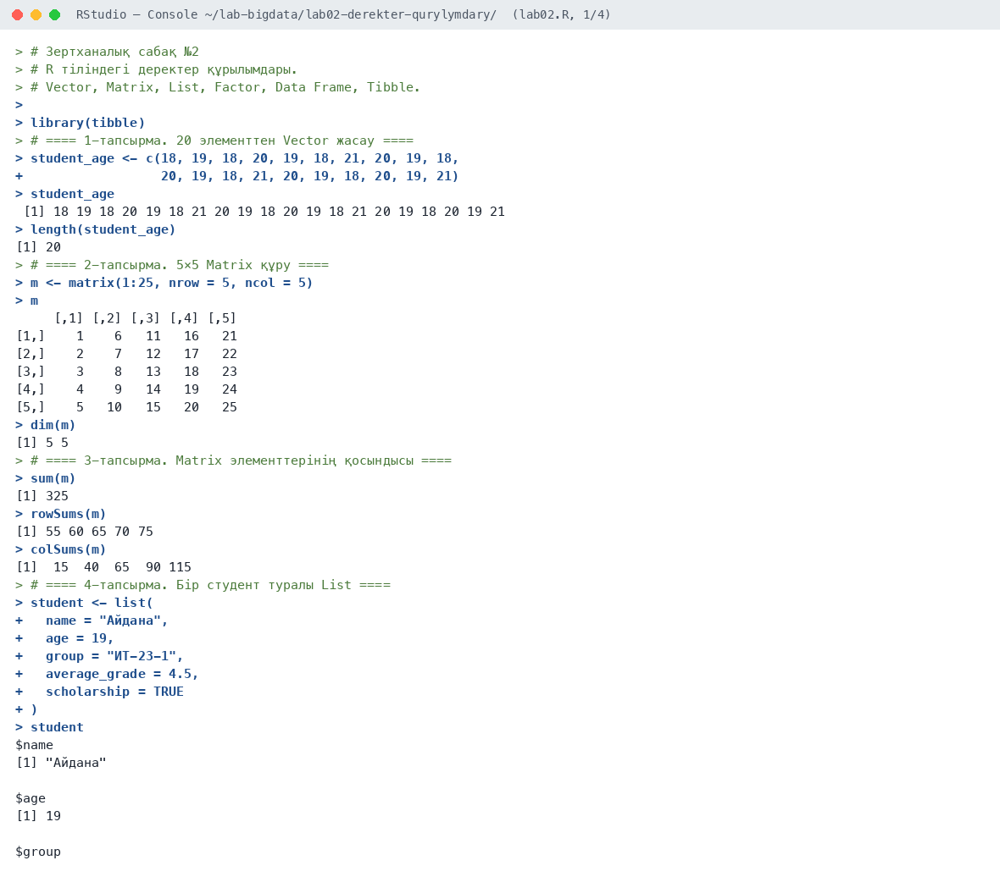
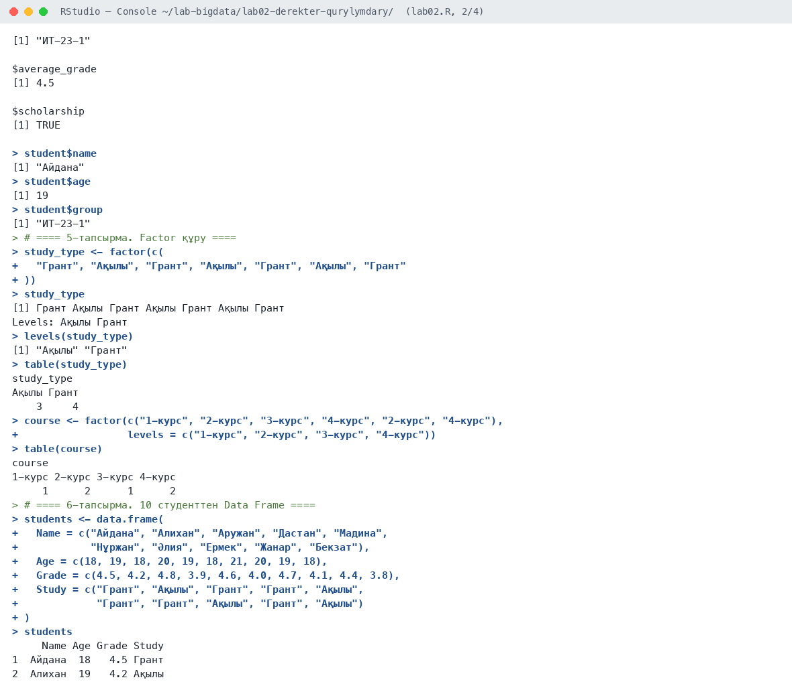
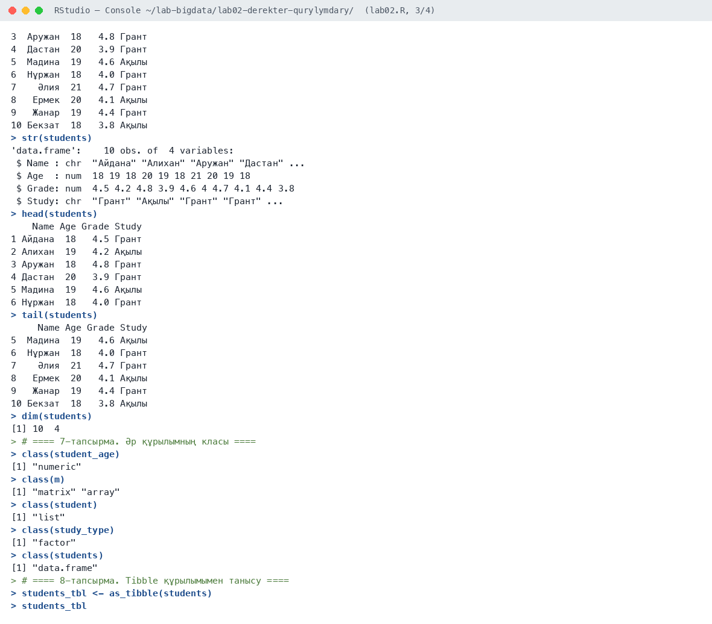
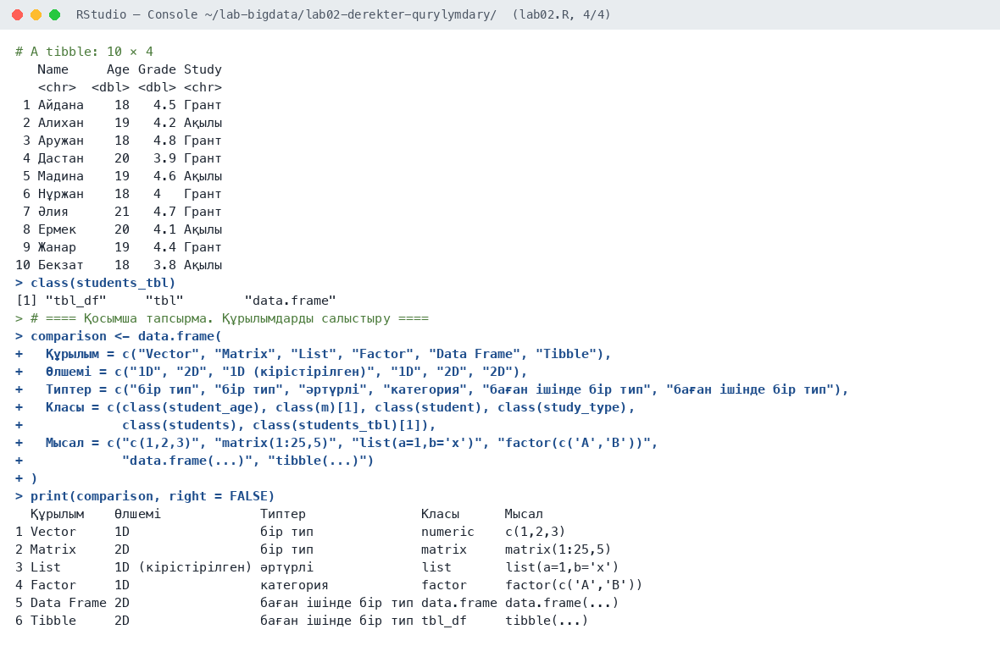

# Зертханалық сабақ №2

**Тақырыбы:** R тіліндегі деректер құрылымдары

**Пәні:** Үлкен деректерді талдау  
**ББ:** <білім беру бағдарламасы, курс, топ>  
**Оқытушы:** <оқытушының аты-жөні>  
**Орындаушы:** <студенттің аты-жөні>  
**Күні:** 2026-10-05

---

## 1. Жұмыстың мақсаты

R тіліндегі негізгі деректер құрылымдарын (Vector, Matrix, List, Factor, Data Frame, Tibble) зерттеу, оларды құруды, қарапайым операцияларды орындауды және класын анықтауды үйрену.

## 2. Теориялық бөлім

R тілінде деректерді сақтау үшін бірнеше құрылым қолданылады. **Vector** — бір типтегі элементтер жиыны. **Matrix** — жолдар мен бағандардан тұратын екіөлшемді құрылым, барлық элементтері бір типті. **List** — әртүрлі типтегі объектілерді сақтай алады. **Factor** — категориялық деректерді деңгейлер (levels) түрінде сақтайды. **Data Frame** — әр бағаны өз типіне ие кестелік құрылым. **Tibble** — Data Frame-нің заманауи нұсқасы (tidyverse), экранға ықшам шығады және бағандар типін көрсетеді.

## 3. Қолданылған құралдар

- **Орта:** R 4.6.1, RStudio, macOS (Apple M-series, 8 ядро)
- **Пакеттер:** base R, tibble
- **Скрипт:** `lab02.R` (толық нәтиже — `output.txt`)

## 4. Жұмыстың орындалу барысы

Скрипттің басы (пакеттерді қосу):

```r
# Зертханалық сабақ №2
# R тіліндегі деректер құрылымдары.
# Vector, Matrix, List, Factor, Data Frame, Tibble.

library(tibble)
```

### 4.1. 1-тапсырма. 20 элементтен Vector жасау

```r
student_age <- c(18, 19, 18, 20, 19, 18, 21, 20, 19, 18,
                 20, 19, 18, 21, 20, 19, 18, 20, 19, 21)
student_age
length(student_age)
```

Нәтиже:

```text
 [1] 18 19 18 20 19 18 21 20 19 18 20 19 18 21 20 19 18 20 19 21
[1] 20
```

**Түсіндірме:** 20 элементтен тұратын `student_age` векторы құрылды, `length()` = 20.

### 4.2. 2-тапсырма. 5×5 Matrix құру

```r
m <- matrix(1:25, nrow = 5, ncol = 5)
m
dim(m)
```

Нәтиже:

```text
     [,1] [,2] [,3] [,4] [,5]
[1,]    1    6   11   16   21
[2,]    2    7   12   17   22
[3,]    3    8   13   18   23
[4,]    4    9   14   19   24
[5,]    5   10   15   20   25
[1] 5 5
```

**Түсіндірме:** `matrix(1:25, nrow = 5)` мәндерді бағандар бойынша толтырады, `dim()` = 5 5.

### 4.3. 3-тапсырма. Matrix элементтерінің қосындысы

```r
sum(m)
rowSums(m)
colSums(m)
```

Нәтиже:

```text
[1] 325
[1] 55 60 65 70 75
[1]  15  40  65  90 115
```

**Түсіндірме:** Барлық элементтердің қосындысы 325. Жолдар бойынша: 55, 60, 65, 70, 75; бағандар бойынша: 15, 40, 65, 90, 115. Екі нұсқаның қосындысы да 325-ке тең.

### 4.4. 4-тапсырма. Бір студент туралы List

```r
student <- list(
  name = "Айдана",
  age = 19,
  group = "ИТ-23-1",
  average_grade = 4.5,
  scholarship = TRUE
)
student
student$name
student$age
student$group
```

Нәтиже:

```text
$name
[1] "Айдана"

$age
[1] 19

$group
[1] "ИТ-23-1"

$average_grade
[1] 4.5

$scholarship
[1] TRUE

[1] "Айдана"
[1] 19
[1] "ИТ-23-1"
```

**Түсіндірме:** List әртүрлі типтерді сақтайды: мәтін, сан, логикалық мән. Элементке `$` арқылы қол жеткіземіз.

### 4.5. 5-тапсырма. Factor құру

```r
study_type <- factor(c(
  "Грант", "Ақылы", "Грант", "Ақылы", "Грант", "Ақылы", "Грант"
))
study_type
levels(study_type)
table(study_type)

course <- factor(c("1-курс", "2-курс", "3-курс", "4-курс", "2-курс", "4-курс"),
                 levels = c("1-курс", "2-курс", "3-курс", "4-курс"))
table(course)
```

Нәтиже:

```text
[1] Грант Ақылы Грант Ақылы Грант Ақылы Грант
Levels: Ақылы Грант
[1] "Ақылы" "Грант"
study_type
Ақылы Грант 
    3     4 
course
1-курс 2-курс 3-курс 4-курс 
     1      2      1      2 
```

**Түсіндірме:** Factor 2 деңгейден тұрады: «Ақылы» — 3, «Грант» — 4. Курс бойынша factor-да деңгейлер реті `levels` арқылы берілді.

### 4.6. 6-тапсырма. 10 студенттен Data Frame

```r
students <- data.frame(
  Name = c("Айдана", "Алихан", "Аружан", "Дастан", "Мадина",
           "Нұржан", "Әлия", "Ермек", "Жанар", "Бекзат"),
  Age = c(18, 19, 18, 20, 19, 18, 21, 20, 19, 18),
  Grade = c(4.5, 4.2, 4.8, 3.9, 4.6, 4.0, 4.7, 4.1, 4.4, 3.8),
  Study = c("Грант", "Ақылы", "Грант", "Грант", "Ақылы",
            "Грант", "Грант", "Ақылы", "Грант", "Ақылы")
)
students
str(students)
head(students)
tail(students)
dim(students)
```

Нәтиже:

```text
     Name Age Grade Study
1  Айдана  18   4.5 Грант
2  Алихан  19   4.2 Ақылы
3  Аружан  18   4.8 Грант
4  Дастан  20   3.9 Грант
5  Мадина  19   4.6 Ақылы
6  Нұржан  18   4.0 Грант
7    Әлия  21   4.7 Грант
8   Ермек  20   4.1 Ақылы
9   Жанар  19   4.4 Грант
10 Бекзат  18   3.8 Ақылы
'data.frame':    10 obs. of  4 variables:
 $ Name : chr  "Айдана" "Алихан" "Аружан" "Дастан" ...
 $ Age  : num  18 19 18 20 19 18 21 20 19 18
 $ Grade: num  4.5 4.2 4.8 3.9 4.6 4 4.7 4.1 4.4 3.8
 $ Study: chr  "Грант" "Ақылы" "Грант" "Грант" ...
    Name Age Grade Study
1 Айдана  18   4.5 Грант
2 Алихан  19   4.2 Ақылы
3 Аружан  18   4.8 Грант
4 Дастан  20   3.9 Грант
5 Мадина  19   4.6 Ақылы
6 Нұржан  18   4.0 Грант
     Name Age Grade Study
5  Мадина  19   4.6 Ақылы
6  Нұржан  18   4.0 Грант
7    Әлия  21   4.7 Грант
8   Ермек  20   4.1 Ақылы
9   Жанар  19   4.4 Грант
10 Бекзат  18   3.8 Ақылы
[1] 10  4
```

**Түсіндірме:** Data Frame — 10 жол және 4 баған. `str()` бағандар типін көрсетеді: Name, Study — chr, Age, Grade — num.

### 4.7. 7-тапсырма. Әр құрылымның класы

```r
class(student_age)
class(m)
class(student)
class(study_type)
class(students)
```

Нәтиже:

```text
[1] "numeric"
[1] "matrix" "array" 
[1] "list"
[1] "factor"
[1] "data.frame"
```

**Түсіндірме:** Кластар: numeric, matrix/array, list, factor, data.frame.

### 4.8. 8-тапсырма. Tibble құрылымымен танысу

```r
students_tbl <- as_tibble(students)
students_tbl
class(students_tbl)
```

Нәтиже:

```text
# A tibble: 10 × 4
   Name     Age Grade Study
   <chr>  <dbl> <dbl> <chr>
 1 Айдана    18   4.5 Грант
 2 Алихан    19   4.2 Ақылы
 3 Аружан    18   4.8 Грант
 4 Дастан    20   3.9 Грант
 5 Мадина    19   4.6 Ақылы
 6 Нұржан    18   4   Грант
 7 Әлия      21   4.7 Грант
 8 Ермек     20   4.1 Ақылы
 9 Жанар     19   4.4 Грант
10 Бекзат    18   3.8 Ақылы
[1] "tbl_df"     "tbl"        "data.frame"
```

**Түсіндірме:** Tibble экранға бағандар типімен (`<chr>`, `<dbl>`) шығады, класы — `tbl_df`, `tbl`, `data.frame`.

### 4.9. Қосымша тапсырма. Құрылымдарды салыстыру

```r
comparison <- data.frame(
  Құрылым = c("Vector", "Matrix", "List", "Factor", "Data Frame", "Tibble"),
  Өлшемі = c("1D", "2D", "1D (кірістірілген)", "1D", "2D", "2D"),
  Типтер = c("бір тип", "бір тип", "әртүрлі", "категория", "баған ішінде бір тип", "баған ішінде бір тип"),
  Класы = c(class(student_age), class(m)[1], class(student), class(study_type),
            class(students), class(students_tbl)[1]),
  Мысал = c("c(1,2,3)", "matrix(1:25,5)", "list(a=1,b='x')", "factor(c('A','B'))",
            "data.frame(...)", "tibble(...)")
)
print(comparison, right = FALSE)
```

Нәтиже:

```text
  Құрылым    Өлшемі             Типтер               Класы      Мысал             
1 Vector     1D                 бір тип              numeric    c(1,2,3)          
2 Matrix     2D                 бір тип              matrix     matrix(1:25,5)    
3 List       1D (кірістірілген) әртүрлі              list       list(a=1,b='x')   
4 Factor     1D                 категория            factor     factor(c('A','B'))
5 Data Frame 2D                 баған ішінде бір тип data.frame data.frame(...)   
6 Tibble     2D                 баған ішінде бір тип tbl_df     tibble(...)       
```

**7-тапсырма бойынша кесте:**

| № | Объект | R-дегі класс |
|---|---|---|
| 1 | student_age | numeric |
| 2 | m | matrix, array |
| 3 | student | list |
| 4 | study_type | factor |
| 5 | students | data.frame |

## 5. Скриншоттар

### 5.1. RStudio консолі









## 6. Бақылау сұрақтарына жауаптар

**1. Vector пен List айырмашылығы неде?**

Vector тек бір типтегі элементтерді сақтайды, ал List әртүрлі типтегі объектілерді (сан, мәтін, вектор, басқа list) сақтай алады.

**2. Factor не үшін қолданылады?**

Factor категориялық деректерді (жыныс, топ, оқу түрі) деңгейлер (levels) түрінде сақтайды. Ол жадты үнемдейді және статистикалық модельдерде категория ретінде дұрыс өңделеді.

**3. Data Frame мен Tibble қалай ерекшеленеді?**

Tibble — Data Frame-нің заманауи нұсқасы: экранға тек алғашқы 10 жолды және бағандар типін шығарады, жол атауларын қолданбайды, мәтінді автоматты түрде factor-ға айналдырмайды.

**4. Matrix элементтерінің қосындысын қалай есептейміз?**

`sum(m)` барлық элементтердің қосындысын, `rowSums(m)` жолдар бойынша, `colSums(m)` бағандар бойынша қосындыны есептейді.

## 7. Қорытынды

R тіліндегі негізгі деректер құрылымдары құрылып, зерттелді. Vector пен Matrix бір типті деректерді, List әртүрлі типті объектілерді, Factor категорияларды, Data Frame мен Tibble кестелік деректерді сақтайтыны анықталды. Әр құрылымның класы `class()` арқылы тексеріліп, салыстыру кестесі жасалды.

## 8. Қолданылған әдебиеттер

1. Черемухин А.Д. Большие данные: учебное пособие. — Москва: Ай Пи Ар Медиа, 2023. — 728 с.
2. Wickham H., Çetinkaya-Rundel M., Grolemund G. R for Data Science. 2nd ed. — O'Reilly, 2023. URL: https://r4ds.hadley.nz
3. R Core Team. R: A Language and Environment for Statistical Computing. — Vienna, 2026. URL: https://www.r-project.org
4. Сухобоков А.А., Лахвич Д.С. Влияние инструментария Big Data на развитие научных дисциплин, связанных с моделированием // Наука и образование: МГТУ им. Н.Э. Баумана.
