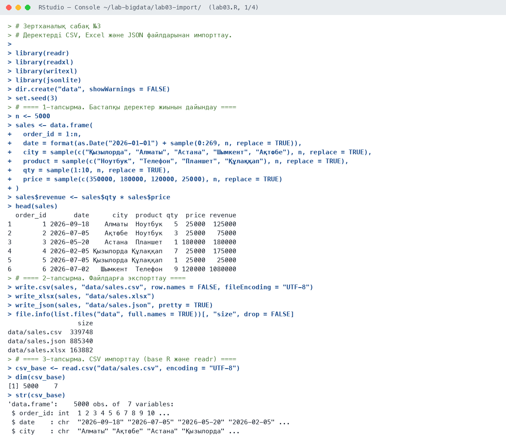
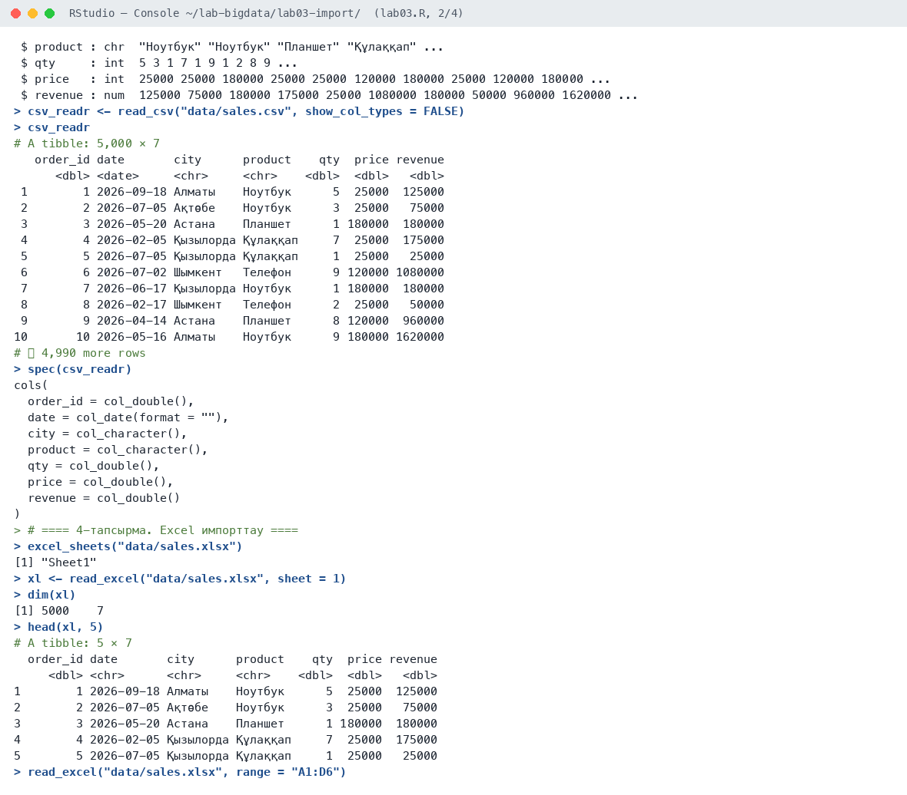
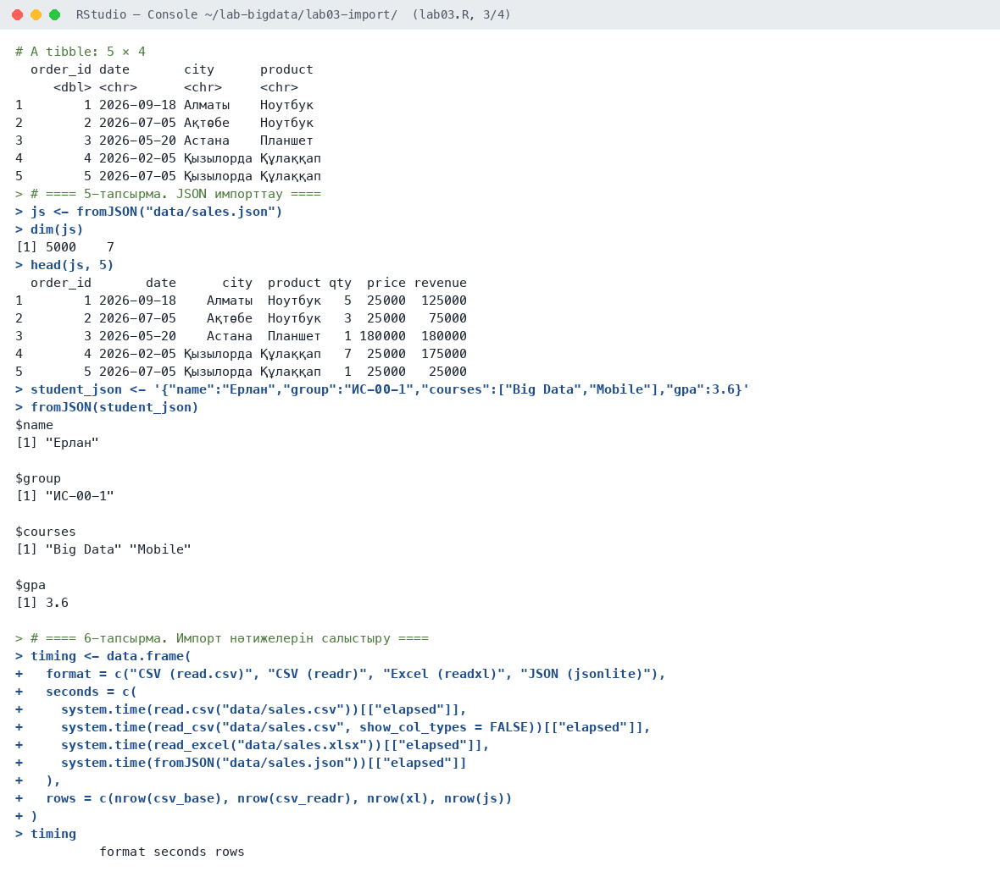
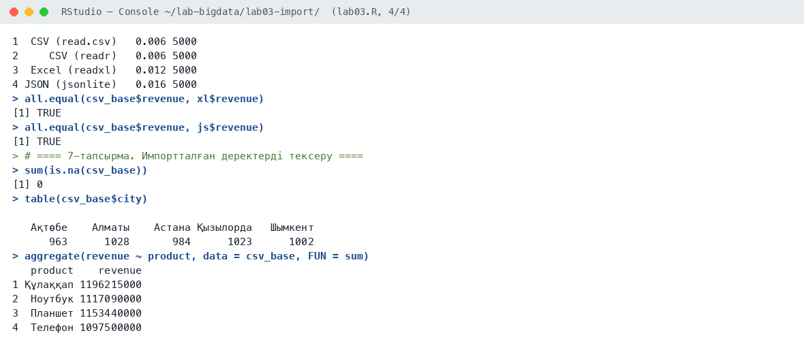

# Зертханалық сабақ №3

**Тақырыбы:** Деректерді CSV, Excel және JSON файлдарынан импорттау

**Пәні:** Үлкен деректерді талдау  
**ББ:** <білім беру бағдарламасы, курс, топ>  
**Оқытушы:** <оқытушының аты-жөні>  
**Орындаушы:** <студенттің аты-жөні>  
**Күні:** 2026-10-05

---

## 1. Жұмыстың мақсаты

R ортасына әртүрлі форматтағы (CSV, Excel, JSON) деректерді импорттау және экспорттау тәсілдерін меңгеру, импорт нәтижесін тексеру.

## 2. Теориялық бөлім

**CSV** — үтірмен бөлінген мәтіндік кесте. Оқу үшін base R-дағы `read.csv()` немесе жылдам `readr::read_csv()` қолданылады. **Excel** (.xlsx) файлдары `readxl::read_excel()` арқылы оқылады: парақ (`sheet`) және ауқым (`range`) таңдауға болады. **JSON** — веб-API және NoSQL жүйелерінде кең тараған иерархиялық формат; `jsonlite::fromJSON()` оны data.frame немесе list түріне айналдырады.

Импорттан кейін міндетті түрде деректердің өлшемі (`dim`), құрылымы (`str`), бос мәндері (`is.na`) тексеріледі.

## 3. Қолданылған құралдар

- **Орта:** R 4.6.1, RStudio, macOS (Apple M-series, 8 ядро)
- **Пакеттер:** readr, readxl, writexl, jsonlite
- **Скрипт:** `lab03.R` (толық нәтиже — `output.txt`)

## 4. Жұмыстың орындалу барысы

Скрипттің басы (пакеттерді қосу):

```r
# Зертханалық сабақ №3
# Деректерді CSV, Excel және JSON файлдарынан импорттау.

library(readr)
library(readxl)
library(writexl)
library(jsonlite)

dir.create("data", showWarnings = FALSE)
set.seed(3)
```

### 4.1. 1-тапсырма. Бастапқы деректер жиынын дайындау

```r
n <- 5000
sales <- data.frame(
  order_id = 1:n,
  date = format(as.Date("2026-01-01") + sample(0:269, n, replace = TRUE)),
  city = sample(c("Қызылорда", "Алматы", "Астана", "Шымкент", "Ақтөбе"), n, replace = TRUE),
  product = sample(c("Ноутбук", "Телефон", "Планшет", "Құлаққап"), n, replace = TRUE),
  qty = sample(1:10, n, replace = TRUE),
  price = sample(c(350000, 180000, 120000, 25000), n, replace = TRUE)
)
sales$revenue <- sales$qty * sales$price
head(sales)
```

Нәтиже:

```text
  order_id       date      city  product qty  price revenue
1        1 2026-09-18    Алматы  Ноутбук   5  25000  125000
2        2 2026-07-05    Ақтөбе  Ноутбук   3  25000   75000
3        3 2026-05-20    Астана  Планшет   1 180000  180000
4        4 2026-02-05 Қызылорда Құлаққап   7  25000  175000
5        5 2026-07-05 Қызылорда Құлаққап   1  25000   25000
6        6 2026-07-02   Шымкент  Телефон   9 120000 1080000
```

**Түсіндірме:** 5 000 жолдан тұратын сатылым жиыны генерацияланды: күн, қала, өнім, саны, бағасы, түсім.

### 4.2. 2-тапсырма. Файлдарға экспорттау

```r
write.csv(sales, "data/sales.csv", row.names = FALSE, fileEncoding = "UTF-8")
write_xlsx(sales, "data/sales.xlsx")
write_json(sales, "data/sales.json", pretty = TRUE)
file.info(list.files("data", full.names = TRUE))[, "size", drop = FALSE]
```

Нәтиже:

```text
                  size
data/sales.csv  339748
data/sales.json 885340
data/sales.xlsx 163882
```

**Түсіндірме:** Бір деректер үш форматқа сақталды. Ең ықшамы — Excel (164 КБ), ең үлкені — JSON (885 КБ), себебі JSON әр жазбада баған атауларын қайталайды.

### 4.3. 3-тапсырма. CSV импорттау (base R және readr)

```r
csv_base <- read.csv("data/sales.csv", encoding = "UTF-8")
dim(csv_base)
str(csv_base)

csv_readr <- read_csv("data/sales.csv", show_col_types = FALSE)
csv_readr
spec(csv_readr)
```

Нәтиже:

```text
[1] 5000    7
'data.frame':    5000 obs. of  7 variables:
 $ order_id: int  1 2 3 4 5 6 7 8 9 10 ...
 $ date    : chr  "2026-09-18" "2026-07-05" "2026-05-20" "2026-02-05" ...
 $ city    : chr  "Алматы" "Ақтөбе" "Астана" "Қызылорда" ...
 $ product : chr  "Ноутбук" "Ноутбук" "Планшет" "Құлаққап" ...
 $ qty     : int  5 3 1 7 1 9 1 2 8 9 ...
 $ price   : int  25000 25000 180000 25000 25000 120000 180000 25000 120000 180000 ...
 $ revenue : num  125000 75000 180000 175000 25000 1080000 180000 50000 960000 1620000 ...
# A tibble: 5,000 × 7
   order_id date       city      product    qty  price revenue
      <dbl> <date>     <chr>     <chr>    <dbl>  <dbl>   <dbl>
 1        1 2026-09-18 Алматы    Ноутбук      5  25000  125000
 2        2 2026-07-05 Ақтөбе    Ноутбук      3  25000   75000
 3        3 2026-05-20 Астана    Планшет      1 180000  180000
 4        4 2026-02-05 Қызылорда Құлаққап     7  25000  175000
 5        5 2026-07-05 Қызылорда Құлаққап     1  25000   25000
 6        6 2026-07-02 Шымкент   Телефон      9 120000 1080000
 7        7 2026-06-17 Қызылорда Ноутбук      1 180000  180000
 8        8 2026-02-17 Шымкент   Телефон      2  25000   50000
 9        9 2026-04-14 Астана    Планшет      8 120000  960000
10       10 2026-05-16 Алматы    Ноутбук      9 180000 1620000
# ℹ 4,990 more rows
cols(
  order_id = col_double(),
  date = col_date(format = ""),
  city = col_character(),
  product = col_character(),
  qty = col_double(),
  price = col_double(),
  revenue = col_double()
)
```

**Түсіндірме:** `read.csv()` күнді мәтін (chr) ретінде оқиды, ал `read_csv()` бағандар типін автоматты анықтайды: күн — `<date>`.

### 4.4. 4-тапсырма. Excel импорттау

```r
excel_sheets("data/sales.xlsx")
xl <- read_excel("data/sales.xlsx", sheet = 1)
dim(xl)
head(xl, 5)
read_excel("data/sales.xlsx", range = "A1:D6")
```

Нәтиже:

```text
[1] "Sheet1"
[1] 5000    7
# A tibble: 5 × 7
  order_id date       city      product    qty  price revenue
     <dbl> <chr>      <chr>     <chr>    <dbl>  <dbl>   <dbl>
1        1 2026-09-18 Алматы    Ноутбук      5  25000  125000
2        2 2026-07-05 Ақтөбе    Ноутбук      3  25000   75000
3        3 2026-05-20 Астана    Планшет      1 180000  180000
4        4 2026-02-05 Қызылорда Құлаққап     7  25000  175000
5        5 2026-07-05 Қызылорда Құлаққап     1  25000   25000
# A tibble: 5 × 4
  order_id date       city      product 
     <dbl> <chr>      <chr>     <chr>   
1        1 2026-09-18 Алматы    Ноутбук 
2        2 2026-07-05 Ақтөбе    Ноутбук 
3        3 2026-05-20 Астана    Планшет 
4        4 2026-02-05 Қызылорда Құлаққап
5        5 2026-07-05 Қызылорда Құлаққап
```

**Түсіндірме:** Excel файлында бір парақ бар — `Sheet1`. `range = "A1:D6"` тек қажетті ауқымды оқиды.

### 4.5. 5-тапсырма. JSON импорттау

```r
js <- fromJSON("data/sales.json")
dim(js)
head(js, 5)
student_json <- '{"name":"Ерлан","group":"ИС-00-1","courses":["Big Data","Mobile"],"gpa":3.6}'
fromJSON(student_json)
```

Нәтиже:

```text
[1] 5000    7
  order_id       date      city  product qty  price revenue
1        1 2026-09-18    Алматы  Ноутбук   5  25000  125000
2        2 2026-07-05    Ақтөбе  Ноутбук   3  25000   75000
3        3 2026-05-20    Астана  Планшет   1 180000  180000
4        4 2026-02-05 Қызылорда Құлаққап   7  25000  175000
5        5 2026-07-05 Қызылорда Құлаққап   1  25000   25000
$name
[1] "Ерлан"

$group
[1] "ИС-00-1"

$courses
[1] "Big Data" "Mobile"  

$gpa
[1] 3.6
```

**Түсіндірме:** JSON массиві data.frame-ге, ал жеке объект list-ке айналды.

### 4.6. 6-тапсырма. Импорт нәтижелерін салыстыру

```r
timing <- data.frame(
  format = c("CSV (read.csv)", "CSV (readr)", "Excel (readxl)", "JSON (jsonlite)"),
  seconds = c(
    system.time(read.csv("data/sales.csv"))[["elapsed"]],
    system.time(read_csv("data/sales.csv", show_col_types = FALSE))[["elapsed"]],
    system.time(read_excel("data/sales.xlsx"))[["elapsed"]],
    system.time(fromJSON("data/sales.json"))[["elapsed"]]
  ),
  rows = c(nrow(csv_base), nrow(csv_readr), nrow(xl), nrow(js))
)
timing

all.equal(csv_base$revenue, xl$revenue)
all.equal(csv_base$revenue, js$revenue)
```

Нәтиже:

```text
           format seconds rows
1  CSV (read.csv)   0.006 5000
2     CSV (readr)   0.006 5000
3  Excel (readxl)   0.012 5000
4 JSON (jsonlite)   0.016 5000
[1] TRUE
[1] TRUE
```

**Түсіндірме:** Барлық форматтан 5 000 жол оқылды, түсім бағаны барлық форматта бірдей (`all.equal` = TRUE). Шағын файлда жылдамдық айырмасы аз, ең баяуы — JSON.

### 4.7. 7-тапсырма. Импортталған деректерді тексеру

```r
sum(is.na(csv_base))
table(csv_base$city)
aggregate(revenue ~ product, data = csv_base, FUN = sum)
```

Нәтиже:

```text
[1] 0

   Ақтөбе    Алматы    Астана Қызылорда   Шымкент 
      963      1028       984      1023      1002 
   product    revenue
1 Құлаққап 1196215000
2  Ноутбук 1117090000
3  Планшет 1153440000
4  Телефон 1097500000
```

**Түсіндірме:** Бос мән жоқ. Қалалар бойынша жазбалар саны тең бөлінген (963–1028), өнімдер бойынша түсім есептелді.

## 5. Скриншоттар

### 5.1. RStudio консолі









## 6. Бақылау сұрақтарына жауаптар

**1. read.csv() мен read_csv() айырмашылығы?**

`read.csv()` — base R функциясы, data.frame қайтарады және күнді мәтін ретінде оқиды. `readr::read_csv()` жылдамырақ, tibble қайтарады және бағандар типін (күн, сан) автоматты анықтайды.

**2. Excel файлынан белгілі бір парақты қалай оқимыз?**

`read_excel("файл.xlsx", sheet = "Парақ атауы")` немесе `sheet = 2`. Барлық парақтар тізімін `excel_sheets()` береді.

**3. JSON форматы қай жерде қолданылады?**

JSON веб-API жауаптарында, конфигурация файлдарында, NoSQL деректер қорларында (MongoDB) және браузер мен сервер арасындағы деректер алмасуда қолданылады.

**4. Импорттан кейін нені тексеру керек?**

Өлшемін (`dim`), құрылымы мен бағандар типін (`str`), бос мәндерді (`is.na`), алғашқы жолдарды (`head`) және бастапқы деректермен сәйкестігін тексеру керек.

## 7. Қорытынды

Деректер CSV, Excel және JSON форматтарына экспортталып, кері импортталды. Үш форматтан оқылған деректер толық сәйкес келді. `readr` бағандар типін дұрыс анықтайтыны, JSON ең көп орын алатыны, Excel-ден ауқым бойынша оқуға болатыны көрсетілді.

## 8. Қолданылған әдебиеттер

1. Черемухин А.Д. Большие данные: учебное пособие. — Москва: Ай Пи Ар Медиа, 2023. — 728 с.
2. Wickham H., Çetinkaya-Rundel M., Grolemund G. R for Data Science. 2nd ed. — O'Reilly, 2023. URL: https://r4ds.hadley.nz
3. R Core Team. R: A Language and Environment for Statistical Computing. — Vienna, 2026. URL: https://www.r-project.org
4. Сухобоков А.А., Лахвич Д.С. Влияние инструментария Big Data на развитие научных дисциплин, связанных с моделированием // Наука и образование: МГТУ им. Н.Э. Баумана.
5. readxl, readr, jsonlite пакеттерінің құжаттамасы. URL: https://readxl.tidyverse.org, https://readr.tidyverse.org
