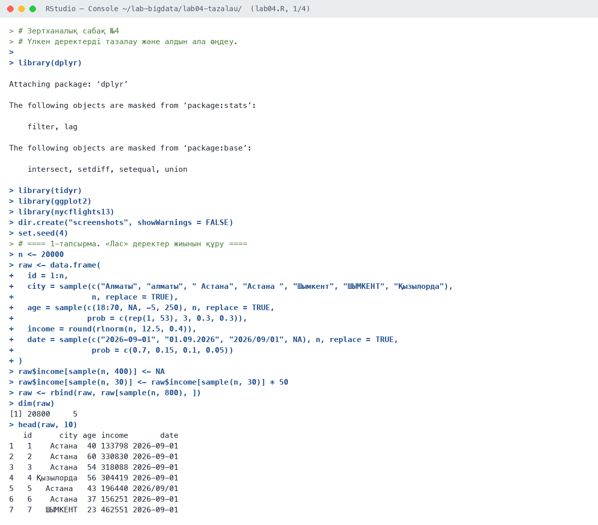
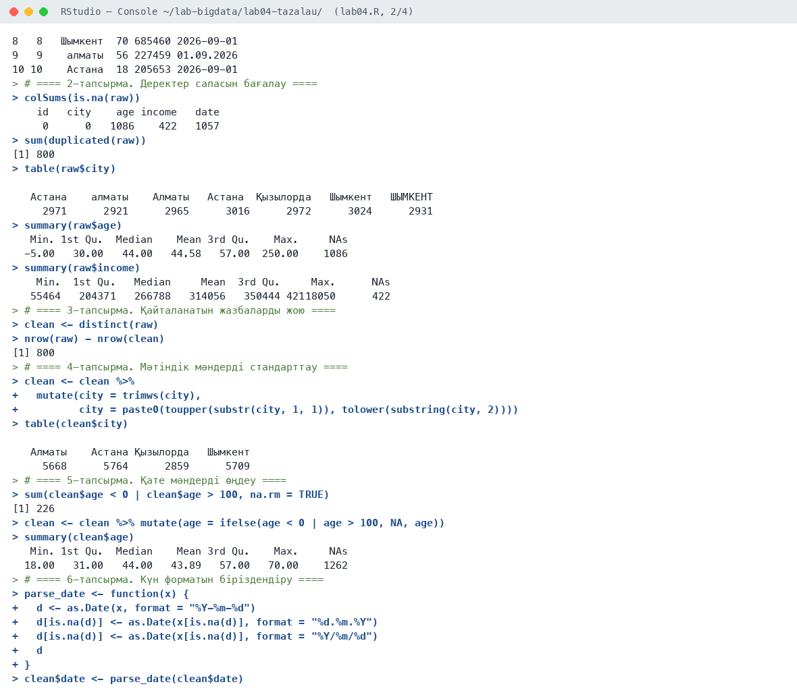
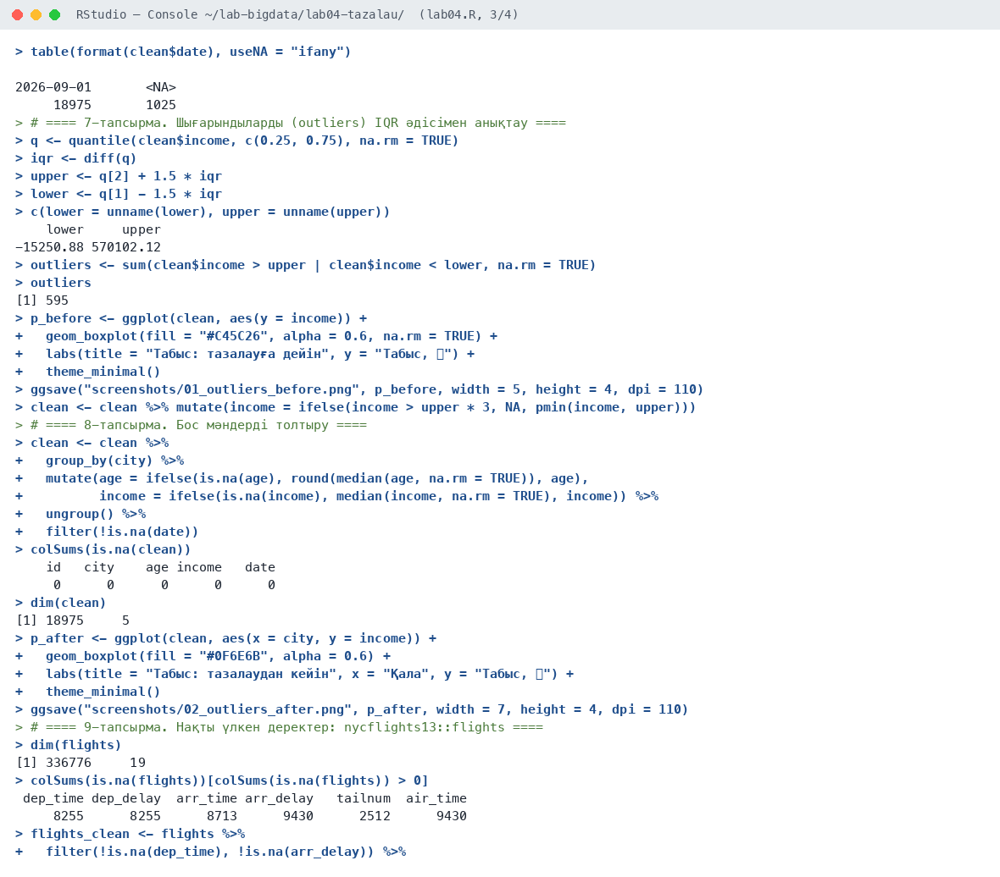
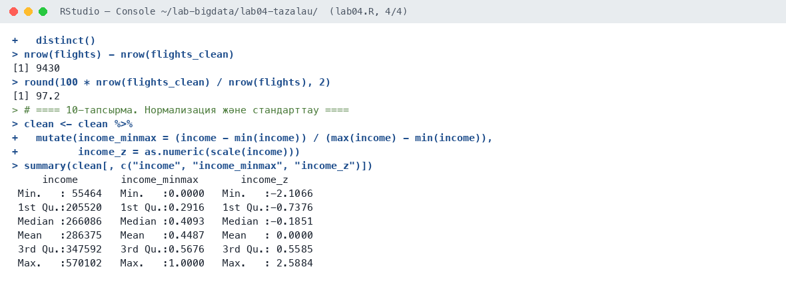
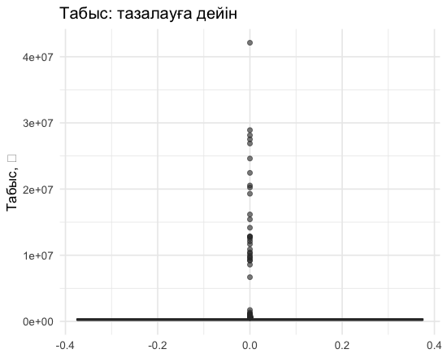
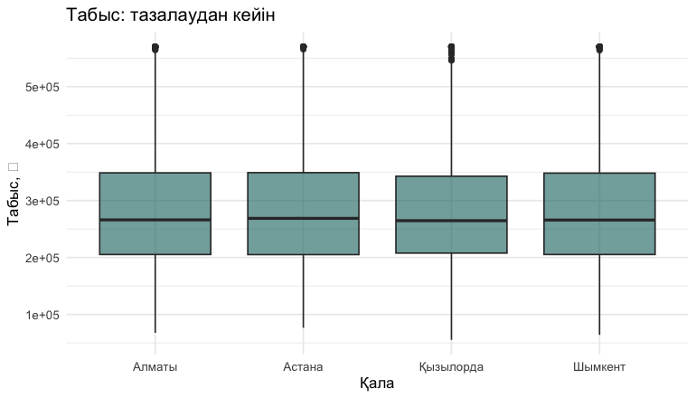

# Зертханалық сабақ №4

**Тақырыбы:** Үлкен деректерді тазалау және алдын ала өңдеу

**Пәні:** Үлкен деректерді талдау  
**ББ:** <білім беру бағдарламасы, курс, топ>  
**Оқытушы:** <оқытушының аты-жөні>  
**Орындаушы:** <студенттің аты-жөні>  
**Күні:** 2026-10-05

---

## 1. Жұмыстың мақсаты

Деректер сапасының негізгі мәселелерін (бос мәндер, қайталанулар, қате мәндер, біркелкі емес формат, шығарындылар) анықтау және оларды R құралдарымен түзету.

## 2. Теориялық бөлім

Нақты деректерде әрқашан ақаулар болады: бос ұяшықтар (NA), қайталанатын жазбалар, логикалық қате мәндер (мысалы, жасы −5), бір мәннің әртүрлі жазылуы («Алматы»/«алматы»), күннің әртүрлі форматы, шығарындылар (outliers). Талдау нәтижесі деректер сапасына тікелей байланысты («garbage in — garbage out»).

Негізгі әдістер: `distinct()` — қайталануды жою; `trimws()`, `tolower()` — мәтінді стандарттау; IQR әдісі — Q1 − 1,5·IQR және Q3 + 1,5·IQR шекарасынан тыс мәндерді шығарынды деп санау; бос мәндерді медианамен толтыру (импутация); min-max нормализация және z-стандарттау.

## 3. Қолданылған құралдар

- **Орта:** R 4.6.1, RStudio, macOS (Apple M-series, 8 ядро)
- **Пакеттер:** dplyr, tidyr, ggplot2, nycflights13
- **Скрипт:** `lab04.R` (толық нәтиже — `output.txt`)

## 4. Жұмыстың орындалу барысы

Скрипттің басы (пакеттерді қосу):

```r
# Зертханалық сабақ №4
# Үлкен деректерді тазалау және алдын ала өңдеу.

library(dplyr)
library(tidyr)
library(ggplot2)
library(nycflights13)

dir.create("screenshots", showWarnings = FALSE)
set.seed(4)
```

### 4.1. 1-тапсырма. «Лас» деректер жиынын құру

```r
n <- 20000
raw <- data.frame(
  id = 1:n,
  city = sample(c("Алматы", "алматы", " Астана", "Астана ", "Шымкент", "ШЫМКЕНТ", "Қызылорда"),
                n, replace = TRUE),
  age = sample(c(18:70, NA, -5, 250), n, replace = TRUE,
               prob = c(rep(1, 53), 3, 0.3, 0.3)),
  income = round(rlnorm(n, 12.5, 0.4)),
  date = sample(c("2026-09-01", "01.09.2026", "2026/09/01", NA), n, replace = TRUE,
                prob = c(0.7, 0.15, 0.1, 0.05))
)
raw$income[sample(n, 400)] <- NA
raw$income[sample(n, 30)] <- raw$income[sample(n, 30)] * 50
raw <- rbind(raw, raw[sample(n, 800), ])
dim(raw)
head(raw, 10)
```

Нәтиже:

```text
[1] 20800     5
   id      city age income       date
1   1    Астана  40 133798 2026-09-01
2   2    Астана  60 330830 2026-09-01
3   3    Астана  54 318088 2026-09-01
4   4 Қызылорда  56 304419 2026-09-01
5   5   Астана   43 196440 2026/09/01
6   6    Астана  37 156251 2026-09-01
7   7   ШЫМКЕНТ  23 462551 2026-09-01
8   8   Шымкент  70 685460 2026-09-01
9   9    алматы  56 227459 01.09.2026
10 10    Астана  18 205653 2026-09-01
```

**Түсіндірме:** 20 800 жолдық «лас» жиын жасалды: 800 қайталану, бос мәндер, қате жас (−5, 250), қала атауларының әртүрлі жазылуы, үш күн форматы, табыстағы 30 шығарынды.

### 4.2. 2-тапсырма. Деректер сапасын бағалау

```r
colSums(is.na(raw))
sum(duplicated(raw))
table(raw$city)
summary(raw$age)
summary(raw$income)
```

Нәтиже:

```text
    id   city    age income   date 
     0      0   1086    422   1057 
[1] 800

   Астана    алматы    Алматы   Астана  Қызылорда   Шымкент   ШЫМКЕНТ 
     2971      2921      2965      3016      2972      3024      2931 
   Min. 1st Qu.  Median    Mean 3rd Qu.    Max.     NAs 
  -5.00   30.00   44.00   44.58   57.00  250.00    1086 
    Min.  1st Qu.   Median     Mean  3rd Qu.     Max.      NAs 
   55464   204371   266788   314056   350444 42118050      422 
```

**Түсіндірме:** Ақаулар анықталды: жас бойынша 1 086, табыс бойынша 422, күн бойынша 1 057 бос мән; 800 қайталану; қала 7 түрлі жазылған; табыс максимумы 42 млн ₸ — шығарынды.

### 4.3. 3-тапсырма. Қайталанатын жазбаларды жою

```r
clean <- distinct(raw)
nrow(raw) - nrow(clean)
```

Нәтиже:

```text
[1] 800
```

**Түсіндірме:** 800 қайталанатын жазба жойылды.

### 4.4. 4-тапсырма. Мәтіндік мәндерді стандарттау

```r
clean <- clean %>%
  mutate(city = trimws(city),
         city = paste0(toupper(substr(city, 1, 1)), tolower(substring(city, 2))))
table(clean$city)
```

Нәтиже:

```text
   Алматы    Астана Қызылорда   Шымкент 
     5668      5764      2859      5709 
```

**Түсіндірме:** Бос орындар мен регистр түзетілгеннен кейін 7 нұсқа 4 нақты қалаға біріктірілді.

### 4.5. 5-тапсырма. Қате мәндерді өңдеу

```r
sum(clean$age < 0 | clean$age > 100, na.rm = TRUE)
clean <- clean %>% mutate(age = ifelse(age < 0 | age > 100, NA, age))
summary(clean$age)
```

Нәтиже:

```text
[1] 226
   Min. 1st Qu.  Median    Mean 3rd Qu.    Max.     NAs 
  18.00   31.00   44.00   43.89   57.00   70.00    1262 
```

**Түсіндірме:** 226 қате жас (0-ден кіші немесе 100-ден үлкен) NA-ға ауыстырылды.

### 4.6. 6-тапсырма. Күн форматын біріздендіру

```r
parse_date <- function(x) {
  d <- as.Date(x, format = "%Y-%m-%d")
  d[is.na(d)] <- as.Date(x[is.na(d)], format = "%d.%m.%Y")
  d[is.na(d)] <- as.Date(x[is.na(d)], format = "%Y/%m/%d")
  d
}
clean$date <- parse_date(clean$date)
table(format(clean$date), useNA = "ifany")
```

Нәтиже:

```text
2026-09-01       <NA> 
     18975       1025 
```

**Түсіндірме:** Үш формат бір `Date` типіне келтірілді; күні жоқ 1 025 жол қалды.

### 4.7. 7-тапсырма. Шығарындыларды (outliers) IQR әдісімен анықтау

```r
q <- quantile(clean$income, c(0.25, 0.75), na.rm = TRUE)
iqr <- diff(q)
upper <- q[2] + 1.5 * iqr
lower <- q[1] - 1.5 * iqr
c(lower = unname(lower), upper = unname(upper))
outliers <- sum(clean$income > upper | clean$income < lower, na.rm = TRUE)
outliers

p_before <- ggplot(clean, aes(y = income)) +
  geom_boxplot(fill = "#C45C26", alpha = 0.6, na.rm = TRUE) +
  labs(title = "Табыс: тазалауға дейін", y = "Табыс, ₸") +
  theme_minimal()
ggsave("screenshots/01_outliers_before.png", p_before, width = 5, height = 4, dpi = 110)

clean <- clean %>% mutate(income = ifelse(income > upper * 3, NA, pmin(income, upper)))
```

Нәтиже:

```text
    lower     upper 
-15250.88 570102.12 
[1] 595
```

**Түсіндірме:** IQR шекарасы: жоғарғы 570 102 ₸. 595 мән шекарадан асады. Тым үлкен мәндер (шекарадан 3 есе) NA деп белгіленді, қалғандары шекараға дейін қысқартылды (winsorizing).

### 4.8. 8-тапсырма. Бос мәндерді толтыру

```r
clean <- clean %>%
  group_by(city) %>%
  mutate(age = ifelse(is.na(age), round(median(age, na.rm = TRUE)), age),
         income = ifelse(is.na(income), median(income, na.rm = TRUE), income)) %>%
  ungroup() %>%
  filter(!is.na(date))
colSums(is.na(clean))
dim(clean)

p_after <- ggplot(clean, aes(x = city, y = income)) +
  geom_boxplot(fill = "#0F6E6B", alpha = 0.6) +
  labs(title = "Табыс: тазалаудан кейін", x = "Қала", y = "Табыс, ₸") +
  theme_minimal()
ggsave("screenshots/02_outliers_after.png", p_after, width = 7, height = 4, dpi = 110)
```

Нәтиже:

```text
    id   city    age income   date 
     0      0      0      0      0 
[1] 18975     5
```

**Түсіндірме:** Жас пен табыстың бос мәндері қала бойынша медианамен толтырылды, күні жоқ жолдар жойылды. Нәтиже: 18 975 таза жол, бос мән жоқ.

### 4.9. 9-тапсырма. Нақты үлкен деректер: nycflights13::flights

```r
dim(flights)
colSums(is.na(flights))[colSums(is.na(flights)) > 0]
flights_clean <- flights %>%
  filter(!is.na(dep_time), !is.na(arr_delay)) %>%
  distinct()
nrow(flights) - nrow(flights_clean)
round(100 * nrow(flights_clean) / nrow(flights), 2)
```

Нәтиже:

```text
[1] 336776     19
 dep_time dep_delay  arr_time arr_delay   tailnum  air_time 
     8255      8255      8713      9430      2512      9430 
[1] 9430
[1] 97.2
```

**Түсіндірме:** Нақты үлкен деректер — 336 776 рейс. Бос мәндер негізінен тоқтатылған рейстерге байланысты (8 255 рейс ұшпаған). Тазалаудан кейін деректердің 97,2%-ы қалды.

### 4.10. 10-тапсырма. Нормализация және стандарттау

```r
clean <- clean %>%
  mutate(income_minmax = (income - min(income)) / (max(income) - min(income)),
         income_z = as.numeric(scale(income)))
summary(clean[, c("income", "income_minmax", "income_z")])
```

Нәтиже:

```text
     income       income_minmax       income_z      
 Min.   : 55464   Min.   :0.0000   Min.   :-2.1066  
 1st Qu.:205520   1st Qu.:0.2916   1st Qu.:-0.7376  
 Median :266086   Median :0.4093   Median :-0.1851  
 Mean   :286375   Mean   :0.4487   Mean   : 0.0000  
 3rd Qu.:347592   3rd Qu.:0.5676   3rd Qu.: 0.5585  
 Max.   :570102   Max.   :1.0000   Max.   : 2.5884  
```

**Түсіндірме:** Min-max нормализация мәндерді [0; 1] аралығына, z-стандарттау орташа 0 және ауытқу 1 болатын шкалаға келтірді.

## 5. Скриншоттар

### 5.1. RStudio консолі









### 5.2. Графиктер

**1-сурет.** Табыстың үлестірімі тазалауға дейін: шығарындылар 42 млн ₸-ге дейін



**2-сурет.** Тазалаудан кейін қалалар бойынша табыс



## 6. Бақылау сұрақтарына жауаптар

**1. Деректер сапасының негізгі мәселелерін атаңыз.**

Бос мәндер (NA), қайталанатын жазбалар, логикалық қате мәндер, бір мәннің әртүрлі жазылуы, біркелкі емес формат (күн, өлшем бірлігі), шығарындылар (outliers).

**2. IQR әдісі қалай жұмыс істейді?**

Q1 (25%) және Q3 (75%) квартильдері табылады, IQR = Q3 − Q1. Q1 − 1,5·IQR-дан кіші немесе Q3 + 1,5·IQR-дан үлкен мәндер шығарынды деп саналады.

**3. Бос мәндерді толтырудың қандай тәсілдері бар?**

Жолды жою, орта мәнмен немесе медианамен толтыру, топ бойынша медиана, алдыңғы/келесі мәнмен толтыру (уақыттық қатарларда), регрессия немесе kNN арқылы болжау.

**4. Нормализация мен стандарттаудың айырмашылығы?**

Нормализация (min-max) мәндерді [0; 1] аралығына келтіреді. Стандарттау (z-score) орта мәні 0, стандартты ауытқуы 1 болатын шкалаға келтіреді.

## 7. Қорытынды

Деректерді тазалаудың толық циклі орындалды: 800 қайталану жойылды, қала атаулары 4 нақты мәнге біріктірілді, 226 қате жас түзетілді, үш күн форматы біріздендірілді, табыстағы шығарындылар IQR әдісімен өңделді, бос мәндер медианамен толтырылды. Нақты 336 776 рейстік жиында тазалаудан кейін 97,2% деректер сақталды.

## 8. Қолданылған әдебиеттер

1. Черемухин А.Д. Большие данные: учебное пособие. — Москва: Ай Пи Ар Медиа, 2023. — 728 с.
2. Wickham H., Çetinkaya-Rundel M., Grolemund G. R for Data Science. 2nd ed. — O'Reilly, 2023. URL: https://r4ds.hadley.nz
3. R Core Team. R: A Language and Environment for Statistical Computing. — Vienna, 2026. URL: https://www.r-project.org
4. Сухобоков А.А., Лахвич Д.С. Влияние инструментария Big Data на развитие научных дисциплин, связанных с моделированием // Наука и образование: МГТУ им. Н.Э. Баумана.
