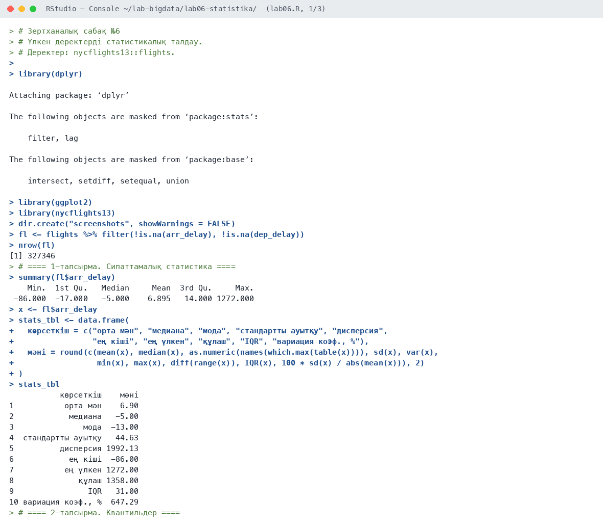
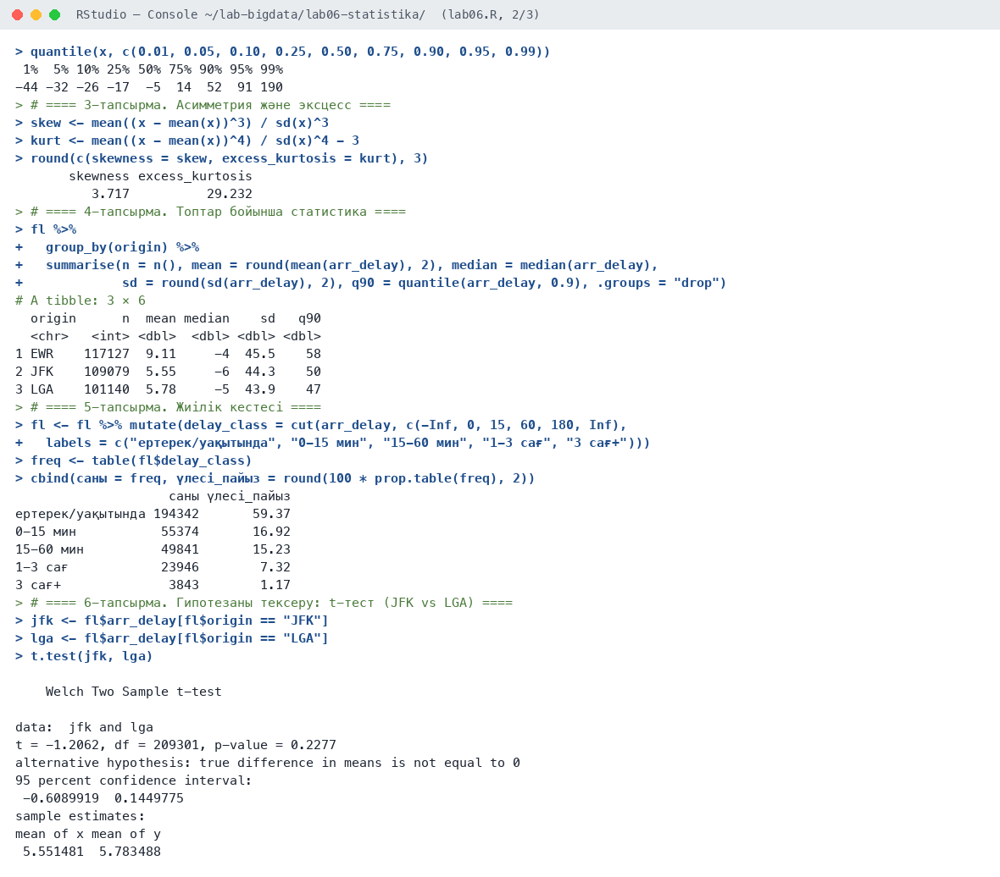
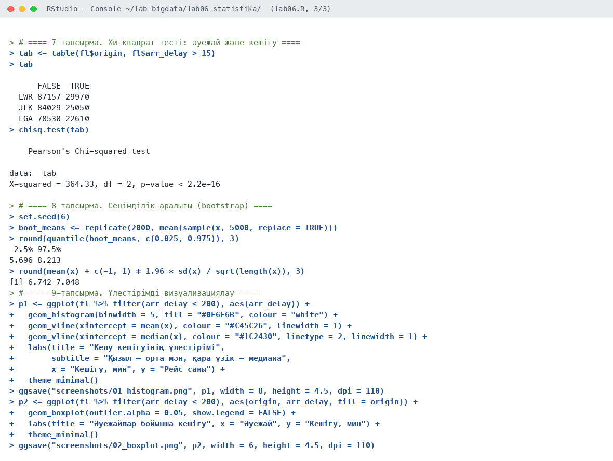
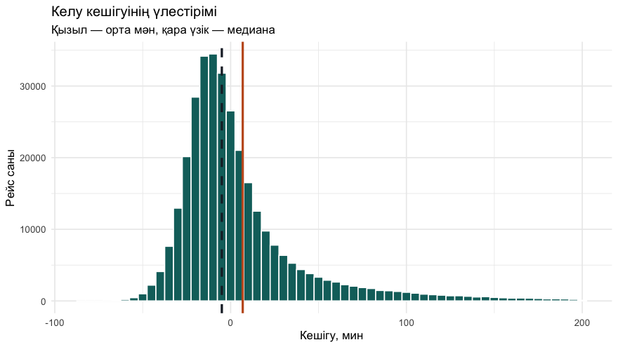
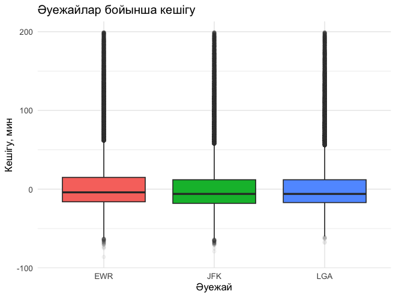

# Зертханалық сабақ №6

**Тақырыбы:** Үлкен деректерді статистикалық талдау

**Пәні:** Үлкен деректерді талдау  
**ББ:** <білім беру бағдарламасы, курс, топ>  
**Оқытушы:** <оқытушының аты-жөні>  
**Орындаушы:** <студенттің аты-жөні>  
**Күні:** 2026-10-05

---

## 1. Жұмыстың мақсаты

Үлкен деректер жиынына сипаттамалық статистика, үлестірім көрсеткіштері, топтық салыстыру, статистикалық гипотезаларды тексеру және bootstrap әдістерін қолдану.

## 2. Теориялық бөлім

**Сипаттамалық статистика**: орталық тенденция (орта мән, медиана, мода), шашырау (дисперсия, стандартты ауытқу, құлаш, IQR, вариация коэффициенті), үлестірім пішіні (асимметрия, эксцесс).

**Гипотезаларды тексеру**: t-тест екі топтың орта мәнін салыстырады; χ²-тест екі категориялық айнымалының тәуелсіздігін тексереді. Егер p < 0,05 болса, нөлдік гипотеза қабылданбайды. **Bootstrap** — таңдамадан қайталап кездейсоқ таңдау арқылы статистиканың сенімділік аралығын бағалау.

## 3. Қолданылған құралдар

- **Орта:** R 4.6.1, RStudio, macOS (Apple M-series, 8 ядро)
- **Пакеттер:** base R stats, dplyr, ggplot2, nycflights13
- **Скрипт:** `lab06.R` (толық нәтиже — `output.txt`)

## 4. Жұмыстың орындалу барысы

Скрипттің басы (пакеттерді қосу):

```r
# Зертханалық сабақ №6
# Үлкен деректерді статистикалық талдау.
# Деректер: nycflights13::flights.

library(dplyr)
library(ggplot2)
library(nycflights13)

dir.create("screenshots", showWarnings = FALSE)
fl <- flights %>% filter(!is.na(arr_delay), !is.na(dep_delay))
nrow(fl)
```

### 4.1. 1-тапсырма. Сипаттамалық статистика

```r
summary(fl$arr_delay)
x <- fl$arr_delay
stats_tbl <- data.frame(
  көрсеткіш = c("орта мән", "медиана", "мода", "стандартты ауытқу", "дисперсия",
                "ең кіші", "ең үлкен", "құлаш", "IQR", "вариация коэф., %"),
  мәні = round(c(mean(x), median(x), as.numeric(names(which.max(table(x)))), sd(x), var(x),
                 min(x), max(x), diff(range(x)), IQR(x), 100 * sd(x) / abs(mean(x))), 2)
)
stats_tbl
```

Нәтиже:

```text
    Min.  1st Qu.   Median     Mean  3rd Qu.     Max. 
 -86.000  -17.000   -5.000    6.895   14.000 1272.000 
           көрсеткіш    мәні
1           орта мән    6.90
2            медиана   -5.00
3               мода  -13.00
4  стандартты ауытқу   44.63
5          дисперсия 1992.13
6            ең кіші  -86.00
7           ең үлкен 1272.00
8              құлаш 1358.00
9                IQR   31.00
10 вариация коэф., %  647.29
```

**Түсіндірме:** 327 346 рейс. Орта кешігу 6,9 мин, бірақ медиана −5 мин: рейстердің жартысынан көбі ертерек келеді, ал аз ғана ұзақ кешігулер орта мәнді жоғары тартады.

### 4.2. 2-тапсырма. Квантильдер

```r
quantile(x, c(0.01, 0.05, 0.10, 0.25, 0.50, 0.75, 0.90, 0.95, 0.99))
```

Нәтиже:

```text
 1%  5% 10% 25% 50% 75% 90% 95% 99% 
-44 -32 -26 -17  -5  14  52  91 190 
```

**Түсіндірме:** Рейстердің 75%-ы 14 минуттан аз кешігеді, ал 1%-ы 190 минуттан артық кешігеді.

### 4.3. 3-тапсырма. Асимметрия және эксцесс

```r
skew <- mean((x - mean(x))^3) / sd(x)^3
kurt <- mean((x - mean(x))^4) / sd(x)^4 - 3
round(c(skewness = skew, excess_kurtosis = kurt), 3)
```

Нәтиже:

```text
       skewness excess_kurtosis 
          3.717          29.232 
```

**Түсіндірме:** Асимметрия 3,72 (оң жаққа қатты ығысқан), эксцесс 29,2 — үлестірім қалыпты емес, «ауыр құйрықты».

### 4.4. 4-тапсырма. Топтар бойынша статистика

```r
fl %>%
  group_by(origin) %>%
  summarise(n = n(), mean = round(mean(arr_delay), 2), median = median(arr_delay),
            sd = round(sd(arr_delay), 2), q90 = quantile(arr_delay, 0.9), .groups = "drop")
```

Нәтиже:

```text
# A tibble: 3 × 6
  origin      n  mean median    sd   q90
  <chr>   <int> <dbl>  <dbl> <dbl> <dbl>
1 EWR    117127  9.11     -4  45.5    58
2 JFK    109079  5.55     -6  44.3    50
3 LGA    101140  5.78     -5  43.9    47
```

**Түсіндірме:** EWR әуежайында кешігу жоғары (орта 9,1 мин), JFK мен LGA шамамен бірдей (5,6 және 5,8).

### 4.5. 5-тапсырма. Жиілік кестесі

```r
fl <- fl %>% mutate(delay_class = cut(arr_delay, c(-Inf, 0, 15, 60, 180, Inf),
  labels = c("ертерек/уақытында", "0-15 мин", "15-60 мин", "1-3 сағ", "3 сағ+")))
freq <- table(fl$delay_class)
cbind(саны = freq, үлесі_пайыз = round(100 * prop.table(freq), 2))
```

Нәтиже:

```text
                    саны үлесі_пайыз
ертерек/уақытында 194342       59.37
0-15 мин           55374       16.92
15-60 мин          49841       15.23
1-3 сағ            23946        7.32
3 сағ+              3843        1.17
```

**Түсіндірме:** 59,4% рейс ертерек немесе уақытында келеді, 1,2% рейс 3 сағаттан артық кешігеді.

### 4.6. 6-тапсырма. Гипотезаны тексеру: t-тест (JFK vs LGA)

```r
jfk <- fl$arr_delay[fl$origin == "JFK"]
lga <- fl$arr_delay[fl$origin == "LGA"]
t.test(jfk, lga)
```

Нәтиже:

```text
    Welch Two Sample t-test

data:  jfk and lga
t = -1.2062, df = 209301, p-value = 0.2277
alternative hypothesis: true difference in means is not equal to 0
95 percent confidence interval:
 -0.6089919  0.1449775
sample estimates:
mean of x mean of y 
 5.551481  5.783488 
```

**Түсіндірме:** JFK және LGA: p = 0,228 > 0,05. Орта кешігуде статистикалық маңызды айырма жоқ.

### 4.7. 7-тапсырма. Хи-квадрат тесті: әуежай және кешігу

```r
tab <- table(fl$origin, fl$arr_delay > 15)
tab
chisq.test(tab)
```

Нәтиже:

```text
      FALSE  TRUE
  EWR 87157 29970
  JFK 84029 25050
  LGA 78530 22610

    Pearson's Chi-squared test

data:  tab
X-squared = 364.33, df = 2, p-value < 2.2e-16
```

**Түсіндірме:** χ² = 364,3, p < 2,2·10⁻¹⁶: кешігу ықтималдығы әуежайға тәуелді (EWR — 25,6%, LGA — 22,4%).

### 4.8. 8-тапсырма. Сенімділік аралығы (bootstrap)

```r
set.seed(6)
boot_means <- replicate(2000, mean(sample(x, 5000, replace = TRUE)))
round(quantile(boot_means, c(0.025, 0.975)), 3)
round(mean(x) + c(-1, 1) * 1.96 * sd(x) / sqrt(length(x)), 3)
```

Нәтиже:

```text
 2.5% 97.5% 
5.696 8.213 
[1] 6.742 7.048
```

**Түсіндірме:** Bootstrap 95% аралығы (5 000 рейстік таңдама): [5,70; 8,21]. Толық деректер бойынша аналитикалық аралық [6,74; 7,05] — тар, себебі n = 327 мың.

### 4.9. 9-тапсырма. Үлестірімді визуализациялау

```r
p1 <- ggplot(fl %>% filter(arr_delay < 200), aes(arr_delay)) +
  geom_histogram(binwidth = 5, fill = "#0F6E6B", colour = "white") +
  geom_vline(xintercept = mean(x), colour = "#C45C26", linewidth = 1) +
  geom_vline(xintercept = median(x), colour = "#1C2430", linetype = 2, linewidth = 1) +
  labs(title = "Келу кешігуінің үлестірімі",
       subtitle = "Қызыл — орта мән, қара үзік — медиана",
       x = "Кешігу, мин", y = "Рейс саны") +
  theme_minimal()
ggsave("screenshots/01_histogram.png", p1, width = 8, height = 4.5, dpi = 110)

p2 <- ggplot(fl %>% filter(arr_delay < 200), aes(origin, arr_delay, fill = origin)) +
  geom_boxplot(outlier.alpha = 0.05, show.legend = FALSE) +
  labs(title = "Әуежайлар бойынша кешігу", x = "Әуежай", y = "Кешігу, мин") +
  theme_minimal()
ggsave("screenshots/02_boxplot.png", p2, width = 6, height = 4.5, dpi = 110)
```

## 5. Скриншоттар

### 5.1. RStudio консолі







### 5.2. Графиктер

**1-сурет.** Келу кешігуінің үлестірімі: оң жаққа ығысқан



**2-сурет.** Әуежайлар бойынша кешігу



## 6. Бақылау сұрақтарына жауаптар

**1. Медиана мен орта мән қашан айтарлықтай ерекшеленеді?**

Үлестірім асимметриялы болғанда немесе шығарындылар болғанда. Мысалы, кешігу деректерінде орта мән 6,9 мин, ал медиана −5 мин.

**2. p-мәні нені білдіреді?**

p-мәні — нөлдік гипотеза дұрыс болған жағдайда бақыланған немесе одан да шеткі нәтижені алу ықтималдығы. p < 0,05 болса, нөлдік гипотеза қабылданбайды.

**3. χ²-тест қандай гипотезаны тексереді?**

Екі категориялық айнымалының тәуелсіздігі туралы гипотезаны (H₀: айнымалылар тәуелсіз).

**4. Bootstrap әдісінің мәні неде?**

Таңдамадан қайталанатын кездейсоқ таңдаулар жасап, әр таңдамада статистиканы есептеу арқылы оның үлестірімін және сенімділік аралығын бағалау. Үлестірім туралы болжам қажет емес.

## 7. Қорытынды

Кешігу уақыты қалыпты үлестірімге бағынбайды (асимметрия 3,7), сондықтан орта мәннен гөрі медиана мен квантильдер дұрыс сипаттама береді. JFK мен LGA арасында орта кешігуде маңызды айырма жоқ (p = 0,23), бірақ кешігу ықтималдығы әуежайға тәуелді (χ², p < 0,001), ең проблемалысы — EWR.

## 8. Қолданылған әдебиеттер

1. Черемухин А.Д. Большие данные: учебное пособие. — Москва: Ай Пи Ар Медиа, 2023. — 728 с.
2. Wickham H., Çetinkaya-Rundel M., Grolemund G. R for Data Science. 2nd ed. — O'Reilly, 2023. URL: https://r4ds.hadley.nz
3. R Core Team. R: A Language and Environment for Statistical Computing. — Vienna, 2026. URL: https://www.r-project.org
4. Сухобоков А.А., Лахвич Д.С. Влияние инструментария Big Data на развитие научных дисциплин, связанных с моделированием // Наука и образование: МГТУ им. Н.Э. Баумана.
