# Зертханалық сабақ №7

**Тақырыбы:** ggplot2 көмегімен үлкен деректерді визуализациялау

**Пәні:** Үлкен деректерді талдау  
**ББ:** <білім беру бағдарламасы, курс, топ>  
**Оқытушы:** <оқытушының аты-жөні>  
**Орындаушы:** <студенттің аты-жөні>  
**Күні:** 2026-10-05

---

## 1. Жұмыстың мақсаты

ggplot2 пакетінің графика грамматикасын (деректер + эстетика + геометрия + шкала + фасет + тема) меңгеру және үлкен деректерге лайық визуализация түрлерін құру.

## 2. Теориялық бөлім

**ggplot2** «Grammar of Graphics» тұжырымдамасына негізделген: график қабаттардан құралады. `ggplot(data, aes(x, y))` — деректер мен эстетика, `geom_*()` — геометрия (сызық, баған, нүкте, boxplot), `scale_*()` — шкала, `facet_*()` — бөлу, `theme_*()` — безендіру.

Үлкен деректерде жүздеген мың нүкте бір-бірін жауып қалады (overplotting). Сондықтан агрегатталған графиктер (hex-bin, жылу картасы, тегістеу), мөлдірлік (alpha) және тығыздық графиктері қолданылады.

## 3. Қолданылған құралдар

- **Орта:** R 4.6.1, RStudio, macOS (Apple M-series, 8 ядро)
- **Пакеттер:** ggplot2, hexbin, dplyr, nycflights13
- **Скрипт:** `lab07.R` (толық нәтиже — `output.txt`)

## 4. Жұмыстың орындалу барысы

Скрипттің басы (пакеттерді қосу):

```r
# Зертханалық сабақ №7
# ggplot2 көмегімен үлкен деректерді визуализациялау.
# Деректер: nycflights13 (flights, weather, airlines).

library(dplyr)
library(ggplot2)
library(nycflights13)

dir.create("screenshots", showWarnings = FALSE)
theme_set(theme_minimal(base_size = 12))
save_plot <- function(p, name, w = 8, h = 4.8) {
  ggsave(file.path("screenshots", name), p, width = w, height = h, dpi = 110)
  name
}
```

### 4.1. 1-тапсырма. Сызықтық график: күндік рейс саны

```r
daily <- flights %>%
  mutate(date = as.Date(time_hour, tz = "America/New_York")) %>%
  count(date)
summary(daily$n)
daily %>% arrange(n) %>% head(3)
p1 <- ggplot(daily, aes(date, n)) +
  geom_line(colour = "#0F6E6B") +
  geom_smooth(method = "loess", span = 0.2, colour = "#C45C26", se = FALSE) +
  labs(title = "2013 жылғы күндік рейстер саны", x = "Күн", y = "Рейстер")
save_plot(p1, "01_line_daily.png")
```

Нәтиже:

```text
   Min. 1st Qu.  Median    Mean 3rd Qu.    Max. 
  634.0   902.0   964.0   922.7   985.0  1014.0 
# A tibble: 3 × 2
  date           n
  <date>     <int>
1 2013-11-28   634
2 2013-11-29   661
3 2013-01-19   674
`geom_smooth()` using formula = 'y ~ x'
[1] "01_line_daily.png"
```

**Түсіндірме:** Күніне орта есеппен 923 рейс (медиана 964). Ең аз рейс мерекеде: 28 қараша (Шүкіршілік күні, Thanksgiving) — 634 рейс, келесі күні — 661 рейс.

### 4.2. 2-тапсырма. Бағандық диаграмма: авиакомпаниялар

```r
by_carrier <- flights %>% count(carrier) %>%
  left_join(airlines, by = "carrier") %>% arrange(desc(n))
head(by_carrier, 5)
p2 <- ggplot(by_carrier, aes(reorder(name, n), n)) +
  geom_col(fill = "#0F6E6B") +
  coord_flip() +
  labs(title = "Авиакомпаниялар бойынша рейс саны", x = NULL, y = "Рейстер")
save_plot(p2, "02_bar_carriers.png")
```

Нәтиже:

```text
# A tibble: 5 × 3
  carrier     n name                    
  <chr>   <int> <chr>                   
1 UA      58665 United Air Lines Inc.   
2 B6      54635 JetBlue Airways         
3 EV      54173 ExpressJet Airlines Inc.
4 DL      48110 Delta Air Lines Inc.    
5 AA      32729 American Airlines Inc.  
[1] "02_bar_carriers.png"
```

**Түсіндірме:** Рейс саны бойынша көшбасшылар: United (58 665), JetBlue (54 635), ExpressJet (54 173).

### 4.3. 3-тапсырма. Гистограмма және тығыздық

```r
p3 <- ggplot(flights %>% filter(!is.na(air_time)), aes(air_time, fill = origin)) +
  geom_density(alpha = 0.45) +
  labs(title = "Ұшу уақытының тығыздығы", x = "Ұшу уақыты, мин", y = "Тығыздық", fill = "Әуежай")
save_plot(p3, "03_density.png")
```

Нәтиже:

```text
[1] "03_density.png"
```

**Түсіндірме:** Ұшу уақытының үлестірімі көп шыңды: қысқа (Бостон, Вашингтон) және ұзақ (Калифорния) бағыттар.

### 4.4. 4-тапсырма. Үлкен деректердегі шашырау: hex-bin

```r
p4 <- ggplot(flights %>% filter(!is.na(arr_delay), dep_delay < 300, arr_delay < 300),
             aes(dep_delay, arr_delay)) +
  geom_hex(bins = 60) +
  scale_fill_viridis_c(trans = "log10") +
  labs(title = "Ұшу және келу кешігуі (327 мың нүкте)", x = "Ұшу кешігуі, мин",
       y = "Келу кешігуі, мин", fill = "Рейс")
save_plot(p4, "04_hexbin.png")
```

Нәтиже:

```text
[1] "04_hexbin.png"
```

**Түсіндірме:** 327 мың нүкте hex-bin ұяшықтарына агрегатталды: келу кешігуі ұшу кешігуіне сызықтық тәуелді.

### 4.5. 5-тапсырма. Boxplot: айлар бойынша

```r
p5 <- ggplot(flights %>% filter(!is.na(dep_delay), dep_delay < 120),
             aes(factor(month), dep_delay)) +
  geom_boxplot(fill = "#E9D8C4", outlier.shape = NA) +
  stat_summary(fun = mean, geom = "point", colour = "#C45C26", size = 2) +
  labs(title = "Айлар бойынша ұшу кешігуі", x = "Ай", y = "Кешігу, мин")
save_plot(p5, "05_boxplot_month.png")
```

Нәтиже:

```text
[1] "05_boxplot_month.png"
```

**Түсіндірме:** Ең жоғары кешігу маусым, шілде және желтоқсанда.

### 4.6. 6-тапсырма. Жылу картасы: апта күні × сағат

```r
heat <- flights %>%
  filter(!is.na(dep_delay)) %>%
  mutate(wday = factor(format(time_hour, "%u"), labels = c("Дс", "Сс", "Ср", "Бс", "Жм", "Сб", "Жс"))) %>%
  group_by(wday, hour) %>%
  summarise(delay = mean(dep_delay), .groups = "drop")
p6 <- ggplot(heat, aes(hour, wday, fill = delay)) +
  geom_tile() +
  scale_fill_gradient(low = "#F7F4EF", high = "#C45C26") +
  labs(title = "Орташа ұшу кешігуі: апта күні және сағат", x = "Сағат", y = NULL, fill = "мин")
save_plot(p6, "06_heatmap.png")
```

Нәтиже:

```text
[1] "06_heatmap.png"
```

**Түсіндірме:** Кешігу күн бойы жинақталады: таңертең аз, кешкі 19–21 сағатта ең көп, әсіресе бейсенбі мен жұма.

### 4.7. 7-тапсырма. Фасеттер: әуежайлар бойынша ауа райы

```r
p7 <- ggplot(weather %>% filter(!is.na(temp)), aes(time_hour, (temp - 32) * 5 / 9)) +
  geom_line(alpha = 0.4, colour = "#0F6E6B") +
  facet_wrap(~origin, ncol = 1) +
  labs(title = "Әуежайлардағы температура, °C", x = NULL, y = "°C")
save_plot(p7, "07_facets_weather.png", h = 6)
```

Нәтиже:

```text
[1] "07_facets_weather.png"
```

**Түсіндірме:** Үш әуежайдағы температура маусымдық циклмен бірдей өзгереді.

### 4.8. 8-тапсырма. Құрама график: кешігу үлесі және рейс саны

```r
monthly <- flights %>% filter(!is.na(arr_delay)) %>%
  group_by(month) %>%
  summarise(n = n(), late = mean(arr_delay > 15), .groups = "drop")
monthly
p8 <- ggplot(monthly, aes(month)) +
  geom_col(aes(y = n), fill = "#D9E6E5") +
  geom_line(aes(y = late * 100000), colour = "#C45C26", linewidth = 1.2) +
  geom_point(aes(y = late * 100000), colour = "#C45C26", size = 2.5) +
  scale_x_continuous(breaks = 1:12) +
  scale_y_continuous(name = "Рейс саны", sec.axis = sec_axis(~ . / 1000, name = "Кешіккен рейс, %")) +
  labs(title = "Ай сайынғы рейстер және кешігу үлесі", x = "Ай")
save_plot(p8, "08_combo.png")
list.files("screenshots")
```

Нәтиже:

```text
# A tibble: 12 × 3
   month     n  late
   <int> <int> <dbl>
 1     1 26398 0.227
 2     2 23611 0.229
 3     3 27902 0.228
 4     4 27564 0.279
 5     5 28128 0.220
 6     6 27075 0.308
 7     7 28293 0.315
 8     8 28756 0.238
 9     9 27010 0.132
10    10 28618 0.168
11    11 26971 0.174
12    12 27020 0.326
[1] "08_combo.png"
 [1] "01_line_daily.png"     "02_bar_carriers.png"   "03_density.png"        "04_hexbin.png"        
 [5] "05_boxplot_month.png"  "06_heatmap.png"        "07_facets_weather.png" "08_combo.png"         
 [9] "console_01.png"        "console_02.png"        "console_03.png"       
```

**Түсіндірме:** Кешіккен рейс үлесі: желтоқсан — 32,6%, шілде — 31,5%, қыркүйек — 13,2% (ең жақсы ай).

## 5. Скриншоттар

### 5.1. RStudio консолі

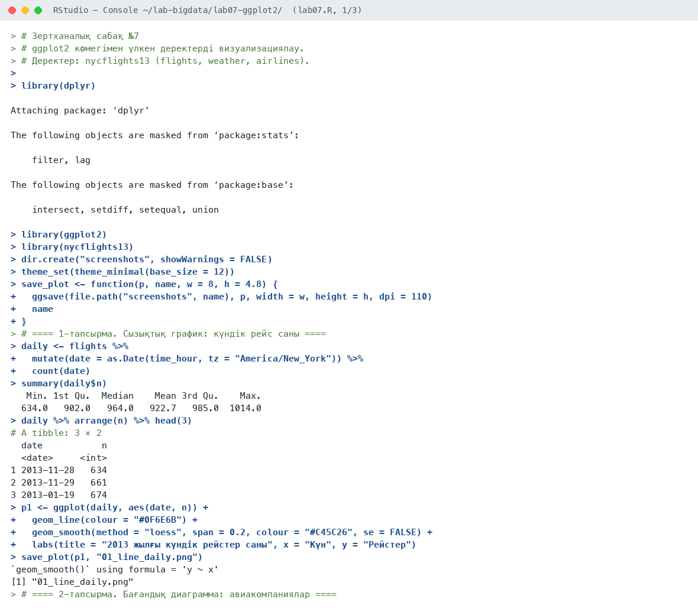

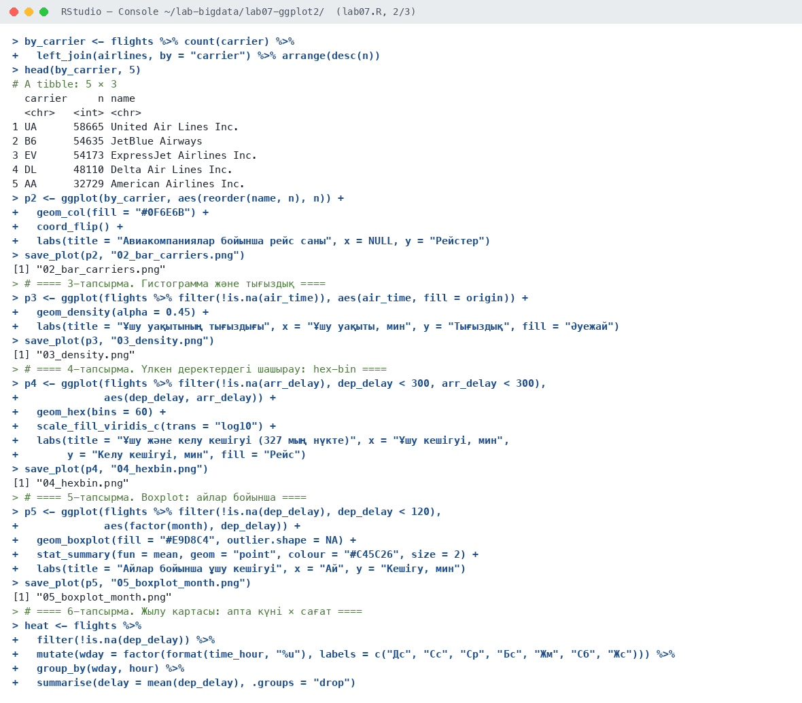

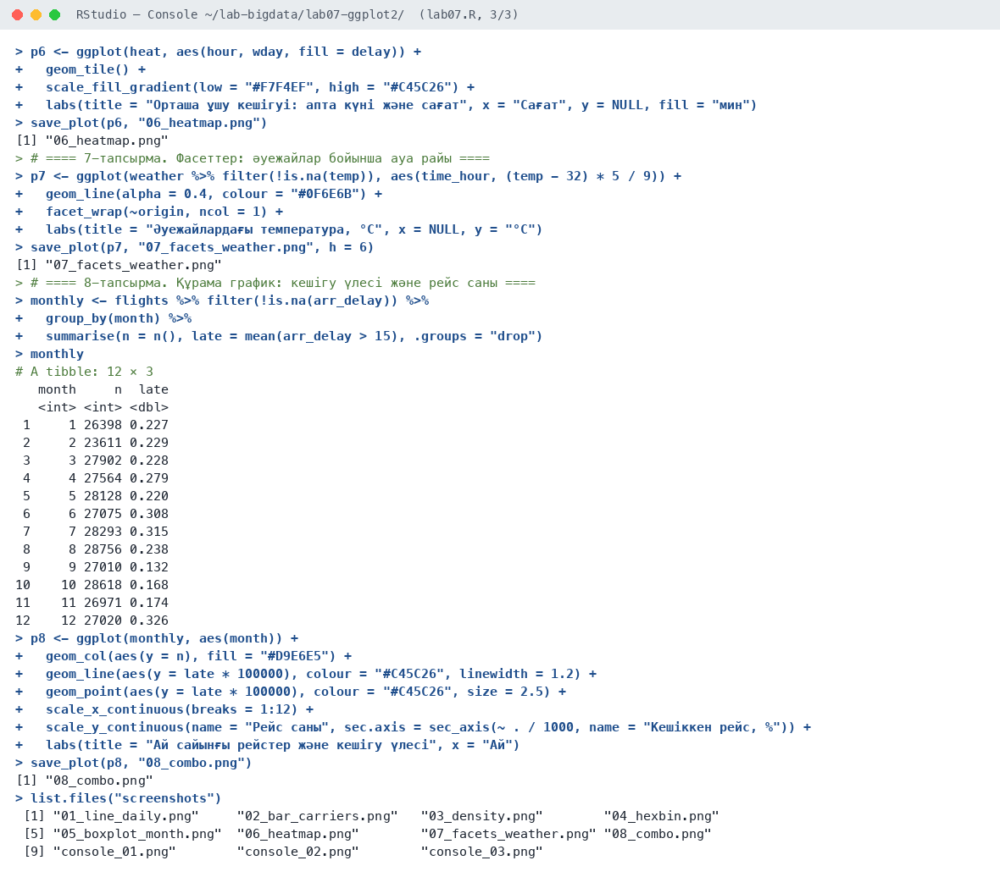

### 5.2. Графиктер

**1-сурет.** Күндік рейстер саны және тегістелген тренд

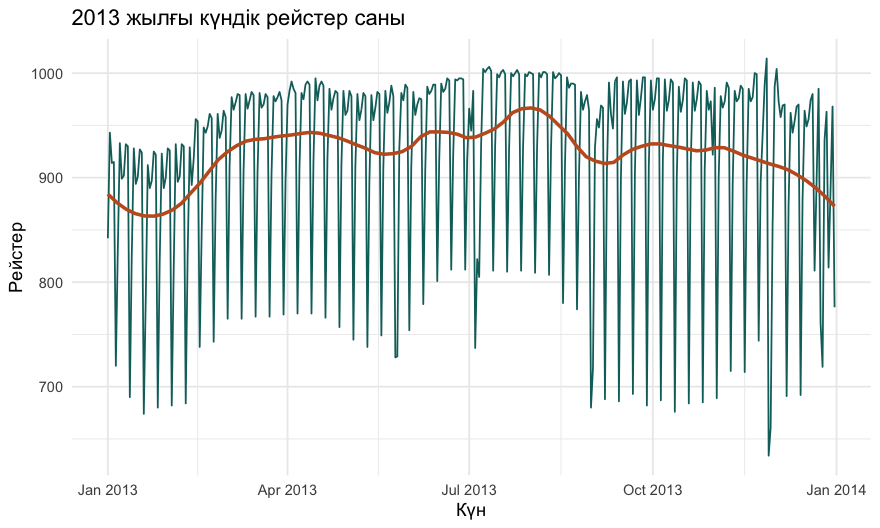

**2-сурет.** Авиакомпаниялар бойынша рейс саны

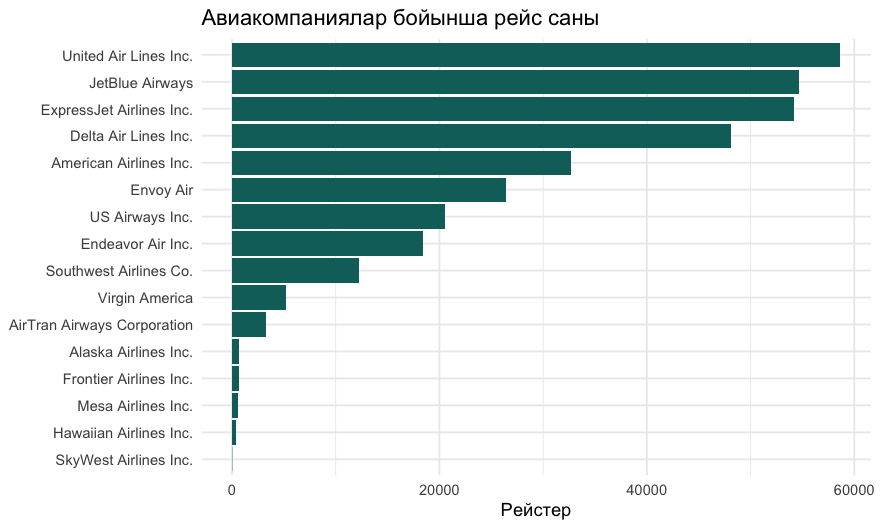

**3-сурет.** Әуежайлар бойынша ұшу уақытының тығыздығы

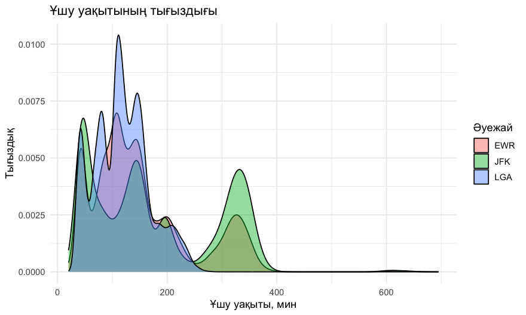

**4-сурет.** Ұшу және келу кешігуі: hex-bin (327 мың нүкте)

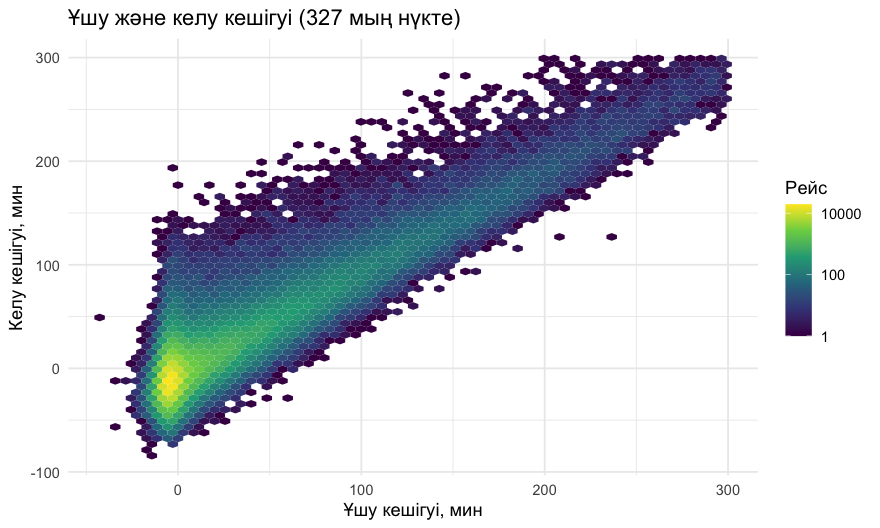

**5-сурет.** Айлар бойынша ұшу кешігуі

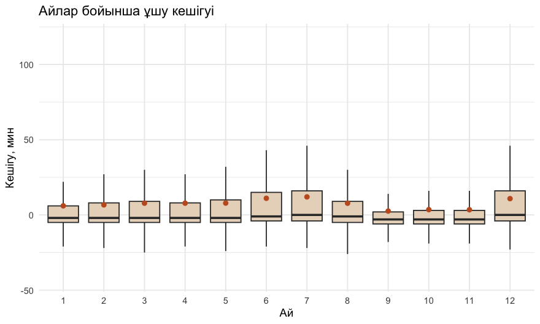

**6-сурет.** Жылу картасы: апта күні × сағат

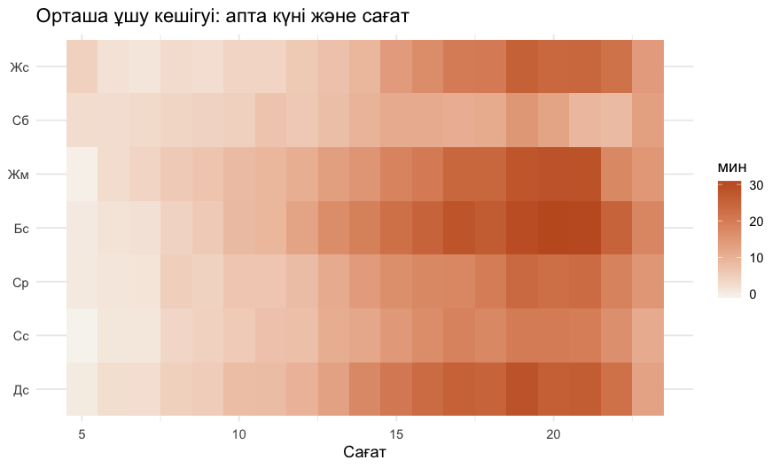

**7-сурет.** Фасеттер: әуежайлардағы температура

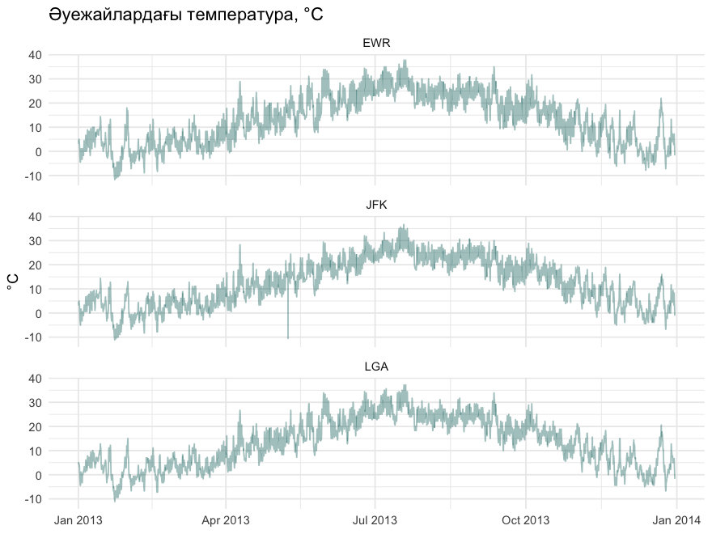

**8-сурет.** Құрама график: рейс саны және кешігу үлесі

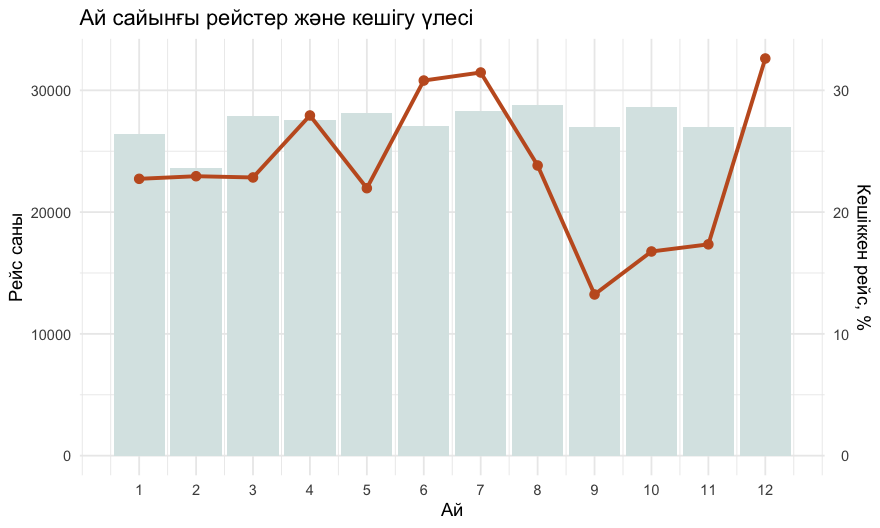

## 6. Бақылау сұрақтарына жауаптар

**1. Графика грамматикасының негізгі компоненттері?**

Деректер (data), эстетика (aes: x, y, түс, өлшем), геометрия (geom), статистикалық түрлендіру (stat), шкала (scale), координаттар (coord), фасеттер (facet), тема (theme).

**2. Overplotting деген не және оны қалай шешеміз?**

Overplotting — нүктелер көп болғанда бір-бірін жауып қалуы. Шешімі: мөлдірлік (alpha), hex-bin немесе 2D тығыздық, таңдама алу, агрегаттау.

**3. facet_wrap() не үшін қолданылады?**

`facet_wrap()` деректерді категория бойынша бөліп, әр категорияға жеке шағын график салады.

**4. aes() функциясының рөлі?**

`aes()` деректердің айнымалыларын графиктің визуалды қасиеттеріне (x, y, түс, толтыру, өлшем, пішін) байланыстырады.

## 7. Қорытынды

ggplot2 арқылы 8 түрлі визуализация құрылды: сызықтық, бағандық, тығыздық, hex-bin, boxplot, жылу картасы, фасеттер және екі осьті құрама график. Үлкен деректер үшін нүктелерді агрегаттау (hex-bin, жылу картасы) тиімді екені көрсетілді. Визуализация кешігудің маусымдық (жаз, желтоқсан) және тәуліктік (кешкі сағаттар) заңдылықтарын анықтады.

## 8. Қолданылған әдебиеттер

1. Черемухин А.Д. Большие данные: учебное пособие. — Москва: Ай Пи Ар Медиа, 2023. — 728 с.
2. Wickham H., Çetinkaya-Rundel M., Grolemund G. R for Data Science. 2nd ed. — O'Reilly, 2023. URL: https://r4ds.hadley.nz
3. R Core Team. R: A Language and Environment for Statistical Computing. — Vienna, 2026. URL: https://www.r-project.org
4. Сухобоков А.А., Лахвич Д.С. Влияние инструментария Big Data на развитие научных дисциплин, связанных с моделированием // Наука и образование: МГТУ им. Н.Э. Баумана.
5. Wickham H. ggplot2: Elegant Graphics for Data Analysis. 3rd ed. — Springer. URL: https://ggplot2-book.org
