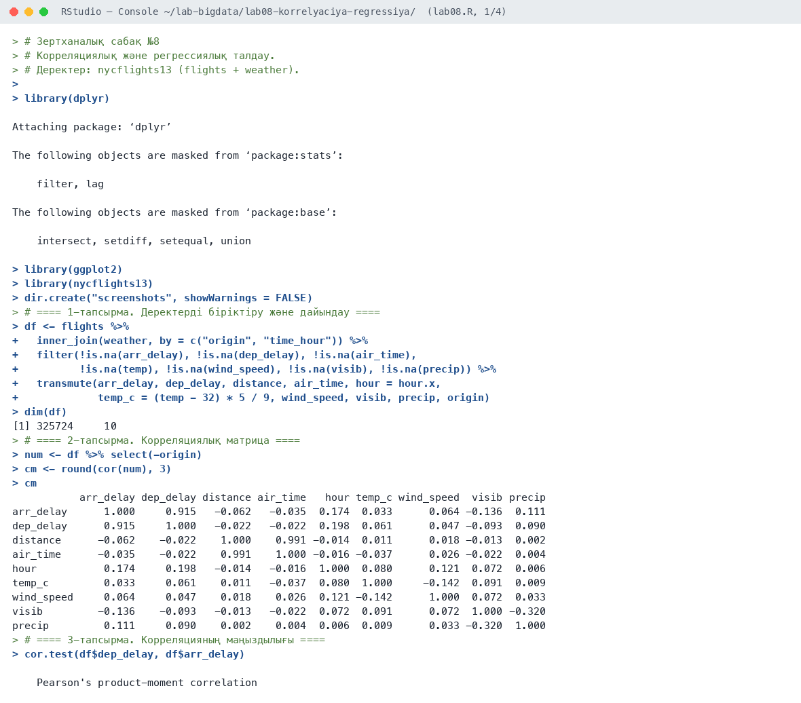
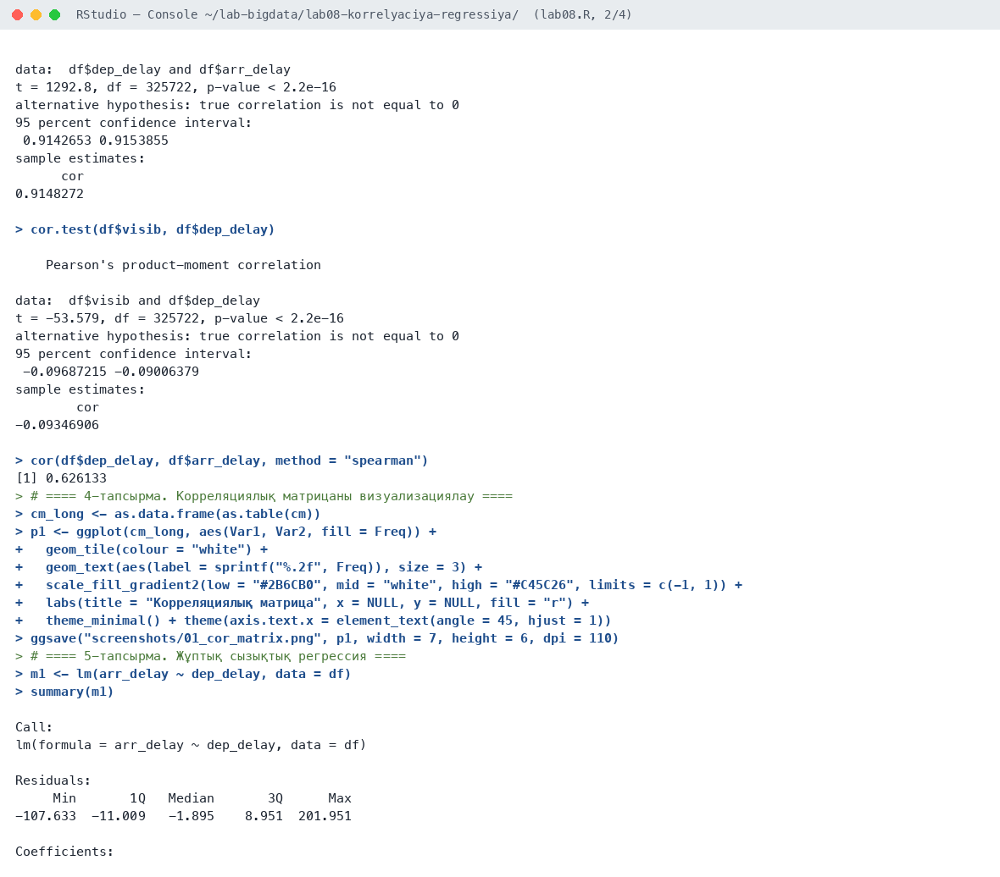
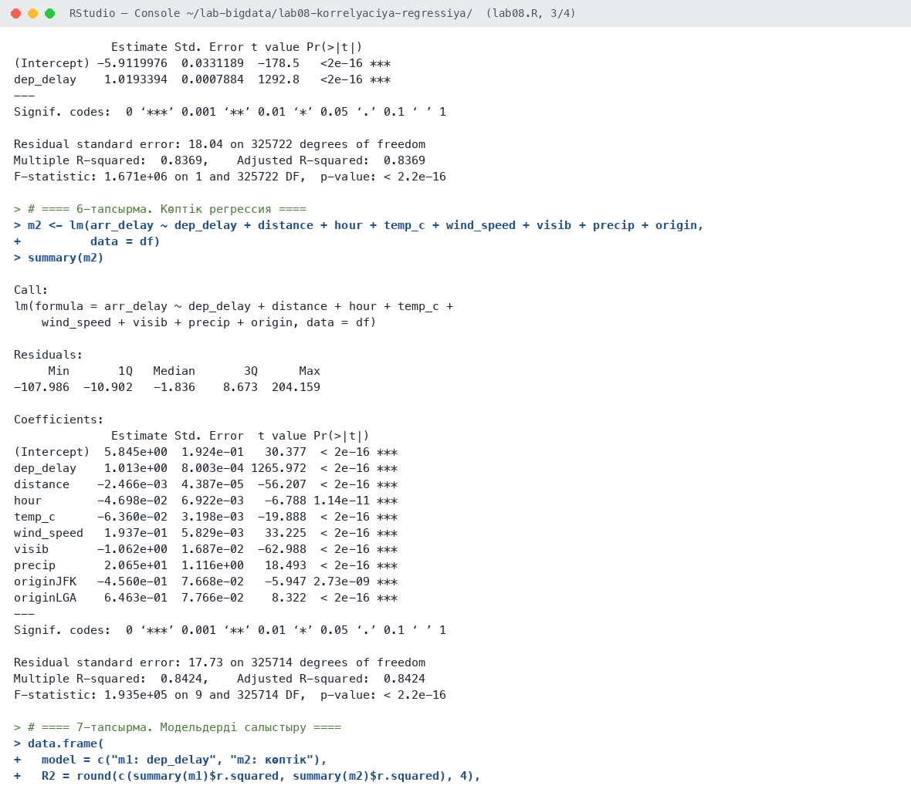
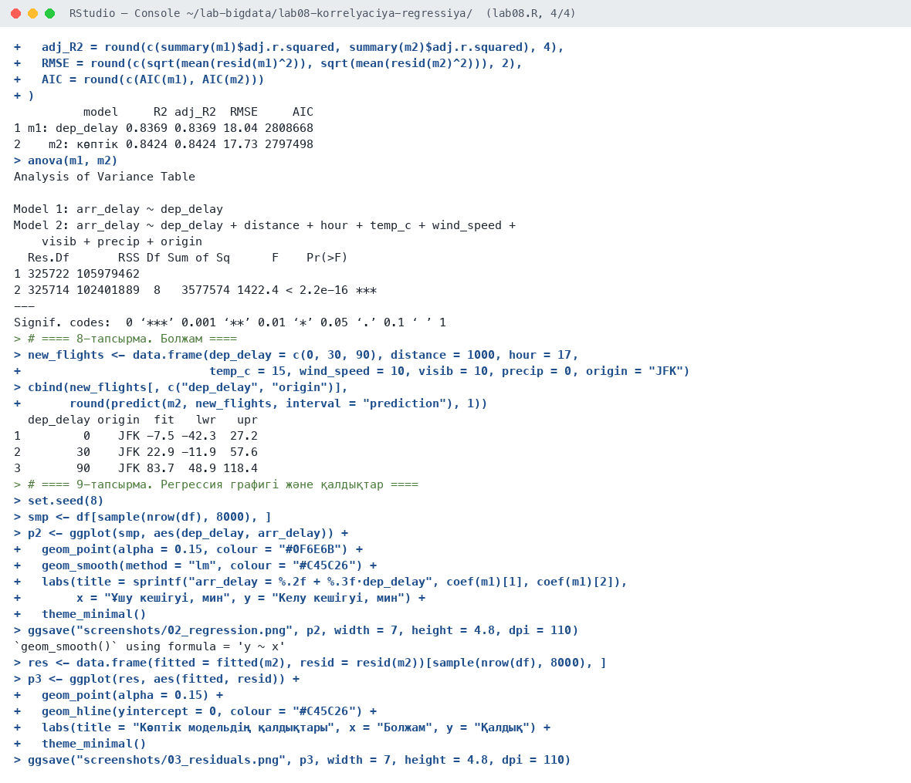
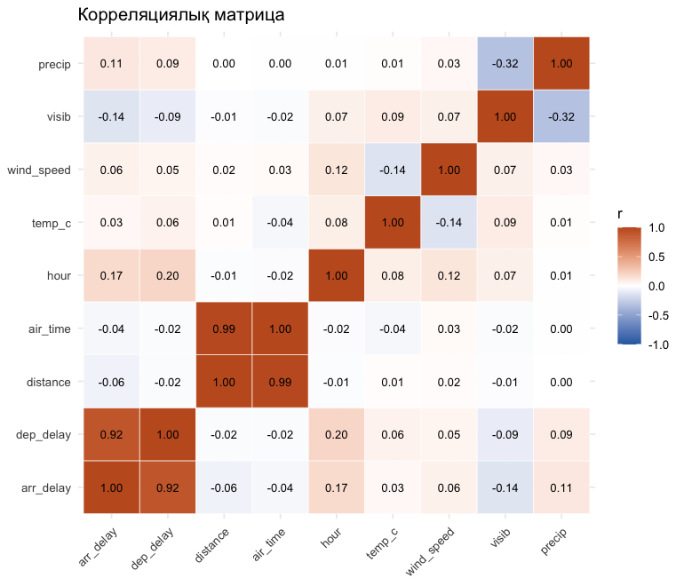
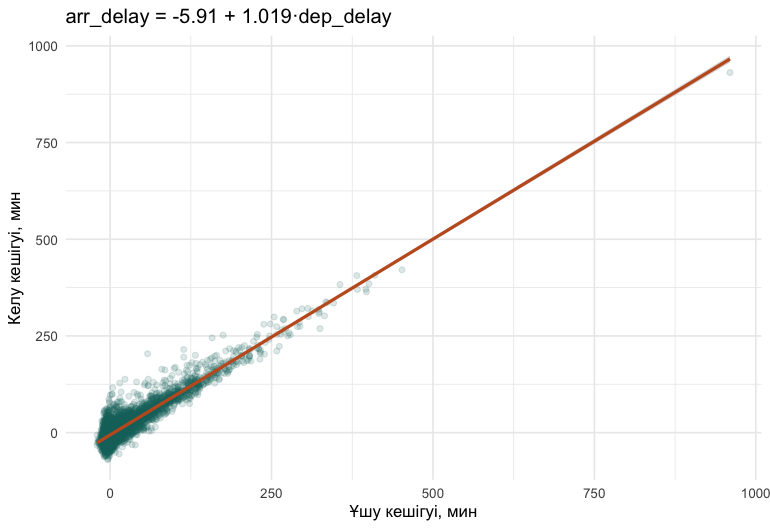
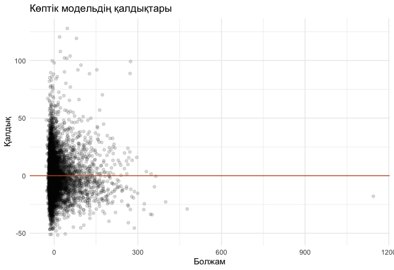

# Зертханалық сабақ №8

**Тақырыбы:** Корреляциялық және регрессиялық талдау

**Пәні:** Үлкен деректерді талдау  
**ББ:** <білім беру бағдарламасы, курс, топ>  
**Оқытушы:** <оқытушының аты-жөні>  
**Орындаушы:** <студенттің аты-жөні>  
**Күні:** 2026-10-05

---

## 1. Жұмыстың мақсаты

Айнымалылар арасындағы байланысты корреляция коэффициенттері арқылы бағалау, жұптық және көптік сызықтық регрессия модельдерін құру, сапасын бағалау және болжам жасау.

## 2. Теориялық бөлім

**Корреляция** екі айнымалының сызықтық байланысының күшін көрсетеді: Пирсон коэффициенті r ∈ [−1; 1]. |r| > 0,7 — күшті, 0,3–0,7 — орташа, < 0,3 — әлсіз байланыс. Спирмен коэффициенті рангтерге негізделген және шығарындыларға төзімді.

**Сызықтық регрессия** Y = b₀ + b₁X₁ + … + bₖXₖ + ε теңдеуін ең кіші квадраттар әдісімен бағалайды. Сапа көрсеткіштері: R² (түсіндірілген дисперсия үлесі), түзетілген R², RMSE, F-тест, коэффициенттердің t-тесті, AIC.

## 3. Қолданылған құралдар

- **Орта:** R 4.6.1, RStudio, macOS (Apple M-series, 8 ядро)
- **Пакеттер:** base R stats, dplyr, ggplot2, nycflights13
- **Скрипт:** `lab08.R` (толық нәтиже — `output.txt`)

## 4. Жұмыстың орындалу барысы

Скрипттің басы (пакеттерді қосу):

```r
# Зертханалық сабақ №8
# Корреляциялық және регрессиялық талдау.
# Деректер: nycflights13 (flights + weather).

library(dplyr)
library(ggplot2)
library(nycflights13)

dir.create("screenshots", showWarnings = FALSE)
```

### 4.1. 1-тапсырма. Деректерді біріктіру және дайындау

```r
df <- flights %>%
  inner_join(weather, by = c("origin", "time_hour")) %>%
  filter(!is.na(arr_delay), !is.na(dep_delay), !is.na(air_time),
         !is.na(temp), !is.na(wind_speed), !is.na(visib), !is.na(precip)) %>%
  transmute(arr_delay, dep_delay, distance, air_time, hour = hour.x,
            temp_c = (temp - 32) * 5 / 9, wind_speed, visib, precip, origin)
dim(df)
```

Нәтиже:

```text
[1] 325724     10
```

**Түсіндірме:** Рейстер ауа райы кестесімен біріктірілді: 325 724 жол, 10 айнымалы.

### 4.2. 2-тапсырма. Корреляциялық матрица

```r
num <- df %>% select(-origin)
cm <- round(cor(num), 3)
cm
```

Нәтиже:

```text
           arr_delay dep_delay distance air_time   hour temp_c wind_speed  visib precip
arr_delay      1.000     0.915   -0.062   -0.035  0.174  0.033      0.064 -0.136  0.111
dep_delay      0.915     1.000   -0.022   -0.022  0.198  0.061      0.047 -0.093  0.090
distance      -0.062    -0.022    1.000    0.991 -0.014  0.011      0.018 -0.013  0.002
air_time      -0.035    -0.022    0.991    1.000 -0.016 -0.037      0.026 -0.022  0.004
hour           0.174     0.198   -0.014   -0.016  1.000  0.080      0.121  0.072  0.006
temp_c         0.033     0.061    0.011   -0.037  0.080  1.000     -0.142  0.091  0.009
wind_speed     0.064     0.047    0.018    0.026  0.121 -0.142      1.000  0.072  0.033
visib         -0.136    -0.093   -0.013   -0.022  0.072  0.091      0.072  1.000 -0.320
precip         0.111     0.090    0.002    0.004  0.006  0.009      0.033 -0.320  1.000
```

**Түсіндірме:** Ең күшті байланыс: arr_delay мен dep_delay (r = 0,915). distance пен air_time (0,991) — бір-бірін қайталайтын айнымалылар. Көріну қашықтығы (visib) кешігумен кері байланысты (−0,136).

### 4.3. 3-тапсырма. Корреляцияның маңыздылығы

```r
cor.test(df$dep_delay, df$arr_delay)
cor.test(df$visib, df$dep_delay)
cor(df$dep_delay, df$arr_delay, method = "spearman")
```

Нәтиже:

```text
    Pearson's product-moment correlation

data:  df$dep_delay and df$arr_delay
t = 1292.8, df = 325722, p-value < 2.2e-16
alternative hypothesis: true correlation is not equal to 0
95 percent confidence interval:
 0.9142653 0.9153855
sample estimates:
      cor 
0.9148272 


    Pearson's product-moment correlation

data:  df$visib and df$dep_delay
t = -53.579, df = 325722, p-value < 2.2e-16
alternative hypothesis: true correlation is not equal to 0
95 percent confidence interval:
 -0.09687215 -0.09006379
sample estimates:
        cor 
-0.09346906 

[1] 0.626133
```

**Түсіндірме:** Барлық корреляциялар маңызды (p < 2,2·10⁻¹⁶). Спирмен коэффициенті 0,626 — Пирсоннан төмен, себебі қатты байланыс ұзақ кешігулерде байқалады.

### 4.4. 4-тапсырма. Корреляциялық матрицаны визуализациялау

```r
cm_long <- as.data.frame(as.table(cm))
p1 <- ggplot(cm_long, aes(Var1, Var2, fill = Freq)) +
  geom_tile(colour = "white") +
  geom_text(aes(label = sprintf("%.2f", Freq)), size = 3) +
  scale_fill_gradient2(low = "#2B6CB0", mid = "white", high = "#C45C26", limits = c(-1, 1)) +
  labs(title = "Корреляциялық матрица", x = NULL, y = NULL, fill = "r") +
  theme_minimal() + theme(axis.text.x = element_text(angle = 45, hjust = 1))
ggsave("screenshots/01_cor_matrix.png", p1, width = 7, height = 6, dpi = 110)
```

### 4.5. 5-тапсырма. Жұптық сызықтық регрессия

```r
m1 <- lm(arr_delay ~ dep_delay, data = df)
summary(m1)
```

Нәтиже:

```text
Call:
lm(formula = arr_delay ~ dep_delay, data = df)

Residuals:
     Min       1Q   Median       3Q      Max 
-107.633  -11.009   -1.895    8.951  201.951 

Coefficients:
              Estimate Std. Error t value Pr(>|t|)    
(Intercept) -5.9119976  0.0331189  -178.5   <2e-16 ***
dep_delay    1.0193394  0.0007884  1292.8   <2e-16 ***
---
Signif. codes:  0 ‘***’ 0.001 ‘**’ 0.01 ‘*’ 0.05 ‘.’ 0.1 ‘ ’ 1

Residual standard error: 18.04 on 325722 degrees of freedom
Multiple R-squared:  0.8369,    Adjusted R-squared:  0.8369 
F-statistic: 1.671e+06 on 1 and 325722 DF,  p-value: < 2.2e-16
```

**Түсіндірме:** arr_delay = −5,91 + 1,019·dep_delay. Ұшу 1 минут кешіксе, келу ~1,02 минут кешігеді. R² = 0,837.

### 4.6. 6-тапсырма. Көптік регрессия

```r
m2 <- lm(arr_delay ~ dep_delay + distance + hour + temp_c + wind_speed + visib + precip + origin,
         data = df)
summary(m2)
```

Нәтиже:

```text
Call:
lm(formula = arr_delay ~ dep_delay + distance + hour + temp_c + 
    wind_speed + visib + precip + origin, data = df)

Residuals:
     Min       1Q   Median       3Q      Max 
-107.986  -10.902   -1.836    8.673  204.159 

Coefficients:
              Estimate Std. Error  t value Pr(>|t|)    
(Intercept)  5.845e+00  1.924e-01   30.377  < 2e-16 ***
dep_delay    1.013e+00  8.003e-04 1265.972  < 2e-16 ***
distance    -2.466e-03  4.387e-05  -56.207  < 2e-16 ***
hour        -4.698e-02  6.922e-03   -6.788 1.14e-11 ***
temp_c      -6.360e-02  3.198e-03  -19.888  < 2e-16 ***
wind_speed   1.937e-01  5.829e-03   33.225  < 2e-16 ***
visib       -1.062e+00  1.687e-02  -62.988  < 2e-16 ***
precip       2.065e+01  1.116e+00   18.493  < 2e-16 ***
originJFK   -4.560e-01  7.668e-02   -5.947 2.73e-09 ***
originLGA    6.463e-01  7.766e-02    8.322  < 2e-16 ***
---
Signif. codes:  0 ‘***’ 0.001 ‘**’ 0.01 ‘*’ 0.05 ‘.’ 0.1 ‘ ’ 1

Residual standard error: 17.73 on 325714 degrees of freedom
Multiple R-squared:  0.8424,    Adjusted R-squared:  0.8424 
F-statistic: 1.935e+05 on 9 and 325714 DF,  p-value: < 2.2e-16
```

**Түсіндірме:** Көптік модельде барлық факторлар маңызды: жауын-шашын (+20,7 мин дюймға), көріну 1 мильге азайса +1,06 мин, жел +0,19 мин. Қашықтық теріс: ұзақ рейстер ауада уақытты қуып жетеді. R² = 0,842.

### 4.7. 7-тапсырма. Модельдерді салыстыру

```r
data.frame(
  model = c("m1: dep_delay", "m2: көптік"),
  R2 = round(c(summary(m1)$r.squared, summary(m2)$r.squared), 4),
  adj_R2 = round(c(summary(m1)$adj.r.squared, summary(m2)$adj.r.squared), 4),
  RMSE = round(c(sqrt(mean(resid(m1)^2)), sqrt(mean(resid(m2)^2))), 2),
  AIC = round(c(AIC(m1), AIC(m2)))
)
anova(m1, m2)
```

Нәтиже:

```text
          model     R2 adj_R2  RMSE     AIC
1 m1: dep_delay 0.8369 0.8369 18.04 2808668
2    m2: көптік 0.8424 0.8424 17.73 2797498
Analysis of Variance Table

Model 1: arr_delay ~ dep_delay
Model 2: arr_delay ~ dep_delay + distance + hour + temp_c + wind_speed + 
    visib + precip + origin
  Res.Df       RSS Df Sum of Sq      F    Pr(>F)    
1 325722 105979462                                  
2 325714 102401889  8   3577574 1422.4 < 2.2e-16 ***
---
Signif. codes:  0 ‘***’ 0.001 ‘**’ 0.01 ‘*’ 0.05 ‘.’ 0.1 ‘ ’ 1
```

**Түсіндірме:** Көптік модель жақсырақ: RMSE 18,04 → 17,73, AIC төмендеді, ANOVA F = 1 422 (p < 0,001).

### 4.8. 8-тапсырма. Болжам

```r
new_flights <- data.frame(dep_delay = c(0, 30, 90), distance = 1000, hour = 17,
                          temp_c = 15, wind_speed = 10, visib = 10, precip = 0, origin = "JFK")
cbind(new_flights[, c("dep_delay", "origin")],
      round(predict(m2, new_flights, interval = "prediction"), 1))
```

Нәтиже:

```text
  dep_delay origin  fit   lwr   upr
1         0    JFK -7.5 -42.3  27.2
2        30    JFK 22.9 -11.9  57.6
3        90    JFK 83.7  48.9 118.4
```

**Түсіндірме:** JFK, 17:00, 1 000 миль: кешігусіз ұшса −7,5 мин (ертерек келеді), 30 мин кешіксе +22,9 мин, 90 мин кешіксе +83,7 мин.

### 4.9. 9-тапсырма. Регрессия графигі және қалдықтар

```r
set.seed(8)
smp <- df[sample(nrow(df), 8000), ]
p2 <- ggplot(smp, aes(dep_delay, arr_delay)) +
  geom_point(alpha = 0.15, colour = "#0F6E6B") +
  geom_smooth(method = "lm", colour = "#C45C26") +
  labs(title = sprintf("arr_delay = %.2f + %.3f·dep_delay", coef(m1)[1], coef(m1)[2]),
       x = "Ұшу кешігуі, мин", y = "Келу кешігуі, мин") +
  theme_minimal()
ggsave("screenshots/02_regression.png", p2, width = 7, height = 4.8, dpi = 110)

res <- data.frame(fitted = fitted(m2), resid = resid(m2))[sample(nrow(df), 8000), ]
p3 <- ggplot(res, aes(fitted, resid)) +
  geom_point(alpha = 0.15) +
  geom_hline(yintercept = 0, colour = "#C45C26") +
  labs(title = "Көптік модельдің қалдықтары", x = "Болжам", y = "Қалдық") +
  theme_minimal()
ggsave("screenshots/03_residuals.png", p3, width = 7, height = 4.8, dpi = 110)
```

Нәтиже:

```text
`geom_smooth()` using formula = 'y ~ x'
```

**Түсіндірме:** Қалдықтар нөлдің айналасында, бірақ ұзақ кешігулерде шашырау ұлғаяды (гетероскедастылық).

## 5. Скриншоттар

### 5.1. RStudio консолі









### 5.2. Графиктер

**1-сурет.** Корреляциялық матрица



**2-сурет.** Жұптық регрессия сызығы



**3-сурет.** Көптік модельдің қалдықтары



## 6. Бақылау сұрақтарына жауаптар

**1. Пирсон мен Спирмен коэффициенттерінің айырмашылығы?**

Пирсон коэффициенті сызықтық байланысты өлшейді және шығарындыларға сезімтал. Спирмен коэффициенті рангтерге негізделген, монотонды байланысты өлшейді және шығарындыларға төзімді.

**2. R² нені көрсетеді?**

R² — тәуелді айнымалының дисперсиясының модель түсіндірген үлесі (0-ден 1-ге дейін). Мысалы, R² = 0,84 — кешігу өзгерісінің 84%-ы түсіндірілді.

**3. Регрессия коэффициенті қалай түсіндіріледі?**

Коэффициент bᵢ — басқа факторлар тұрақты болғанда Xᵢ бір бірлікке өскенде Y-тің орташа өзгерісі. Мысалы, dep_delay коэффициенті 1,019 — ұшу 1 минутқа кешіксе, келу 1,019 минутқа кешігеді.

**4. Мультиколлинеарлық деген не?**

Мультиколлинеарлық — тәуелсіз айнымалылардың бір-бірімен күшті корреляциясы (мысалы, distance пен air_time, r = 0,99). Ол коэффициенттерді тұрақсыз етеді, сондықтан модельге олардың біреуін ғана қосамыз.

## 7. Қорытынды

Келу кешігуінің негізгі факторы — ұшу кешігуі (r = 0,915, R² = 0,837). Ауа райы факторлары (жауын-шашын, көріну, жел) мен қашықтықты қосу модельді статистикалық маңызды түрде жақсартты (R² = 0,842, RMSE 17,73 мин). Модель нақты жағдайлар үшін болжам жасауға қолданылды.

## 8. Қолданылған әдебиеттер

1. Черемухин А.Д. Большие данные: учебное пособие. — Москва: Ай Пи Ар Медиа, 2023. — 728 с.
2. Wickham H., Çetinkaya-Rundel M., Grolemund G. R for Data Science. 2nd ed. — O'Reilly, 2023. URL: https://r4ds.hadley.nz
3. R Core Team. R: A Language and Environment for Statistical Computing. — Vienna, 2026. URL: https://www.r-project.org
4. Сухобоков А.А., Лахвич Д.С. Влияние инструментария Big Data на развитие научных дисциплин, связанных с моделированием // Наука и образование: МГТУ им. Н.Э. Баумана.
