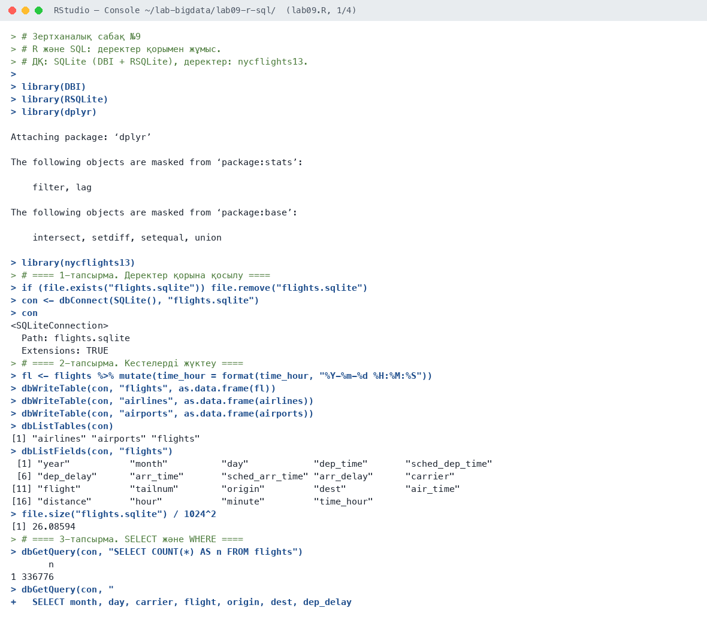
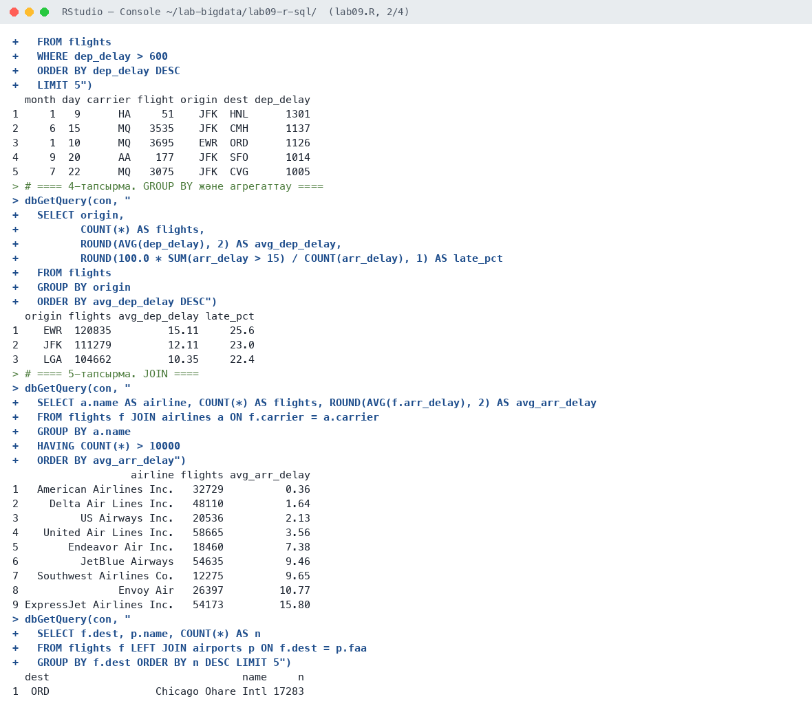
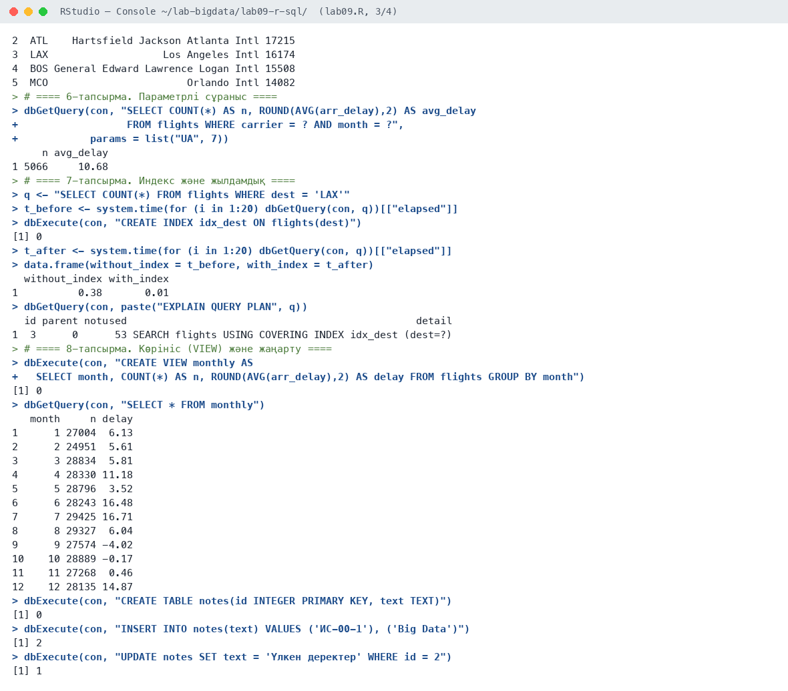
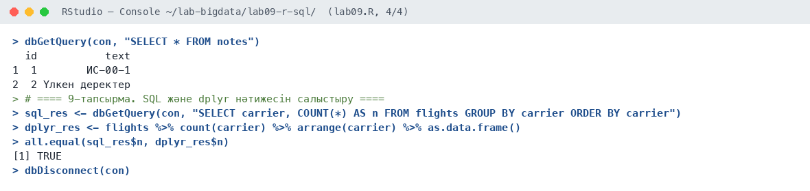

# Зертханалық сабақ №9

**Тақырыбы:** R және SQL: деректер қорымен жұмыс

**Пәні:** Үлкен деректерді талдау  
**ББ:** <білім беру бағдарламасы, курс, топ>  
**Оқытушы:** <оқытушының аты-жөні>  
**Орындаушы:** <студенттің аты-жөні>  
**Күні:** 2026-10-05

---

## 1. Жұмыстың мақсаты

R ортасынан реляциялық деректер қорына қосылу, кестелерді жүктеу, SQL сұраныстарын (SELECT, WHERE, GROUP BY, JOIN, VIEW, INDEX) орындау және нәтижелерді R-де өңдеу.

## 2. Теориялық бөлім

**DBI** — R-дің деректер қорымен жұмыс істеуге арналған бірыңғай интерфейсі. Нақты драйверлер: RSQLite, RPostgres, RMariaDB, odbc. Негізгі функциялар: `dbConnect()`, `dbWriteTable()`, `dbGetQuery()` (SELECT), `dbExecute()` (INSERT/UPDATE/CREATE), `dbDisconnect()`.

**SQLite** — серверсіз, бір файлда сақталатын реляциялық ДҚ. Үлкен деректерде есептеуді ДҚ ішінде жүргізіп, R-ге тек нәтижені алу тиімді. **Индекс** іздеуді толық сканерлеуден (full scan) бинарлық іздеуге ауыстырады.

## 3. Қолданылған құралдар

- **Орта:** R 4.6.1, RStudio, macOS (Apple M-series, 8 ядро)
- **Пакеттер:** DBI, RSQLite, dplyr, nycflights13
- **Скрипт:** `lab09.R` (толық нәтиже — `output.txt`)

## 4. Жұмыстың орындалу барысы

Скрипттің басы (пакеттерді қосу):

```r
# Зертханалық сабақ №9
# R және SQL: деректер қорымен жұмыс.
# ДҚ: SQLite (DBI + RSQLite), деректер: nycflights13.

library(DBI)
library(RSQLite)
library(dplyr)
library(nycflights13)
```

### 4.1. 1-тапсырма. Деректер қорына қосылу

```r
if (file.exists("flights.sqlite")) file.remove("flights.sqlite")
con <- dbConnect(SQLite(), "flights.sqlite")
con
```

Нәтиже:

```text
<SQLiteConnection>
  Path: flights.sqlite
  Extensions: TRUE
```

### 4.2. 2-тапсырма. Кестелерді жүктеу

```r
fl <- flights %>% mutate(time_hour = format(time_hour, "%Y-%m-%d %H:%M:%S"))
dbWriteTable(con, "flights", as.data.frame(fl))
dbWriteTable(con, "airlines", as.data.frame(airlines))
dbWriteTable(con, "airports", as.data.frame(airports))
dbListTables(con)
dbListFields(con, "flights")
file.size("flights.sqlite") / 1024^2
```

Нәтиже:

```text
[1] "airlines" "airports" "flights" 
 [1] "year"           "month"          "day"            "dep_time"       "sched_dep_time"
 [6] "dep_delay"      "arr_time"       "sched_arr_time" "arr_delay"      "carrier"       
[11] "flight"         "tailnum"        "origin"         "dest"           "air_time"      
[16] "distance"       "hour"           "minute"         "time_hour"     
[1] 26.08594
```

**Түсіндірме:** Үш кесте жүктелді, flights кестесі 336 776 жол, файл көлемі 26 МБ.

### 4.3. 3-тапсырма. SELECT және WHERE

```r
dbGetQuery(con, "SELECT COUNT(*) AS n FROM flights")
dbGetQuery(con, "
  SELECT month, day, carrier, flight, origin, dest, dep_delay
  FROM flights
  WHERE dep_delay > 600
  ORDER BY dep_delay DESC
  LIMIT 5")
```

Нәтиже:

```text
       n
1 336776
  month day carrier flight origin dest dep_delay
1     1   9      HA     51    JFK  HNL      1301
2     6  15      MQ   3535    JFK  CMH      1137
3     1  10      MQ   3695    EWR  ORD      1126
4     9  20      AA    177    JFK  SFO      1014
5     7  22      MQ   3075    JFK  CVG      1005
```

**Түсіндірме:** SQL нәтижесі dplyr-мен бірдей: ең ұзақ кешігу — HA 51, 1 301 мин.

### 4.4. 4-тапсырма. GROUP BY және агрегаттау

```r
dbGetQuery(con, "
  SELECT origin,
         COUNT(*) AS flights,
         ROUND(AVG(dep_delay), 2) AS avg_dep_delay,
         ROUND(100.0 * SUM(arr_delay > 15) / COUNT(arr_delay), 1) AS late_pct
  FROM flights
  GROUP BY origin
  ORDER BY avg_dep_delay DESC")
```

Нәтиже:

```text
  origin flights avg_dep_delay late_pct
1    EWR  120835         15.11     25.6
2    JFK  111279         12.11     23.0
3    LGA  104662         10.35     22.4
```

**Түсіндірме:** EWR: орташа ұшу кешігуі 15,1 мин, 25,6% рейс кешігеді — ең нашар әуежай.

### 4.5. 5-тапсырма. JOIN

```r
dbGetQuery(con, "
  SELECT a.name AS airline, COUNT(*) AS flights, ROUND(AVG(f.arr_delay), 2) AS avg_arr_delay
  FROM flights f JOIN airlines a ON f.carrier = a.carrier
  GROUP BY a.name
  HAVING COUNT(*) > 10000
  ORDER BY avg_arr_delay")

dbGetQuery(con, "
  SELECT f.dest, p.name, COUNT(*) AS n
  FROM flights f LEFT JOIN airports p ON f.dest = p.faa
  GROUP BY f.dest ORDER BY n DESC LIMIT 5")
```

Нәтиже:

```text
                   airline flights avg_arr_delay
1   American Airlines Inc.   32729          0.36
2     Delta Air Lines Inc.   48110          1.64
3          US Airways Inc.   20536          2.13
4    United Air Lines Inc.   58665          3.56
5        Endeavor Air Inc.   18460          7.38
6          JetBlue Airways   54635          9.46
7   Southwest Airlines Co.   12275          9.65
8                Envoy Air   26397         10.77
9 ExpressJet Airlines Inc.   54173         15.80
  dest                               name     n
1  ORD                 Chicago Ohare Intl 17283
2  ATL    Hartsfield Jackson Atlanta Intl 17215
3  LAX                   Los Angeles Intl 16174
4  BOS General Edward Lawrence Logan Intl 15508
5  MCO                       Orlando Intl 14082
```

**Түсіндірме:** JOIN: 10 000-нан көп рейсі бар авиакомпаниялардың ең дәлі — American Airlines (0,36 мин). Ең көп ұшатын бағыт — Чикаго О'Хара (17 283 рейс).

### 4.6. 6-тапсырма. Параметрлі сұраныс

```r
dbGetQuery(con, "SELECT COUNT(*) AS n, ROUND(AVG(arr_delay),2) AS avg_delay
                 FROM flights WHERE carrier = ? AND month = ?",
           params = list("UA", 7))
```

Нәтиже:

```text
     n avg_delay
1 5066     10.68
```

**Түсіндірме:** Параметрлі сұраныс (`?`): United Airlines шілдеде 5 066 рейс, орташа кешігу 10,68 мин. Параметрлер SQL injection-нан қорғайды.

### 4.7. 7-тапсырма. Индекс және жылдамдық

```r
q <- "SELECT COUNT(*) FROM flights WHERE dest = 'LAX'"
t_before <- system.time(for (i in 1:20) dbGetQuery(con, q))[["elapsed"]]
dbExecute(con, "CREATE INDEX idx_dest ON flights(dest)")
t_after <- system.time(for (i in 1:20) dbGetQuery(con, q))[["elapsed"]]
data.frame(without_index = t_before, with_index = t_after)
dbGetQuery(con, paste("EXPLAIN QUERY PLAN", q))
```

Нәтиже:

```text
[1] 0
  without_index with_index
1          0.38       0.01
  id parent notused                                                detail
1  3      0      53 SEARCH flights USING COVERING INDEX idx_dest (dest=?)
```

**Түсіндірме:** Индекс сұранысты 38 есе жылдамдатты (0,38 с → 0,01 с, 20 рет қайталау). `EXPLAIN QUERY PLAN` индекс қолданылғанын көрсетеді.

### 4.8. 8-тапсырма. Көрініс (VIEW) және жаңарту

```r
dbExecute(con, "CREATE VIEW monthly AS
  SELECT month, COUNT(*) AS n, ROUND(AVG(arr_delay),2) AS delay FROM flights GROUP BY month")
dbGetQuery(con, "SELECT * FROM monthly")
dbExecute(con, "CREATE TABLE notes(id INTEGER PRIMARY KEY, text TEXT)")
dbExecute(con, "INSERT INTO notes(text) VALUES ('ИС-00-1'), ('Big Data')")
dbExecute(con, "UPDATE notes SET text = 'Үлкен деректер' WHERE id = 2")
dbGetQuery(con, "SELECT * FROM notes")
```

Нәтиже:

```text
[1] 0
   month     n delay
1      1 27004  6.13
2      2 24951  5.61
3      3 28834  5.81
4      4 28330 11.18
5      5 28796  3.52
6      6 28243 16.48
7      7 29425 16.71
8      8 29327  6.04
9      9 27574 -4.02
10    10 28889 -0.17
11    11 27268  0.46
12    12 28135 14.87
[1] 0
[1] 2
[1] 1
  id           text
1  1        ИС-00-1
2  2 Үлкен деректер
```

**Түсіндірме:** VIEW ай сайынғы статистиканы сақтайды; INSERT/UPDATE командалары орындалды.

### 4.9. 9-тапсырма. SQL және dplyr нәтижесін салыстыру

```r
sql_res <- dbGetQuery(con, "SELECT carrier, COUNT(*) AS n FROM flights GROUP BY carrier ORDER BY carrier")
dplyr_res <- flights %>% count(carrier) %>% arrange(carrier) %>% as.data.frame()
all.equal(sql_res$n, dplyr_res$n)

dbDisconnect(con)
```

Нәтиже:

```text
[1] TRUE
```

**Түсіндірме:** SQL пен dplyr нәтижелері толық сәйкес (`all.equal` = TRUE).

## 5. Скриншоттар

### 5.1. RStudio консолі









## 6. Бақылау сұрақтарына жауаптар

**1. DBI пакетінің рөлі?**

DBI — барлық деректер қорлары үшін бірыңғай интерфейс. Бір код (dbConnect, dbGetQuery) SQLite, PostgreSQL, MySQL сияқты әртүрлі ДҚ-мен драйверді ауыстыру арқылы жұмыс істейді.

**2. dbGetQuery() мен dbExecute() айырмашылығы?**

`dbGetQuery()` SELECT сұранысын орындап, нәтижені data.frame ретінде қайтарады. `dbExecute()` деректерді өзгертетін командаларды (INSERT, UPDATE, CREATE) орындап, өзгерген жолдар санын қайтарады.

**3. Индекс сұранысты қалай жылдамдатады?**

Индекс — бағанның сұрыпталған құрылымы (B-ағаш). Ол толық кестені сканерлеудің орнына бинарлық іздеу арқылы қажетті жолдарды тез табады.

**4. Параметрлі сұраныс не үшін қажет?**

Параметрлі сұраныс SQL кодын деректерден бөледі: SQL injection шабуылынан қорғайды және бір сұранысты әртүрлі мәндермен қайта қолдануға мүмкіндік береді.

## 7. Қорытынды

R-ден SQLite деректер қорына қосылып, 336 мың жолдық кестемен SQL сұраныстары орындалды: сүзу, топтау, JOIN, параметрлі сұраныс, VIEW, INSERT/UPDATE. Индекс іздеуді 38 есе жылдамдатты. SQL мен dplyr нәтижелерінің сәйкестігі тексерілді.

## 8. Қолданылған әдебиеттер

1. Черемухин А.Д. Большие данные: учебное пособие. — Москва: Ай Пи Ар Медиа, 2023. — 728 с.
2. Wickham H., Çetinkaya-Rundel M., Grolemund G. R for Data Science. 2nd ed. — O'Reilly, 2023. URL: https://r4ds.hadley.nz
3. R Core Team. R: A Language and Environment for Statistical Computing. — Vienna, 2026. URL: https://www.r-project.org
4. Сухобоков А.А., Лахвич Д.С. Влияние инструментария Big Data на развитие научных дисциплин, связанных с моделированием // Наука и образование: МГТУ им. Н.Э. Баумана.
5. DBI және RSQLite құжаттамасы. URL: https://dbi.r-dbi.org
