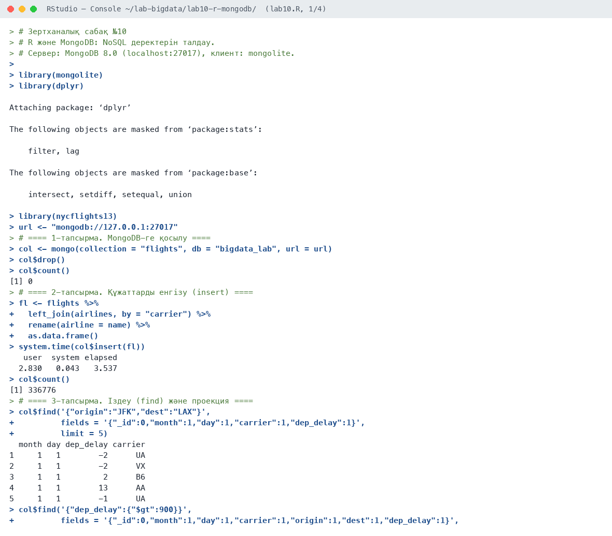
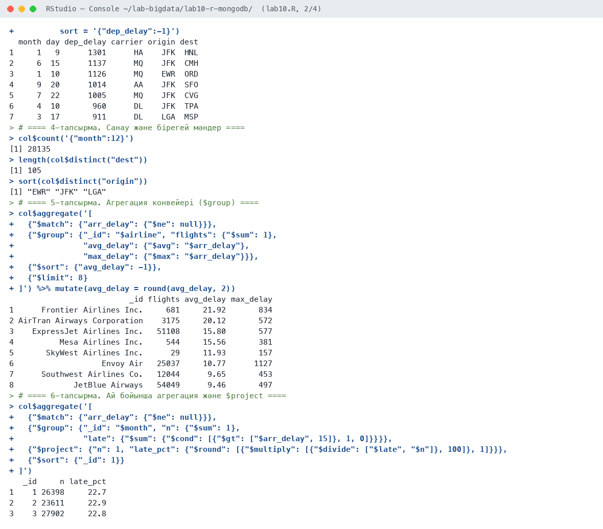
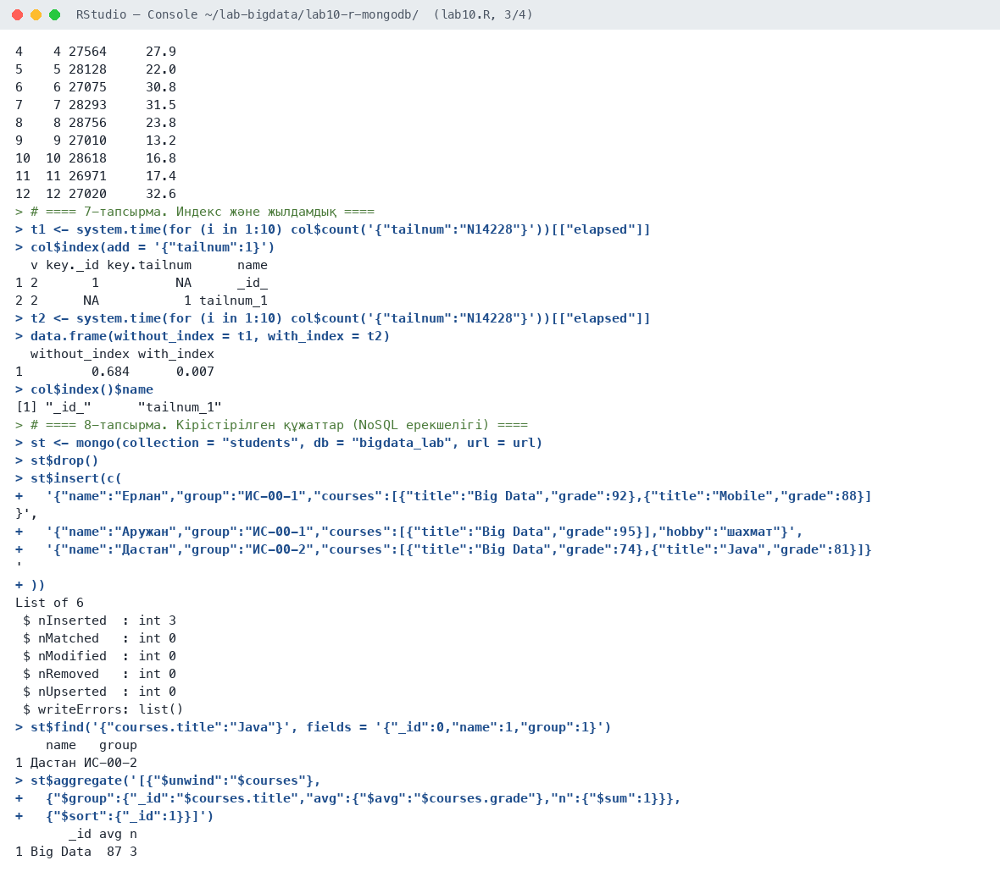
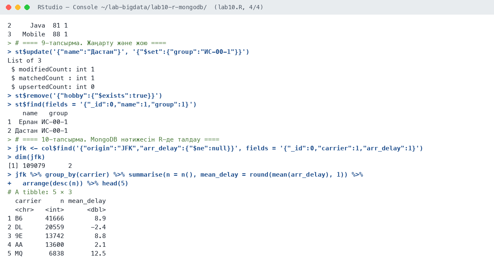

# Зертханалық сабақ №10

**Тақырыбы:** R және MongoDB: NoSQL деректерін талдау

**Пәні:** Үлкен деректерді талдау  
**ББ:** <білім беру бағдарламасы, курс, топ>  
**Оқытушы:** <оқытушының аты-жөні>  
**Орындаушы:** <студенттің аты-жөні>  
**Күні:** 2026-10-05

---

## 1. Жұмыстың мақсаты

NoSQL құжаттық деректер қоры MongoDB-мен R арқылы жұмыс істеу: құжаттарды енгізу, іздеу, агрегация конвейері, индекс, кірістірілген құжаттар, жаңарту және жою.

## 2. Теориялық бөлім

**MongoDB** — құжаттық NoSQL деректер қоры: деректер кестеде емес, коллекцияларда BSON/JSON құжаттары түрінде сақталады. Құжаттардың құрылымы әртүрлі болуы мүмкін (схемасыз), ішкі массивтер мен объектілерді сақтай алады, көлденең масштабталады (sharding).

R-ден `mongolite` пакеті арқылы жұмыс істейміз: `insert()`, `find(query, fields, sort)`, `count()`, `distinct()`, `aggregate(pipeline)`, `index()`, `update()`, `remove()`. Агрегация конвейері кезеңдерден тұрады: `$match` (сүзу), `$group` (топтау), `$project` (бағандар), `$sort`, `$unwind` (массивті жазу).

## 3. Қолданылған құралдар

- **Орта:** R 4.6.1, RStudio, macOS (Apple M-series, 8 ядро)
- **Пакеттер:** mongolite, MongoDB Server 8.0.4 (localhost:27017), dplyr, nycflights13
- **Скрипт:** `lab10.R` (толық нәтиже — `output.txt`)

## 4. Жұмыстың орындалу барысы

Скрипттің басы (пакеттерді қосу):

```r
# Зертханалық сабақ №10
# R және MongoDB: NoSQL деректерін талдау.
# Сервер: MongoDB 8.0 (localhost:27017), клиент: mongolite.

library(mongolite)
library(dplyr)
library(nycflights13)

url <- "mongodb://127.0.0.1:27017"
```

### 4.1. 1-тапсырма. MongoDB-ге қосылу

```r
col <- mongo(collection = "flights", db = "bigdata_lab", url = url)
col$drop()
col$count()
```

Нәтиже:

```text
[1] 0
```

**Түсіндірме:** Жергілікті MongoDB серверіне қосылдық, коллекция бос (0).

### 4.2. 2-тапсырма. Құжаттарды енгізу (insert)

```r
fl <- flights %>%
  left_join(airlines, by = "carrier") %>%
  rename(airline = name) %>%
  as.data.frame()
system.time(col$insert(fl))
col$count()
```

Нәтиже:

```text
   user  system elapsed 
  2.830   0.043   3.537 
[1] 336776
```

**Түсіндірме:** 336 776 құжат 3,5 секундта енгізілді.

### 4.3. 3-тапсырма. Іздеу (find) және проекция

```r
col$find('{"origin":"JFK","dest":"LAX"}',
         fields = '{"_id":0,"month":1,"day":1,"carrier":1,"dep_delay":1}',
         limit = 5)
col$find('{"dep_delay":{"$gt":900}}',
         fields = '{"_id":0,"month":1,"day":1,"carrier":1,"origin":1,"dest":1,"dep_delay":1}',
         sort = '{"dep_delay":-1}')
```

Нәтиже:

```text
  month day dep_delay carrier
1     1   1        -2      UA
2     1   1        -2      VX
3     1   1         2      B6
4     1   1        13      AA
5     1   1        -1      UA
  month day dep_delay carrier origin dest
1     1   9      1301      HA    JFK  HNL
2     6  15      1137      MQ    JFK  CMH
3     1  10      1126      MQ    EWR  ORD
4     9  20      1014      AA    JFK  SFO
5     7  22      1005      MQ    JFK  CVG
6     4  10       960      DL    JFK  TPA
7     3  17       911      DL    LGA  MSP
```

**Түсіндірме:** Сұраныстар JSON түрінде жазылады: `{"dep_delay":{"$gt":900}}` — 900 минуттан артық кешіккен 7 рейс.

### 4.4. 4-тапсырма. Санау және бірегей мәндер

```r
col$count('{"month":12}')
length(col$distinct("dest"))
sort(col$distinct("origin"))
```

Нәтиже:

```text
[1] 28135
[1] 105
[1] "EWR" "JFK" "LGA"
```

**Түсіндірме:** Желтоқсанда 28 135 рейс, 105 бірегей бағыт, 3 әуежай.

### 4.5. 5-тапсырма. Агрегация конвейері ($group)

```r
col$aggregate('[
  {"$match": {"arr_delay": {"$ne": null}}},
  {"$group": {"_id": "$airline", "flights": {"$sum": 1},
              "avg_delay": {"$avg": "$arr_delay"},
              "max_delay": {"$max": "$arr_delay"}}},
  {"$sort": {"avg_delay": -1}},
  {"$limit": 8}
]') %>% mutate(avg_delay = round(avg_delay, 2))
```

Нәтиже:

```text
                          _id flights avg_delay max_delay
1      Frontier Airlines Inc.     681     21.92       834
2 AirTran Airways Corporation    3175     20.12       572
3    ExpressJet Airlines Inc.   51108     15.80       577
4          Mesa Airlines Inc.     544     15.56       381
5       SkyWest Airlines Inc.      29     11.93       157
6                   Envoy Air   25037     10.77      1127
7      Southwest Airlines Co.   12044      9.65       453
8             JetBlue Airways   54049      9.46       497
```

**Түсіндірме:** `$group` нәтижесі dplyr және SQL нәтижелерімен сәйкес: ең нашар — Frontier (21,92 мин).

### 4.6. 6-тапсырма. Ай бойынша агрегация және $project

```r
col$aggregate('[
  {"$match": {"arr_delay": {"$ne": null}}},
  {"$group": {"_id": "$month", "n": {"$sum": 1},
              "late": {"$sum": {"$cond": [{"$gt": ["$arr_delay", 15]}, 1, 0]}}}},
  {"$project": {"n": 1, "late_pct": {"$round": [{"$multiply": [{"$divide": ["$late", "$n"]}, 100]}, 1]}}},
  {"$sort": {"_id": 1}}
]')
```

Нәтиже:

```text
   _id     n late_pct
1    1 26398     22.7
2    2 23611     22.9
3    3 27902     22.8
4    4 27564     27.9
5    5 28128     22.0
6    6 27075     30.8
7    7 28293     31.5
8    8 28756     23.8
9    9 27010     13.2
10  10 28618     16.8
11  11 26971     17.4
12  12 27020     32.6
```

**Түсіндірме:** Ай бойынша кешігу пайызы `$cond` және `$project` арқылы ДҚ ішінде есептелді.

### 4.7. 7-тапсырма. Индекс және жылдамдық

```r
t1 <- system.time(for (i in 1:10) col$count('{"tailnum":"N14228"}'))[["elapsed"]]
col$index(add = '{"tailnum":1}')
t2 <- system.time(for (i in 1:10) col$count('{"tailnum":"N14228"}'))[["elapsed"]]
data.frame(without_index = t1, with_index = t2)
col$index()$name
```

Нәтиже:

```text
  v key._id key.tailnum      name
1 2       1          NA      _id_
2 2      NA           1 tailnum_1
  without_index with_index
1         0.684      0.007
[1] "_id_"      "tailnum_1"
```

**Түсіндірме:** `tailnum` индексі іздеуді ~98 есе жылдамдатты (0,684 с → 0,007 с).

### 4.8. 8-тапсырма. Кірістірілген құжаттар (NoSQL ерекшелігі)

```r
st <- mongo(collection = "students", db = "bigdata_lab", url = url)
st$drop()
st$insert(c(
  '{"name":"Ерлан","group":"ИС-00-1","courses":[{"title":"Big Data","grade":92},{"title":"Mobile","grade":88}]}',
  '{"name":"Аружан","group":"ИС-00-1","courses":[{"title":"Big Data","grade":95}],"hobby":"шахмат"}',
  '{"name":"Дастан","group":"ИС-00-2","courses":[{"title":"Big Data","grade":74},{"title":"Java","grade":81}]}'
))
st$find('{"courses.title":"Java"}', fields = '{"_id":0,"name":1,"group":1}')
st$aggregate('[{"$unwind":"$courses"},
  {"$group":{"_id":"$courses.title","avg":{"$avg":"$courses.grade"},"n":{"$sum":1}}},
  {"$sort":{"_id":1}}]')
```

Нәтиже:

```text
List of 6
 $ nInserted  : int 3
 $ nMatched   : int 0
 $ nModified  : int 0
 $ nRemoved   : int 0
 $ nUpserted  : int 0
 $ writeErrors: list()
    name   group
1 Дастан ИС-00-2
       _id avg n
1 Big Data  87 3
2     Java  81 1
3   Mobile  88 1
```

**Түсіндірме:** Студент құжаттары әртүрлі құрылымда (біреуінде `hobby` өрісі бар) — NoSQL-дың схемасыз ерекшелігі. `$unwind` курстар массивін жазып, пән бойынша орташа баға есептелді.

### 4.9. 9-тапсырма. Жаңарту және жою

```r
st$update('{"name":"Дастан"}', '{"$set":{"group":"ИС-00-1"}}')
st$remove('{"hobby":{"$exists":true}}')
st$find(fields = '{"_id":0,"name":1,"group":1}')
```

Нәтиже:

```text
List of 3
 $ modifiedCount: int 1
 $ matchedCount : int 1
 $ upsertedCount: int 0
    name   group
1  Ерлан ИС-00-1
2 Дастан ИС-00-1
```

**Түсіндірме:** `$set` арқылы топ жаңартылды, `$exists` шарты бойынша құжат жойылды.

### 4.10. 10-тапсырма. MongoDB нәтижесін R-де талдау

```r
jfk <- col$find('{"origin":"JFK","arr_delay":{"$ne":null}}', fields = '{"_id":0,"carrier":1,"arr_delay":1}')
dim(jfk)
jfk %>% group_by(carrier) %>% summarise(n = n(), mean_delay = round(mean(arr_delay), 1)) %>%
  arrange(desc(n)) %>% head(5)
```

Нәтиже:

```text
[1] 109079      2
# A tibble: 5 × 3
  carrier     n mean_delay
  <chr>   <int>      <dbl>
1 B6      41666        8.9
2 DL      20559       -2.4
3 9E      13742        8.8
4 AA      13600        2.1
5 MQ       6838       12.5
```

**Түсіндірме:** MongoDB-ден алынған 109 079 JFK рейсі R-де dplyr-мен талданды.

## 5. Скриншоттар

### 5.1. RStudio консолі









## 6. Бақылау сұрақтарына жауаптар

**1. NoSQL мен SQL ДҚ айырмашылығы?**

SQL ДҚ деректерді қатаң схемасы бар кестелерде сақтайды, JOIN мен транзакцияларды қолдайды. NoSQL ДҚ (мысалы, MongoDB) схемасыз құжаттарды сақтайды, көлденең масштабталады және құрылымы өзгермелі деректерге ыңғайлы.

**2. MongoDB-да құжат пен коллекция деген не?**

Құжат — бір жазба (JSON/BSON объектісі, кірістірілген өрістері мен массивтері болуы мүмкін). Коллекция — құжаттар жиыны, реляциялық ДҚ-дағы кестеге ұқсас.

**3. Агрегация конвейерінің кезеңдері?**

`$match` — сүзу, `$group` — топтау және агрегаттау, `$project` — өрістерді таңдау/есептеу, `$sort` — сұрыптау, `$limit` — шектеу, `$unwind` — массивті жеке құжаттарға жазу, `$lookup` — басқа коллекциямен біріктіру.

**4. $unwind операторы не істейді?**

`$unwind` массив өрісінің әр элементі үшін жеке құжат жасайды. Мысалы, 2 курсы бар студент 2 құжатқа айналады, содан кейін курстар бойынша топтауға болады.

## 7. Қорытынды

R-ден MongoDB-ге 336 мың құжат жүктеліп, find, count, distinct, агрегация конвейері ($match, $group, $project, $unwind), индекс, update және remove операциялары орындалды. Индекс іздеуді ~98 есе жылдамдатты. MongoDB-дың схемасыз құрылымы және кірістірілген құжаттармен жұмыс реляциялық ДҚ-дан басты айырмашылығы ретінде көрсетілді.

## 8. Қолданылған әдебиеттер

1. Черемухин А.Д. Большие данные: учебное пособие. — Москва: Ай Пи Ар Медиа, 2023. — 728 с.
2. Wickham H., Çetinkaya-Rundel M., Grolemund G. R for Data Science. 2nd ed. — O'Reilly, 2023. URL: https://r4ds.hadley.nz
3. R Core Team. R: A Language and Environment for Statistical Computing. — Vienna, 2026. URL: https://www.r-project.org
4. Сухобоков А.А., Лахвич Д.С. Влияние инструментария Big Data на развитие научных дисциплин, связанных с моделированием // Наука и образование: МГТУ им. Н.Э. Баумана.
5. mongolite User Manual. URL: https://jeroen.github.io/mongolite/; MongoDB Manual. URL: https://www.mongodb.com/docs/manual/
