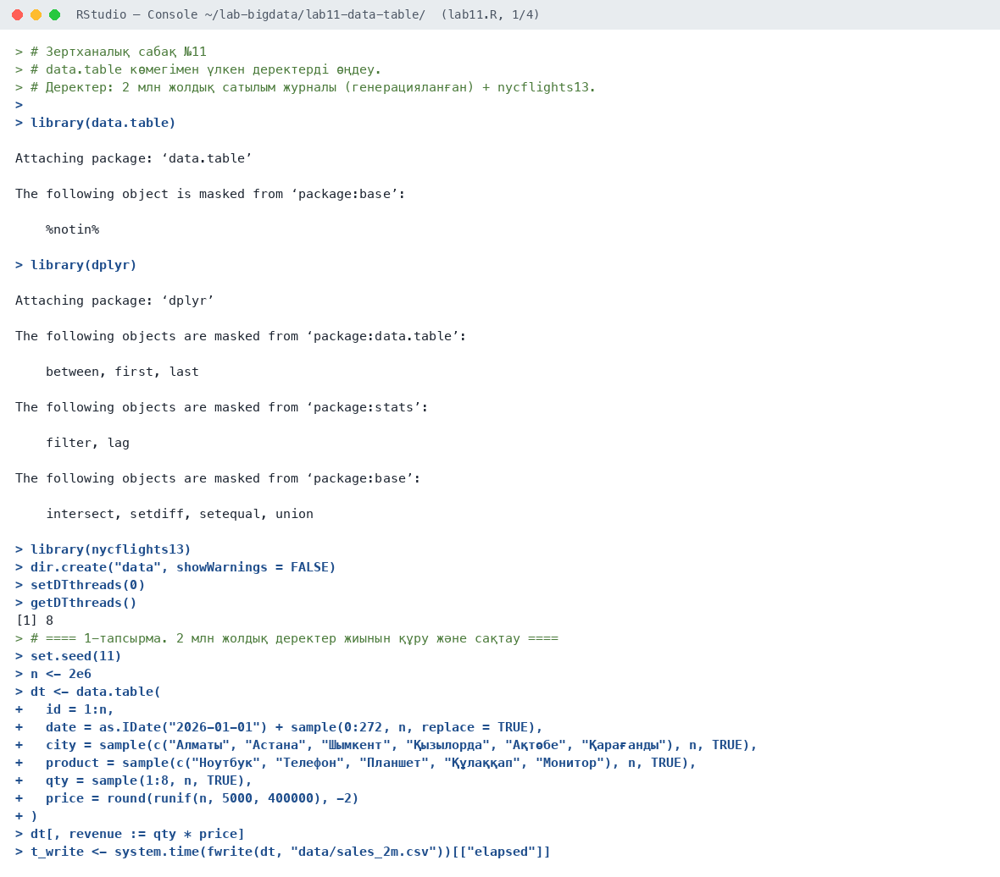
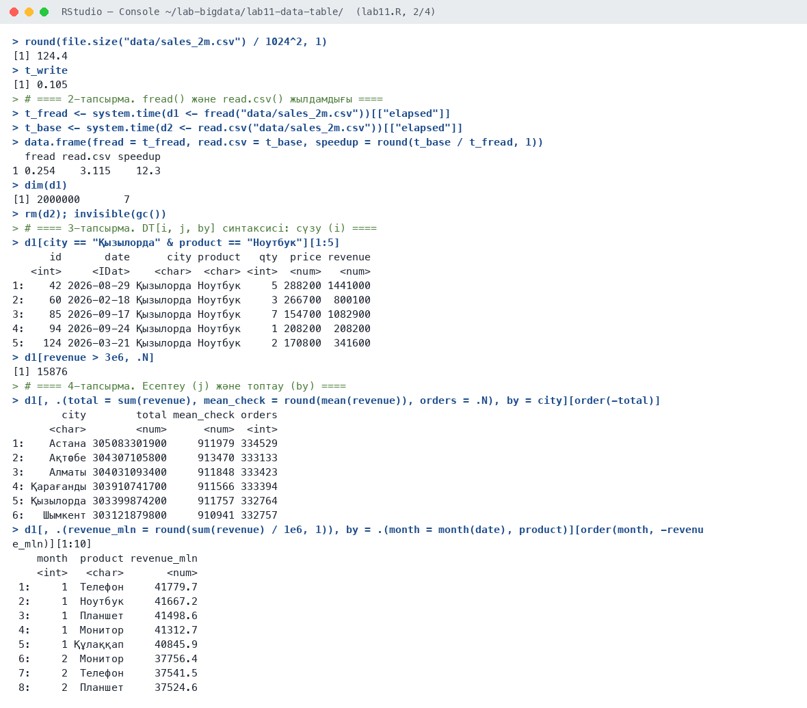
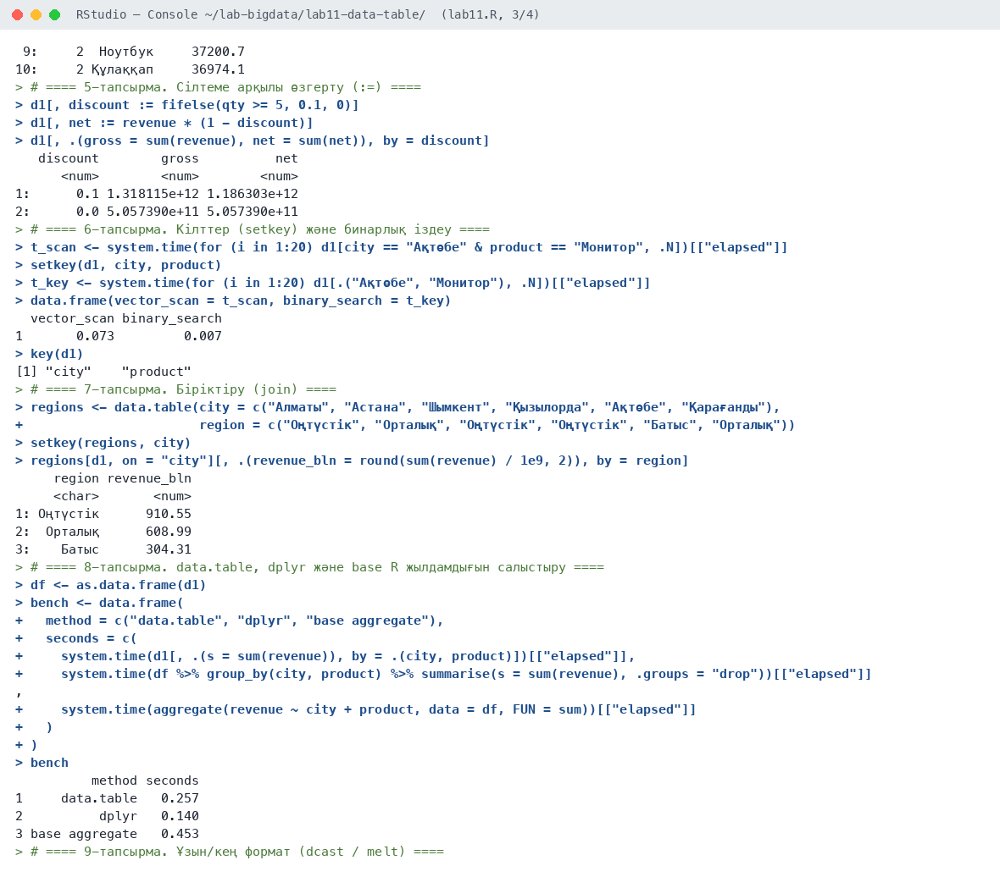
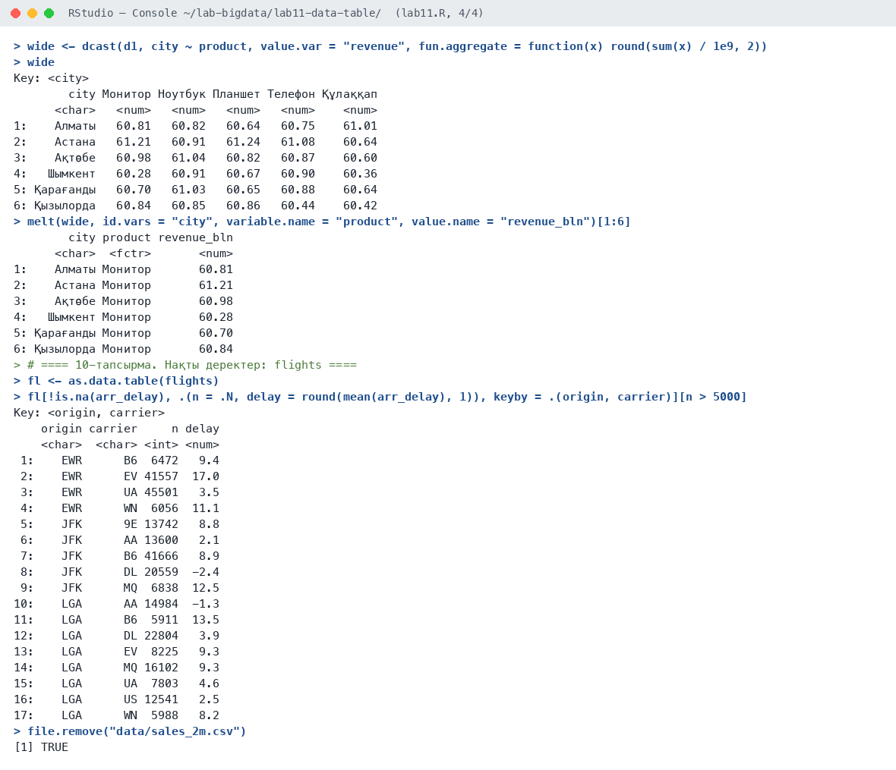

# Зертханалық сабақ №11

**Тақырыбы:** data.table көмегімен үлкен деректерді өңдеу

**Пәні:** Үлкен деректерді талдау  
**ББ:** <білім беру бағдарламасы, курс, топ>  
**Оқытушы:** <оқытушының аты-жөні>  
**Орындаушы:** <студенттің аты-жөні>  
**Күні:** 2026-10-05

---

## 1. Жұмыстың мақсаты

data.table пакетінің жоғары өнімді құралдарын меңгеру: fread/fwrite, DT[i, j, by] синтаксисі, сілтеме бойынша өзгерту (:=), кілттер, біріктіру, кең/ұзын форматқа түрлендіру; өнімділікті base R және dplyr-мен салыстыру.

## 2. Теориялық бөлім

**data.table** — R-дегі ең жылдам кестелік деректер құралдарының бірі. Синтаксис: `DT[i, j, by]` — i: қай жолдар (сүзу), j: не есептеу, by: қалай топтау. `.N` — жол саны, `.SD` — топтың ішкі кестесі.

Өнімділік көздері: C тілінде жазылған көп ағынды `fread()`/`fwrite()`, `:=` арқылы көшірмесіз (by reference) өзгерту, `setkey()` арқылы сұрыптау және бинарлық іздеу, жадты үнемдеу.

## 3. Қолданылған құралдар

- **Орта:** R 4.6.1, RStudio, macOS (Apple M-series, 8 ядро)
- **Пакеттер:** data.table (8 ағын), dplyr, nycflights13
- **Скрипт:** `lab11.R` (толық нәтиже — `output.txt`)

## 4. Жұмыстың орындалу барысы

Скрипттің басы (пакеттерді қосу):

```r
# Зертханалық сабақ №11
# data.table көмегімен үлкен деректерді өңдеу.
# Деректер: 2 млн жолдық сатылым журналы (генерацияланған) + nycflights13.

library(data.table)
library(dplyr)
library(nycflights13)

dir.create("data", showWarnings = FALSE)
setDTthreads(0)
getDTthreads()
```

### 4.1. 1-тапсырма. 2 млн жолдық деректер жиынын құру және сақтау

```r
set.seed(11)
n <- 2e6
dt <- data.table(
  id = 1:n,
  date = as.IDate("2026-01-01") + sample(0:272, n, replace = TRUE),
  city = sample(c("Алматы", "Астана", "Шымкент", "Қызылорда", "Ақтөбе", "Қарағанды"), n, TRUE),
  product = sample(c("Ноутбук", "Телефон", "Планшет", "Құлаққап", "Монитор"), n, TRUE),
  qty = sample(1:8, n, TRUE),
  price = round(runif(n, 5000, 400000), -2)
)
dt[, revenue := qty * price]
t_write <- system.time(fwrite(dt, "data/sales_2m.csv"))[["elapsed"]]
round(file.size("data/sales_2m.csv") / 1024^2, 1)
t_write
```

Нәтиже:

```text
[1] 124.4
[1] 0.105
```

**Түсіндірме:** 2 млн жолдық сатылым журналы құрылды. `fwrite()` 124 МБ CSV файлды 0,1 секундта жазды.

### 4.2. 2-тапсырма. fread() және read.csv() жылдамдығы

```r
t_fread <- system.time(d1 <- fread("data/sales_2m.csv"))[["elapsed"]]
t_base <- system.time(d2 <- read.csv("data/sales_2m.csv"))[["elapsed"]]
data.frame(fread = t_fread, read.csv = t_base, speedup = round(t_base / t_fread, 1))
dim(d1)
rm(d2); invisible(gc())
```

Нәтиже:

```text
  fread read.csv speedup
1 0.254    3.115    12.3
[1] 2000000       7
```

**Түсіндірме:** `fread()` 0,25 с, `read.csv()` 3,1 с — data.table 12 есе жылдам.

### 4.3. 3-тапсырма. DT[i, j, by] синтаксисі: сүзу (i)

```r
d1[city == "Қызылорда" & product == "Ноутбук"][1:5]
d1[revenue > 3e6, .N]
```

Нәтиже:

```text
      id       date      city product   qty  price revenue
   <int>     <IDat>    <char>  <char> <int>  <num>   <num>
1:    42 2026-08-29 Қызылорда Ноутбук     5 288200 1441000
2:    60 2026-02-18 Қызылорда Ноутбук     3 266700  800100
3:    85 2026-09-17 Қызылорда Ноутбук     7 154700 1082900
4:    94 2026-09-24 Қызылорда Ноутбук     1 208200  208200
5:   124 2026-03-21 Қызылорда Ноутбук     2 170800  341600
[1] 15876
```

**Түсіндірме:** Қызылордадағы ноутбук сатылымдары сүзілді; 3 млн ₸-ден асатын 15 876 тапсырыс.

### 4.4. 4-тапсырма. Есептеу (j) және топтау (by)

```r
d1[, .(total = sum(revenue), mean_check = round(mean(revenue)), orders = .N), by = city][order(-total)]
d1[, .(revenue_mln = round(sum(revenue) / 1e6, 1)), by = .(month = month(date), product)][order(month, -revenue_mln)][1:10]
```

Нәтиже:

```text
        city        total mean_check orders
      <char>        <num>      <num>  <int>
1:    Астана 305083301900     911979 334529
2:    Ақтөбе 304307105800     913470 333133
3:    Алматы 304031093400     911848 333423
4: Қарағанды 303910741700     911566 333394
5: Қызылорда 303399874200     911757 332764
6:   Шымкент 303121879800     910941 332757
    month  product revenue_mln
    <int>   <char>       <num>
 1:     1  Телефон     41779.7
 2:     1  Ноутбук     41667.2
 3:     1  Планшет     41498.6
 4:     1  Монитор     41312.7
 5:     1 Құлаққап     40845.9
 6:     2  Монитор     37756.4
 7:     2  Телефон     37541.5
 8:     2  Планшет     37524.6
 9:     2  Ноутбук     37200.7
10:     2 Құлаққап     36974.1
```

**Түсіндірме:** Қалалар бойынша түсім шамамен тең (~304 млрд ₸) — деректер біркелкі генерацияланған.

### 4.5. 5-тапсырма. Сілтеме арқылы өзгерту (:=)

```r
d1[, discount := fifelse(qty >= 5, 0.1, 0)]
d1[, net := revenue * (1 - discount)]
d1[, .(gross = sum(revenue), net = sum(net)), by = discount]
```

Нәтиже:

```text
   discount        gross          net
      <num>        <num>        <num>
1:      0.1 1.318115e+12 1.186303e+12
2:      0.0 5.057390e+11 5.057390e+11
```

**Түсіндірме:** `:=` көшірмесіз жаңа бағандар қосты: 5 және одан көп дана алғанда 10% жеңілдік.

### 4.6. 6-тапсырма. Кілттер (setkey) және бинарлық іздеу

```r
t_scan <- system.time(for (i in 1:20) d1[city == "Ақтөбе" & product == "Монитор", .N])[["elapsed"]]
setkey(d1, city, product)
t_key <- system.time(for (i in 1:20) d1[.("Ақтөбе", "Монитор"), .N])[["elapsed"]]
data.frame(vector_scan = t_scan, binary_search = t_key)
key(d1)
```

Нәтиже:

```text
  vector_scan binary_search
1       0.073         0.007
[1] "city"    "product"
```

**Түсіндірме:** Кілт бойынша бинарлық іздеу векторлық сканерлеуден 10 есе жылдам (0,073 с → 0,007 с).

### 4.7. 7-тапсырма. Біріктіру (join)

```r
regions <- data.table(city = c("Алматы", "Астана", "Шымкент", "Қызылорда", "Ақтөбе", "Қарағанды"),
                      region = c("Оңтүстік", "Орталық", "Оңтүстік", "Оңтүстік", "Батыс", "Орталық"))
setkey(regions, city)
regions[d1, on = "city"][, .(revenue_bln = round(sum(revenue) / 1e9, 2)), by = region]
```

Нәтиже:

```text
     region revenue_bln
     <char>       <num>
1: Оңтүстік      910.55
2:  Орталық      608.99
3:    Батыс      304.31
```

**Түсіндірме:** Аймақтар анықтамалығымен біріктіру: Оңтүстік аймақ — 910,6 млрд ₸.

### 4.8. 8-тапсырма. data.table, dplyr және base R жылдамдығын салыстыру

```r
df <- as.data.frame(d1)
bench <- data.frame(
  method = c("data.table", "dplyr", "base aggregate"),
  seconds = c(
    system.time(d1[, .(s = sum(revenue)), by = .(city, product)])[["elapsed"]],
    system.time(df %>% group_by(city, product) %>% summarise(s = sum(revenue), .groups = "drop"))[["elapsed"]],
    system.time(aggregate(revenue ~ city + product, data = df, FUN = sum))[["elapsed"]]
  )
)
bench
```

Нәтиже:

```text
          method seconds
1     data.table   0.257
2          dplyr   0.140
3 base aggregate   0.453
```

**Түсіндірме:** Бұл тәжірибеде dplyr (0,14 с) data.table-ден (0,26 с) жылдам шықты. Себебі кесте алдында қала мен өнім бойынша кілттелген, ал dplyr топтау кезінде кілтті пайдаланбайды; бір реттік өлшеу кездейсоқ ауытқуға да тәуелді. base `aggregate()` ең баяу (0,45 с).

### 4.9. 9-тапсырма. Ұзын/кең формат (dcast / melt)

```r
wide <- dcast(d1, city ~ product, value.var = "revenue", fun.aggregate = function(x) round(sum(x) / 1e9, 2))
wide
melt(wide, id.vars = "city", variable.name = "product", value.name = "revenue_bln")[1:6]
```

Нәтиже:

```text
Key: <city>
        city Монитор Ноутбук Планшет Телефон Құлаққап
      <char>   <num>   <num>   <num>   <num>    <num>
1:    Алматы   60.81   60.82   60.64   60.75    61.01
2:    Астана   61.21   60.91   61.24   61.08    60.64
3:    Ақтөбе   60.98   61.04   60.82   60.87    60.60
4:   Шымкент   60.28   60.91   60.67   60.90    60.36
5: Қарағанды   60.70   61.03   60.65   60.88    60.64
6: Қызылорда   60.84   60.85   60.86   60.44    60.42
        city product revenue_bln
      <char>  <fctr>       <num>
1:    Алматы Монитор       60.81
2:    Астана Монитор       61.21
3:    Ақтөбе Монитор       60.98
4:   Шымкент Монитор       60.28
5: Қарағанды Монитор       60.70
6: Қызылорда Монитор       60.84
```

**Түсіндірме:** `dcast()` кестені кең форматқа (қала × өнім), `melt()` қайтадан ұзын форматқа айналдырды.

### 4.10. 10-тапсырма. Нақты деректер: flights

```r
fl <- as.data.table(flights)
fl[!is.na(arr_delay), .(n = .N, delay = round(mean(arr_delay), 1)), keyby = .(origin, carrier)][n > 5000]

file.remove("data/sales_2m.csv")
```

Нәтиже:

```text
Key: <origin, carrier>
    origin carrier     n delay
    <char>  <char> <int> <num>
 1:    EWR      B6  6472   9.4
 2:    EWR      EV 41557  17.0
 3:    EWR      UA 45501   3.5
 4:    EWR      WN  6056  11.1
 5:    JFK      9E 13742   8.8
 6:    JFK      AA 13600   2.1
 7:    JFK      B6 41666   8.9
 8:    JFK      DL 20559  -2.4
 9:    JFK      MQ  6838  12.5
10:    LGA      AA 14984  -1.3
11:    LGA      B6  5911  13.5
12:    LGA      DL 22804   3.9
13:    LGA      EV  8225   9.3
14:    LGA      MQ 16102   9.3
15:    LGA      UA  7803   4.6
16:    LGA      US 12541   2.5
17:    LGA      WN  5988   8.2
[1] TRUE
```

**Түсіндірме:** flights деректерінде әуежай × авиакомпания бойынша орташа кешігу есептелді.

## 5. Скриншоттар

### 5.1. RStudio консолі









## 6. Бақылау сұрақтарына жауаптар

**1. DT[i, j, by] синтаксисін түсіндіріңіз.**

i — қай жолдарды таңдау (сүзу немесе кілт бойынша іздеу), j — не есептеу немесе қай бағандарды алу, by — қай бағандар бойынша топтау. Мысалы, `DT[city == "Алматы", sum(revenue), by = product]`.

**2. := операторының артықшылығы?**

`:=` бағанды көшірме жасамай, кестенің өзінде (by reference) қосады немесе өзгертеді. Бұл үлкен кестелерде жад пен уақытты үнемдейді.

**3. setkey() не береді?**

`setkey()` кестені көрсетілген бағандар бойынша сұрыптап, кілт белгілейді. Содан кейін іздеу мен JOIN бинарлық іздеу арқылы әлдеқайда жылдам орындалады.

**4. dcast() мен melt() айырмашылығы?**

`dcast()` ұзын форматты кең форматқа айналдырады (мәндерді бағандарға жаяды), `melt()` керісінше кең форматты ұзын форматқа айналдырады.

## 7. Қорытынды

data.table арқылы 2 млн жолдық деректер өңделді. Оқу жылдамдығында ең үлкен ұтыс: `fread()` `read.csv()`-тен 12 есе жылдам. Кілт бойынша іздеу 10 есе жылдамдатты, `:=` жадты көшірмей бағандар қосты. Топтап агрегаттауда data.table мен dplyr жылдамдығы бірдей деңгейде, екеуі де base R-дан жылдам.

## 8. Қолданылған әдебиеттер

1. Черемухин А.Д. Большие данные: учебное пособие. — Москва: Ай Пи Ар Медиа, 2023. — 728 с.
2. Wickham H., Çetinkaya-Rundel M., Grolemund G. R for Data Science. 2nd ed. — O'Reilly, 2023. URL: https://r4ds.hadley.nz
3. R Core Team. R: A Language and Environment for Statistical Computing. — Vienna, 2026. URL: https://www.r-project.org
4. Сухобоков А.А., Лахвич Д.С. Влияние инструментария Big Data на развитие научных дисциплин, связанных с моделированием // Наука и образование: МГТУ им. Н.Э. Баумана.
5. data.table vignettes. URL: https://rdatatable.gitlab.io/data.table/
