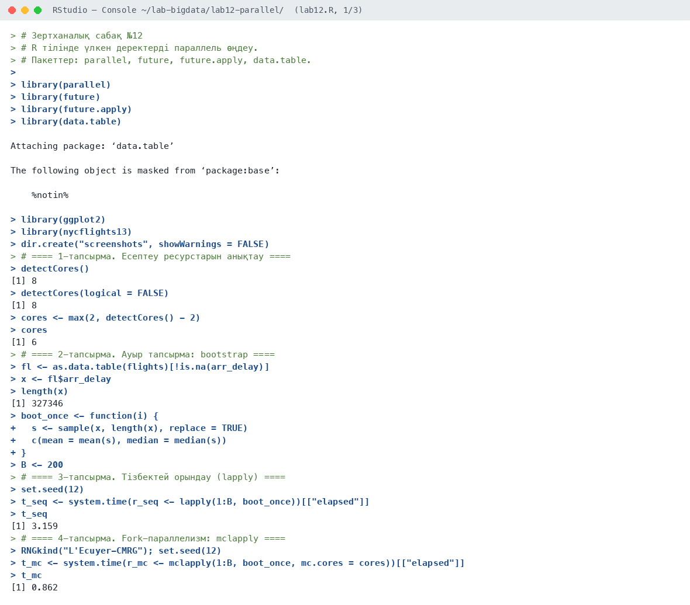
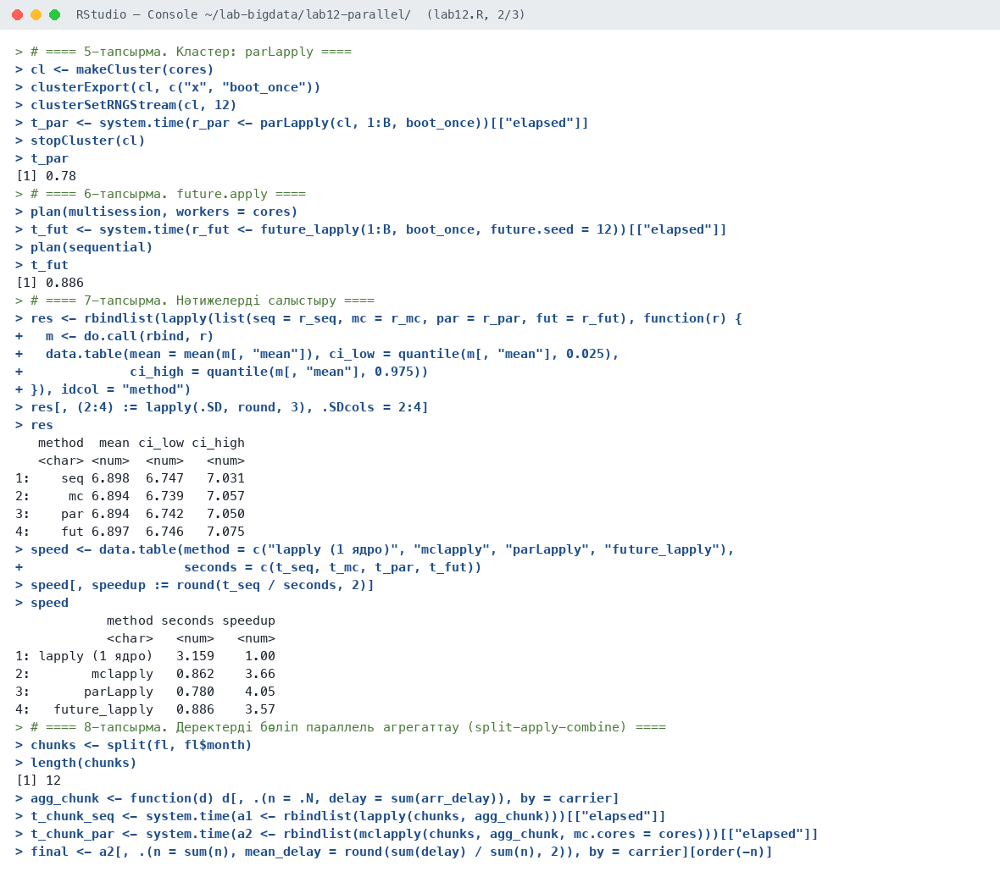
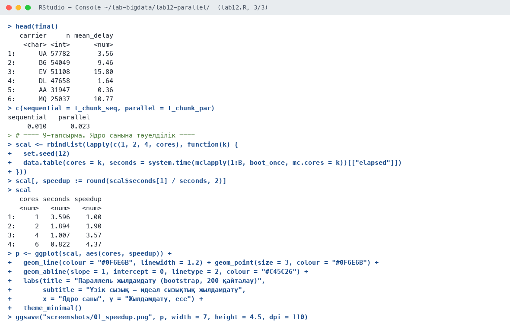
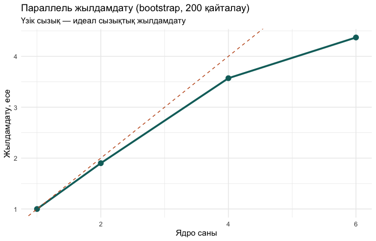

# Зертханалық сабақ №12

**Тақырыбы:** R тілінде үлкен деректерді параллель өңдеу

**Пәні:** Үлкен деректерді талдау  
**ББ:** <білім беру бағдарламасы, курс, топ>  
**Оқытушы:** <оқытушының аты-жөні>  
**Орындаушы:** <студенттің аты-жөні>  
**Күні:** 2026-10-05

---

## 1. Жұмыстың мақсаты

Есептеулерді бірнеше процессор ядросына бөлу тәсілдерін (mclapply, parLapply, future.apply) меңгеру, жылдамдатуды өлшеу және параллельдеудің тиімді/тиімсіз жағдайларын анықтау.

## 2. Теориялық бөлім

R әдепкіде бір ядрода жұмыс істейді. Параллельдеудің негізгі тәсілдері: **fork** (`mclapply`, macOS/Linux) — процесс көшірмелері жадты ортақ пайдаланады; **socket кластері** (`makeCluster` + `parLapply`) — тәуелсіз R процестері, деректерді `clusterExport` арқылы жіберу керек; **future** — бірыңғай интерфейс, жоспар (`plan`) арқылы режимді таңдау.

Амдал заңы бойынша жылдамдату тізбекті бөлікпен шектеледі. Параллельдеу ауыр, тәуелсіз тапсырмаларда (bootstrap, модельдерді оқыту) тиімді, ал жеңіл тапсырмаларда процестерді іске қосу шығыны пайдадан асып кетеді.

## 3. Қолданылған құралдар

- **Орта:** R 4.6.1, RStudio, macOS (Apple M-series, 8 ядро)
- **Пакеттер:** parallel, future, future.apply, data.table, ggplot2
- **Скрипт:** `lab12.R` (толық нәтиже — `output.txt`)

## 4. Жұмыстың орындалу барысы

Скрипттің басы (пакеттерді қосу):

```r
# Зертханалық сабақ №12
# R тілінде үлкен деректерді параллель өңдеу.
# Пакеттер: parallel, future, future.apply, data.table.

library(parallel)
library(future)
library(future.apply)
library(data.table)
library(ggplot2)
library(nycflights13)

dir.create("screenshots", showWarnings = FALSE)
```

### 4.1. 1-тапсырма. Есептеу ресурстарын анықтау

```r
detectCores()
detectCores(logical = FALSE)
cores <- max(2, detectCores() - 2)
cores
```

Нәтиже:

```text
[1] 8
[1] 8
[1] 6
```

**Түсіндірме:** Компьютерде 8 ядро бар, жұмысқа 6 ядро бөлінді (жүйеге 2 ядро қалдырдық).

### 4.2. 2-тапсырма. Ауыр тапсырма: bootstrap

```r
fl <- as.data.table(flights)[!is.na(arr_delay)]
x <- fl$arr_delay
length(x)
boot_once <- function(i) {
  s <- sample(x, length(x), replace = TRUE)
  c(mean = mean(s), median = median(s))
}
B <- 200
```

Нәтиже:

```text
[1] 327346
```

**Түсіндірме:** Ауыр тапсырма: 327 346 кешігу мәнінен 200 рет bootstrap (орта мән және медиана).

### 4.3. 3-тапсырма. Тізбектей орындау (lapply)

```r
set.seed(12)
t_seq <- system.time(r_seq <- lapply(1:B, boot_once))[["elapsed"]]
t_seq
```

Нәтиже:

```text
[1] 3.159
```

**Түсіндірме:** Бір ядрода: 3,16 с.

### 4.4. 4-тапсырма. Fork-параллелизм: mclapply

```r
RNGkind("L'Ecuyer-CMRG"); set.seed(12)
t_mc <- system.time(r_mc <- mclapply(1:B, boot_once, mc.cores = cores))[["elapsed"]]
t_mc
```

Нәтиже:

```text
[1] 0.862
```

**Түсіндірме:** mclapply (fork): 0,86 с.

### 4.5. 5-тапсырма. Кластер: parLapply

```r
cl <- makeCluster(cores)
clusterExport(cl, c("x", "boot_once"))
clusterSetRNGStream(cl, 12)
t_par <- system.time(r_par <- parLapply(cl, 1:B, boot_once))[["elapsed"]]
stopCluster(cl)
t_par
```

Нәтиже:

```text
[1] 0.78
```

**Түсіндірме:** parLapply (socket кластері): 0,78 с.

### 4.6. 6-тапсырма. future.apply

```r
plan(multisession, workers = cores)
t_fut <- system.time(r_fut <- future_lapply(1:B, boot_once, future.seed = 12))[["elapsed"]]
plan(sequential)
t_fut
```

Нәтиже:

```text
[1] 0.886
```

**Түсіндірме:** future_lapply (multisession): 0,89 с.

### 4.7. 7-тапсырма. Нәтижелерді салыстыру

```r
res <- rbindlist(lapply(list(seq = r_seq, mc = r_mc, par = r_par, fut = r_fut), function(r) {
  m <- do.call(rbind, r)
  data.table(mean = mean(m[, "mean"]), ci_low = quantile(m[, "mean"], 0.025),
             ci_high = quantile(m[, "mean"], 0.975))
}), idcol = "method")
res[, (2:4) := lapply(.SD, round, 3), .SDcols = 2:4]
res

speed <- data.table(method = c("lapply (1 ядро)", "mclapply", "parLapply", "future_lapply"),
                    seconds = c(t_seq, t_mc, t_par, t_fut))
speed[, speedup := round(t_seq / seconds, 2)]
speed
```

Нәтиже:

```text
   method  mean ci_low ci_high
   <char> <num>  <num>   <num>
1:    seq 6.898  6.747   7.031
2:     mc 6.894  6.739   7.057
3:    par 6.894  6.742   7.050
4:    fut 6.897  6.746   7.075
            method seconds speedup
            <char>   <num>   <num>
1: lapply (1 ядро)   3.159    1.00
2:        mclapply   0.862    3.66
3:       parLapply   0.780    4.05
4:   future_lapply   0.886    3.57
```

**Түсіндірме:** Барлық әдістер бірдей нәтиже берді (орта ~6,9 мин, 95% аралық ~[6,74; 7,05]). Жылдамдату 3,6–4,1 есе.

### 4.8. 8-тапсырма. Деректерді бөліп параллель агрегаттау (split-apply-combine)

```r
chunks <- split(fl, fl$month)
length(chunks)
agg_chunk <- function(d) d[, .(n = .N, delay = sum(arr_delay)), by = carrier]
t_chunk_seq <- system.time(a1 <- rbindlist(lapply(chunks, agg_chunk)))[["elapsed"]]
t_chunk_par <- system.time(a2 <- rbindlist(mclapply(chunks, agg_chunk, mc.cores = cores)))[["elapsed"]]
final <- a2[, .(n = sum(n), mean_delay = round(sum(delay) / sum(n), 2)), by = carrier][order(-n)]
head(final)
c(sequential = t_chunk_seq, parallel = t_chunk_par)
```

Нәтиже:

```text
[1] 12
   carrier     n mean_delay
    <char> <int>      <num>
1:      UA 57782       3.56
2:      B6 54049       9.46
3:      EV 51108      15.80
4:      DL 47658       1.64
5:      AA 31947       0.36
6:      MQ 25037      10.77
sequential   parallel 
     0.010      0.023 
```

**Түсіндірме:** Ай бойынша жеңіл агрегаттауда параллель нұсқа баяу (0,010 с → 0,023 с): процестерді іске қосу шығыны есептеуден көп.

### 4.9. 9-тапсырма. Ядро санына тәуелділік

```r
scal <- rbindlist(lapply(c(1, 2, 4, cores), function(k) {
  set.seed(12)
  data.table(cores = k, seconds = system.time(mclapply(1:B, boot_once, mc.cores = k))[["elapsed"]])
}))
scal[, speedup := round(scal$seconds[1] / seconds, 2)]
scal
p <- ggplot(scal, aes(cores, speedup)) +
  geom_line(colour = "#0F6E6B", linewidth = 1.2) + geom_point(size = 3, colour = "#0F6E6B") +
  geom_abline(slope = 1, intercept = 0, linetype = 2, colour = "#C45C26") +
  labs(title = "Параллель жылдамдату (bootstrap, 200 қайталау)",
       subtitle = "Үзік сызық — идеал сызықтық жылдамдату",
       x = "Ядро саны", y = "Жылдамдату, есе") +
  theme_minimal()
ggsave("screenshots/01_speedup.png", p, width = 7, height = 4.5, dpi = 110)
```

Нәтиже:

```text
   cores seconds speedup
   <num>   <num>   <num>
1:     1   3.596    1.00
2:     2   1.894    1.90
3:     4   1.007    3.57
4:     6   0.822    4.37
```

**Түсіндірме:** 2 ядро — 1,9 есе, 4 ядро — 3,6 есе, 6 ядро — 4,4 есе. Идеалды сызықтық жылдамдатудан ауытқу — процестерді басқару шығыны.

## 5. Скриншоттар

### 5.1. RStudio консолі







### 5.2. Графиктер

**1-сурет.** Ядро санына қарай жылдамдату



## 6. Бақылау сұрақтарына жауаптар

**1. mclapply мен parLapply айырмашылығы?**

`mclapply()` fork арқылы процесс көшірмелерін жасайды, жадты ортақ пайдаланады, бірақ тек macOS/Linux-та жұмыс істейді. `parLapply()` тәуелсіз R процестерінің кластерін қолданады, Windows-та да жұмыс істейді, бірақ деректерді `clusterExport()` арқылы жіберу керек.

**2. Амдал заңы нені тұжырымдайды?**

Бағдарламаның жылдамдатуы оның тізбекті (параллельденбейтін) бөлігімен шектеледі: S = 1 / ((1 − p) + p/N), мұнда p — параллель бөлігі, N — ядро саны.

**3. Параллель есептеуде кездейсоқ сандар генераторын қалай баптаймыз?**

`RNGkind("L'Ecuyer-CMRG")`, `clusterSetRNGStream()` немесе `future.seed` арқылы әр процеске тәуелсіз әрі қайталанатын кездейсоқ сандар ағыны беріледі.

**4. Қай кезде параллельдеу тиімсіз?**

Тапсырма өте жеңіл болғанда (процестерді іске қосу және деректерді жіберу уақыты есептеуден көп), тапсырмалар бір-біріне тәуелді болғанда немесе жад жетіспегенде.

## 7. Қорытынды

Bootstrap есептеуі үш түрлі параллель тәсілмен орындалды, 6 ядрода 3,6–4,4 есе жылдамдату алынды, нәтижелер тізбекті есептеумен сәйкес. Ядро саны өскен сайын жылдамдату артады, бірақ сызықтық емес. Жеңіл тапсырмаларда параллельдеу керісінше баяулатады — тапсырма жеткілікті ауыр болғанда ғана тиімді.

## 8. Қолданылған әдебиеттер

1. Черемухин А.Д. Большие данные: учебное пособие. — Москва: Ай Пи Ар Медиа, 2023. — 728 с.
2. Wickham H., Çetinkaya-Rundel M., Grolemund G. R for Data Science. 2nd ed. — O'Reilly, 2023. URL: https://r4ds.hadley.nz
3. R Core Team. R: A Language and Environment for Statistical Computing. — Vienna, 2026. URL: https://www.r-project.org
4. Сухобоков А.А., Лахвич Д.С. Влияние инструментария Big Data на развитие научных дисциплин, связанных с моделированием // Наука и образование: МГТУ им. Н.Э. Баумана.
5. Bengtsson H. future: Unified Parallel and Distributed Processing in R. URL: https://future.futureverse.org
