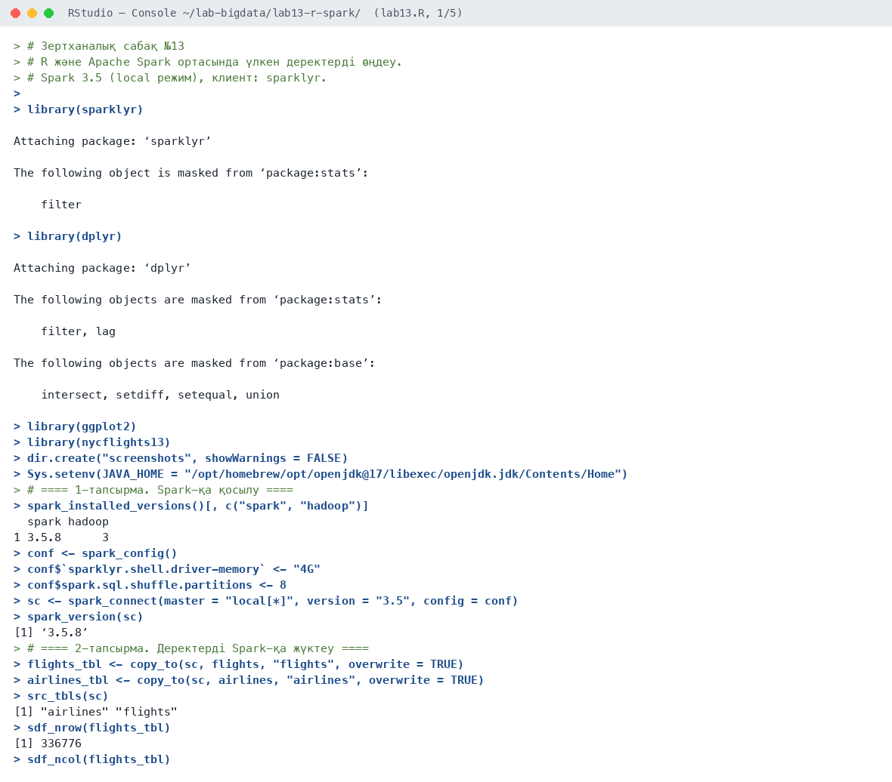
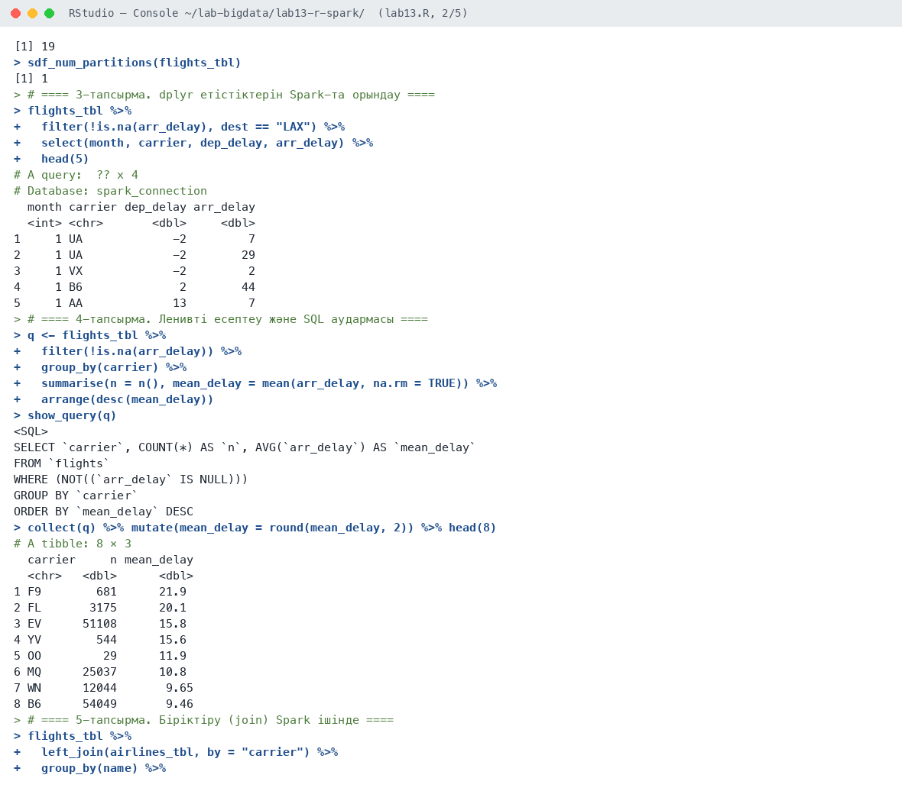
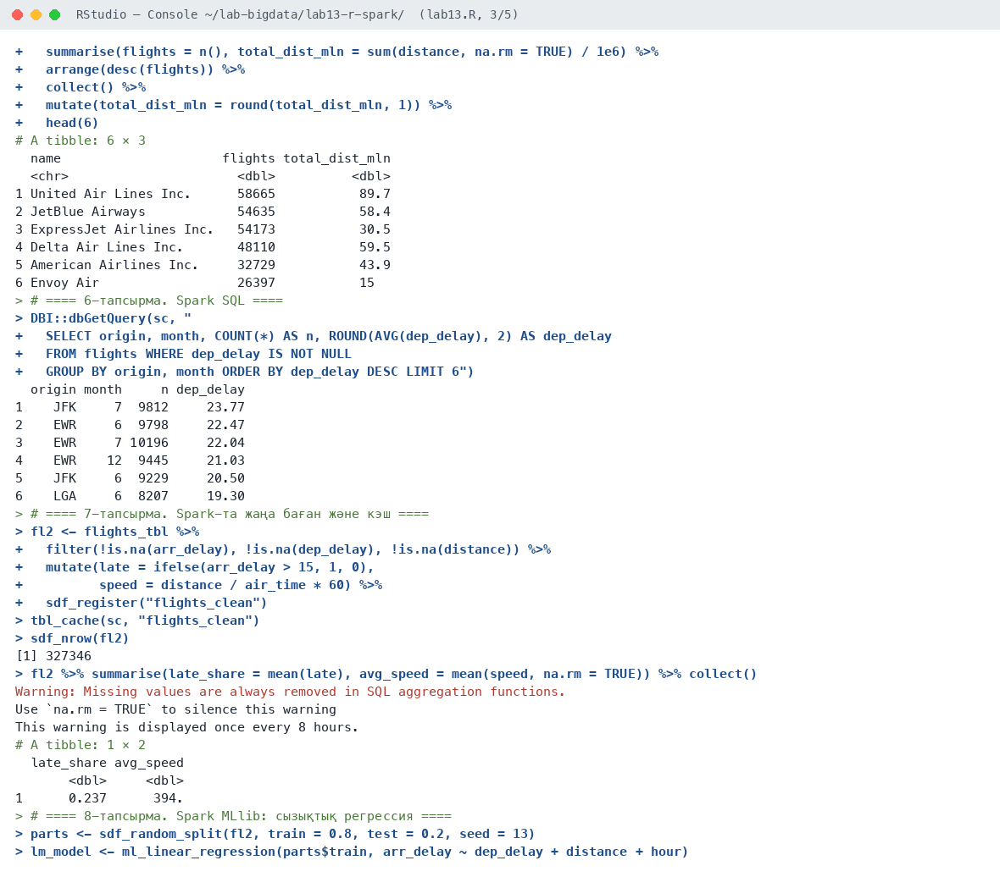
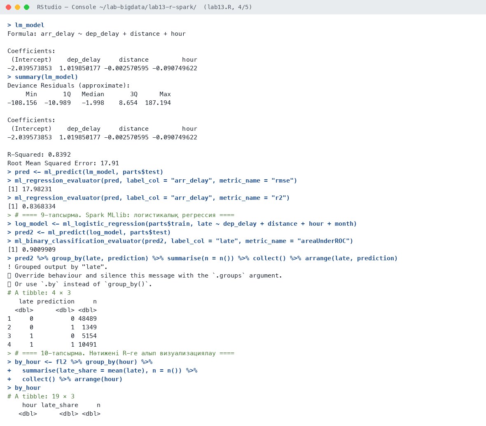
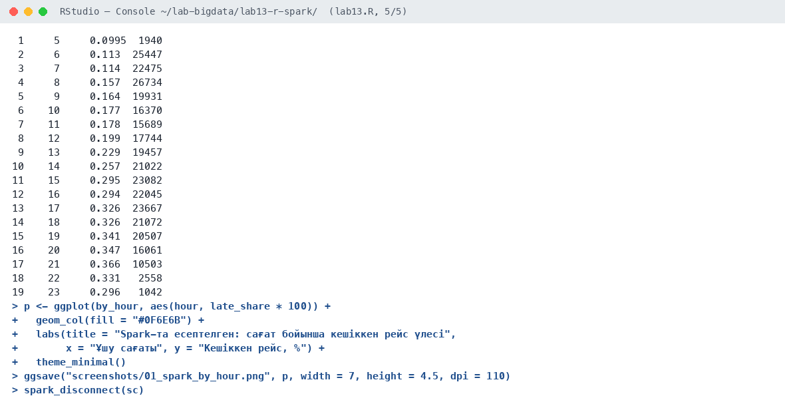
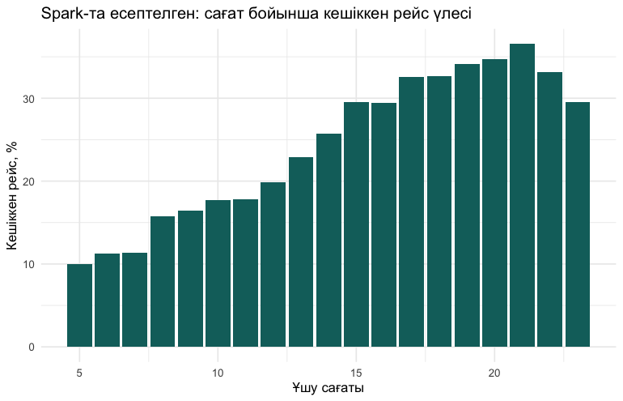

# Зертханалық сабақ №13

**Тақырыбы:** R және Apache Spark ортасында үлкен деректерді өңдеу

**Пәні:** Үлкен деректерді талдау  
**ББ:** <білім беру бағдарламасы, курс, топ>  
**Оқытушы:** <оқытушының аты-жөні>  
**Орындаушы:** <студенттің аты-жөні>  
**Күні:** 2026-10-05

---

## 1. Жұмыстың мақсаты

Apache Spark-қа R-ден sparklyr арқылы қосылу, деректерді Spark-та dplyr және Spark SQL арқылы өңдеу, кэштеу, Spark MLlib арқылы модельдер құру.

## 2. Теориялық бөлім

**Apache Spark** — кластерде үлкен деректерді жадта (in-memory) үлестіріп өңдеуге арналған жүйе. Негізгі ұғымдар: DataFrame (бөлімдерге — partitions — бөлінген кесте), ленивті есептеу (әрекет тек `collect()` кезінде орындалады), кэштеу, Spark SQL, MLlib (машиналық оқыту кітапханасы).

**sparklyr** R-ден Spark-пен жұмыс істеуге мүмкіндік береді: dplyr етістіктері автоматты түрде Spark SQL-ге аударылады (`show_query()`), нәтиже R-ге `collect()` арқылы алынады. Зертханада Spark жергілікті режимде (`local[*]`) барлық ядроны пайдаланды; дәл осы код нақты кластерде де жұмыс істейді.

## 3. Қолданылған құралдар

- **Орта:** R 4.6.1, RStudio, macOS (Apple M-series, 8 ядро)
- **Пакеттер:** sparklyr, Apache Spark 3.5.8 (local[*]), Java 17, dplyr, ggplot2, nycflights13
- **Скрипт:** `lab13.R` (толық нәтиже — `output.txt`)

## 4. Жұмыстың орындалу барысы

Скрипттің басы (пакеттерді қосу):

```r
# Зертханалық сабақ №13
# R және Apache Spark ортасында үлкен деректерді өңдеу.
# Spark 3.5 (local режим), клиент: sparklyr.

library(sparklyr)
library(dplyr)
library(ggplot2)
library(nycflights13)

dir.create("screenshots", showWarnings = FALSE)
Sys.setenv(JAVA_HOME = "/opt/homebrew/opt/openjdk@17/libexec/openjdk.jdk/Contents/Home")
```

### 4.1. 1-тапсырма. Spark-қа қосылу

```r
spark_installed_versions()[, c("spark", "hadoop")]
conf <- spark_config()
conf$`sparklyr.shell.driver-memory` <- "4G"
conf$spark.sql.shuffle.partitions <- 8
sc <- spark_connect(master = "local[*]", version = "3.5", config = conf)
spark_version(sc)
```

Нәтиже:

```text
  spark hadoop
1 3.5.8      3
[1] ‘3.5.8’
```

**Түсіндірме:** Spark 3.5.8 жергілікті режимде іске қосылды, драйверге 4 ГБ жад бөлінді.

### 4.2. 2-тапсырма. Деректерді Spark-қа жүктеу

```r
flights_tbl <- copy_to(sc, flights, "flights", overwrite = TRUE)
airlines_tbl <- copy_to(sc, airlines, "airlines", overwrite = TRUE)
src_tbls(sc)
sdf_nrow(flights_tbl)
sdf_ncol(flights_tbl)
sdf_num_partitions(flights_tbl)
```

Нәтиже:

```text
[1] "airlines" "flights" 
[1] 336776
[1] 19
[1] 1
```

**Түсіндірме:** flights және airlines кестелері Spark-қа жүктелді: 336 776 жол × 19 баған.

### 4.3. 3-тапсырма. dplyr етістіктерін Spark-та орындау

```r
flights_tbl %>%
  filter(!is.na(arr_delay), dest == "LAX") %>%
  select(month, carrier, dep_delay, arr_delay) %>%
  head(5)
```

Нәтиже:

```text
# A query:  ?? x 4
# Database: spark_connection
  month carrier dep_delay arr_delay
  <int> <chr>       <dbl>     <dbl>
1     1 UA             -2         7
2     1 UA             -2        29
3     1 VX             -2         2
4     1 B6              2        44
5     1 AA             13         7
```

**Түсіндірме:** dplyr етістіктері Spark ішінде орындалды, R-ге тек 5 жол алынды.

### 4.4. 4-тапсырма. Ленивті есептеу және SQL аудармасы

```r
q <- flights_tbl %>%
  filter(!is.na(arr_delay)) %>%
  group_by(carrier) %>%
  summarise(n = n(), mean_delay = mean(arr_delay, na.rm = TRUE)) %>%
  arrange(desc(mean_delay))
show_query(q)
collect(q) %>% mutate(mean_delay = round(mean_delay, 2)) %>% head(8)
```

Нәтиже:

```text
<SQL>
SELECT `carrier`, COUNT(*) AS `n`, AVG(`arr_delay`) AS `mean_delay`
FROM `flights`
WHERE (NOT((`arr_delay` IS NULL)))
GROUP BY `carrier`
ORDER BY `mean_delay` DESC
# A tibble: 8 × 3
  carrier     n mean_delay
  <chr>   <dbl>      <dbl>
1 F9        681      21.9 
2 FL       3175      20.1 
3 EV      51108      15.8 
4 YV        544      15.6 
5 OO         29      11.9 
6 MQ      25037      10.8 
7 WN      12044       9.65
8 B6      54049       9.46
```

**Түсіндірме:** `show_query()` dplyr кодының Spark SQL-ге аудармасын көрсетеді. Нәтиже бұрынғы зертханалармен сәйкес (F9 — 21,9 мин).

### 4.5. 5-тапсырма. Біріктіру (join) Spark ішінде

```r
flights_tbl %>%
  left_join(airlines_tbl, by = "carrier") %>%
  group_by(name) %>%
  summarise(flights = n(), total_dist_mln = sum(distance, na.rm = TRUE) / 1e6) %>%
  arrange(desc(flights)) %>%
  collect() %>%
  mutate(total_dist_mln = round(total_dist_mln, 1)) %>%
  head(6)
```

Нәтиже:

```text
# A tibble: 6 × 3
  name                     flights total_dist_mln
  <chr>                      <dbl>          <dbl>
1 United Air Lines Inc.      58665           89.7
2 JetBlue Airways            54635           58.4
3 ExpressJet Airlines Inc.   54173           30.5
4 Delta Air Lines Inc.       48110           59.5
5 American Airlines Inc.     32729           43.9
6 Envoy Air                  26397           15  
```

**Түсіндірме:** JOIN Spark ішінде: United Airlines 89,7 млн миль ұшқан.

### 4.6. 6-тапсырма. Spark SQL

```r
DBI::dbGetQuery(sc, "
  SELECT origin, month, COUNT(*) AS n, ROUND(AVG(dep_delay), 2) AS dep_delay
  FROM flights WHERE dep_delay IS NOT NULL
  GROUP BY origin, month ORDER BY dep_delay DESC LIMIT 6")
```

Нәтиже:

```text
  origin month     n dep_delay
1    JFK     7  9812     23.77
2    EWR     6  9798     22.47
3    EWR     7 10196     22.04
4    EWR    12  9445     21.03
5    JFK     6  9229     20.50
6    LGA     6  8207     19.30
```

**Түсіндірме:** Spark SQL тікелей: шілдедегі JFK — ең көп кешігу (23,77 мин).

### 4.7. 7-тапсырма. Spark-та жаңа баған және кэш

```r
fl2 <- flights_tbl %>%
  filter(!is.na(arr_delay), !is.na(dep_delay), !is.na(distance)) %>%
  mutate(late = ifelse(arr_delay > 15, 1, 0),
         speed = distance / air_time * 60) %>%
  sdf_register("flights_clean")
tbl_cache(sc, "flights_clean")
sdf_nrow(fl2)
fl2 %>% summarise(late_share = mean(late), avg_speed = mean(speed, na.rm = TRUE)) %>% collect()
```

Нәтиже:

```text
[1] 327346
Warning: Missing values are always removed in SQL aggregation functions.
Use `na.rm = TRUE` to silence this warning
This warning is displayed once every 8 hours.
# A tibble: 1 × 2
  late_share avg_speed
       <dbl>     <dbl>
1      0.237      394.
```

**Түсіндірме:** Тазаланған кесте `flights_clean` атымен тіркеліп, жадқа кэштелді: 327 346 жол, 23,7% кешігу.

### 4.8. 8-тапсырма. Spark MLlib: сызықтық регрессия

```r
parts <- sdf_random_split(fl2, train = 0.8, test = 0.2, seed = 13)
lm_model <- ml_linear_regression(parts$train, arr_delay ~ dep_delay + distance + hour)
lm_model
summary(lm_model)
pred <- ml_predict(lm_model, parts$test)
ml_regression_evaluator(pred, label_col = "arr_delay", metric_name = "rmse")
ml_regression_evaluator(pred, label_col = "arr_delay", metric_name = "r2")
```

Нәтиже:

```text
Formula: arr_delay ~ dep_delay + distance + hour

Coefficients:
 (Intercept)    dep_delay     distance         hour 
-2.039573853  1.019850177 -0.002570595 -0.090749622 
Deviance Residuals (approximate):
     Min       1Q   Median       3Q      Max 
-108.156  -10.989   -1.998    8.654  187.194 

Coefficients:
 (Intercept)    dep_delay     distance         hour 
-2.039573853  1.019850177 -0.002570595 -0.090749622 

R-Squared: 0.8392
Root Mean Squared Error: 17.91
[1] 17.98231
[1] 0.8368334
```

**Түсіндірме:** MLlib сызықтық регрессия (80/20 бөлу): тест жиынында R² = 0,837, RMSE = 17,98 мин — R-дегі `lm()` нәтижесіне жақын.

### 4.9. 9-тапсырма. Spark MLlib: логистикалық регрессия

```r
log_model <- ml_logistic_regression(parts$train, late ~ dep_delay + distance + hour + month)
pred2 <- ml_predict(log_model, parts$test)
ml_binary_classification_evaluator(pred2, label_col = "late", metric_name = "areaUnderROC")
pred2 %>% group_by(late, prediction) %>% summarise(n = n()) %>% collect() %>% arrange(late, prediction)
```

Нәтиже:

```text
[1] 0.9009909
! Grouped output by "late".
ℹ Override behaviour and silence this message with the `.groups` argument.
ℹ Or use `.by` instead of `group_by()`.
# A tibble: 4 × 3
   late prediction     n
  <dbl>      <dbl> <dbl>
1     0          0 48489
2     0          1  1349
3     1          0  5154
4     1          1 10491
```

**Түсіндірме:** MLlib логистикалық регрессия: AUC = 0,901. Тест жиынында 48 489 + 10 491 рейс дұрыс жіктелді (~90%).

### 4.10. 10-тапсырма. Нәтижені R-ге алып визуализациялау

```r
by_hour <- fl2 %>% group_by(hour) %>%
  summarise(late_share = mean(late), n = n()) %>%
  collect() %>% arrange(hour)
by_hour
p <- ggplot(by_hour, aes(hour, late_share * 100)) +
  geom_col(fill = "#0F6E6B") +
  labs(title = "Spark-та есептелген: сағат бойынша кешіккен рейс үлесі",
       x = "Ұшу сағаты", y = "Кешіккен рейс, %") +
  theme_minimal()
ggsave("screenshots/01_spark_by_hour.png", p, width = 7, height = 4.5, dpi = 110)

spark_disconnect(sc)
```

Нәтиже:

```text
# A tibble: 19 × 3
    hour late_share     n
   <dbl>      <dbl> <dbl>
 1     5     0.0995  1940
 2     6     0.113  25447
 3     7     0.114  22475
 4     8     0.157  26734
 5     9     0.164  19931
 6    10     0.177  16370
 7    11     0.178  15689
 8    12     0.199  17744
 9    13     0.229  19457
10    14     0.257  21022
11    15     0.295  23082
12    16     0.294  22045
13    17     0.326  23667
14    18     0.326  21072
15    19     0.341  20507
16    20     0.347  16061
17    21     0.366  10503
18    22     0.331   2558
19    23     0.296   1042
```

**Түсіндірме:** Spark-та агрегатталған нәтиже: кешігу қаупі таңғы 5-те 10%, кешкі 21-де 36,6%.

## 5. Скриншоттар

### 5.1. RStudio консолі











### 5.2. Графиктер

**1-сурет.** Spark-та есептелген: сағат бойынша кешіккен рейс үлесі



## 6. Бақылау сұрақтарына жауаптар

**1. Spark-тың Hadoop MapReduce-тен айырмашылығы?**

MapReduce әр кезеңнің нәтижесін дискке жазады, ал Spark деректерді жадта (in-memory) сақтайды, сондықтан итеративті алгоритмдерде 10–100 есе жылдам. Spark-та SQL, ағындық өңдеу және MLlib бір жүйеде біріктірілген.

**2. Ленивті есептеу деген не?**

Түрлендірулер бірден орындалмайды, Spark тек орындау жоспарын құрады. Есептеу нәтиже қажет болғанда ғана (`collect()`, `count()`) басталады, бұл жоспарды оңтайландыруға мүмкіндік береді.

**3. collect() функциясы не істейді?**

`collect()` Spark-тағы есептеуді іске қосып, нәтижені R жадына tibble ретінде алып келеді. Оны тек шағын (агрегатталған) нәтижелерге қолдану керек.

**4. Spark MLlib қандай алгоритмдерді қамтиды?**

Регрессия (сызықтық, логистикалық, шешімдер ағашы, кездейсоқ орман, градиенттік бустинг), кластерлеу (k-means, GMM), ұсыныс жүйелері (ALS), белгілерді түрлендіру және модельді бағалау құралдары.

## 7. Қорытынды

R-ден Apache Spark 3.5 ортасына қосылып, 336 мың жолдық деректер Spark ішінде dplyr және Spark SQL арқылы өңделді, кэштелді, MLlib арқылы сызықтық (R² = 0,837) және логистикалық (AUC = 0,901) регрессия модельдері құрылды. dplyr кодының SQL-ге автоматты аударылуы және ленивті есептеу принципі көрсетілді.

## 8. Қолданылған әдебиеттер

1. Черемухин А.Д. Большие данные: учебное пособие. — Москва: Ай Пи Ар Медиа, 2023. — 728 с.
2. Wickham H., Çetinkaya-Rundel M., Grolemund G. R for Data Science. 2nd ed. — O'Reilly, 2023. URL: https://r4ds.hadley.nz
3. R Core Team. R: A Language and Environment for Statistical Computing. — Vienna, 2026. URL: https://www.r-project.org
4. Сухобоков А.А., Лахвич Д.С. Влияние инструментария Big Data на развитие научных дисциплин, связанных с моделированием // Наука и образование: МГТУ им. Н.Э. Баумана.
5. Luraschi J., Kuo K., Ruiz E. Mastering Spark with R. — O'Reilly, 2019. URL: https://therinspark.com
