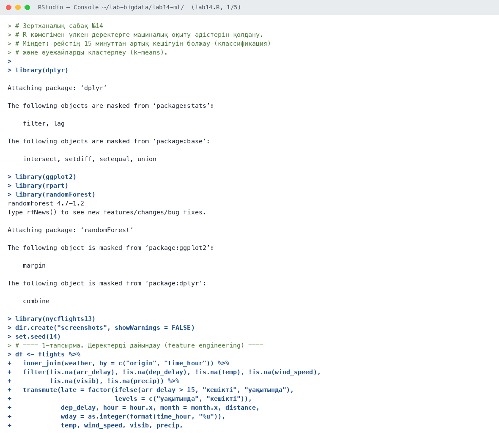
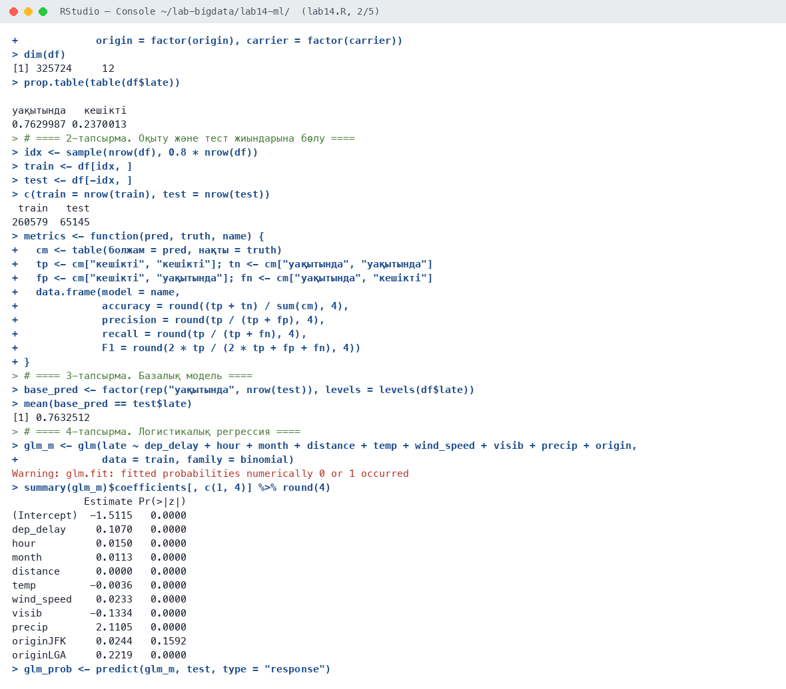
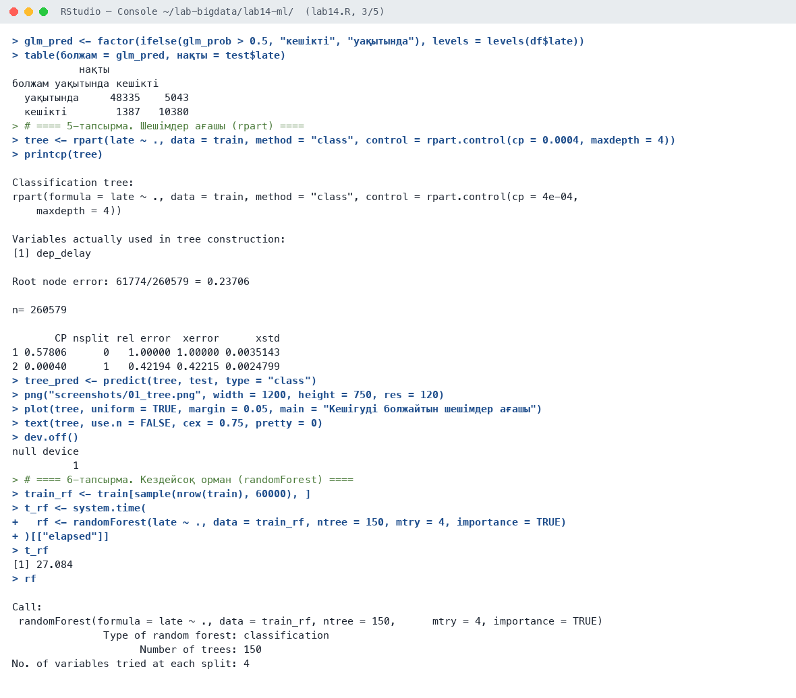
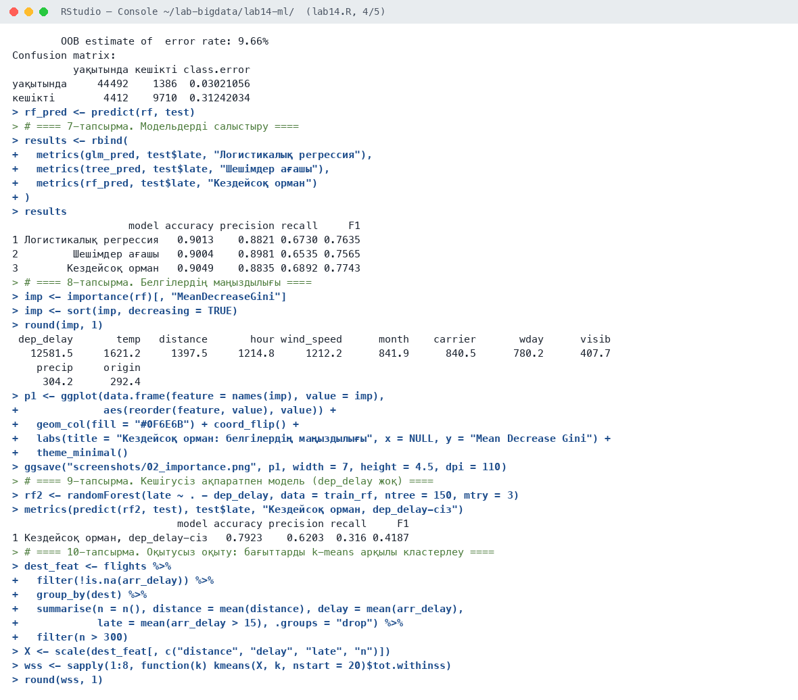
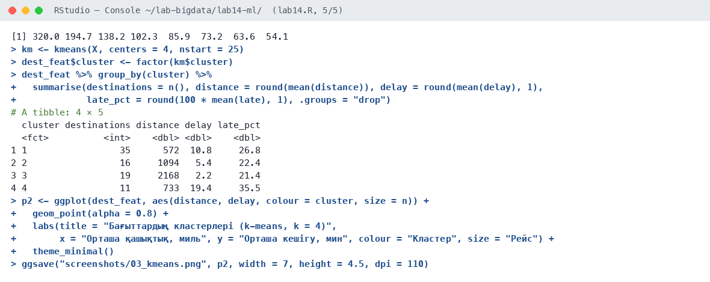
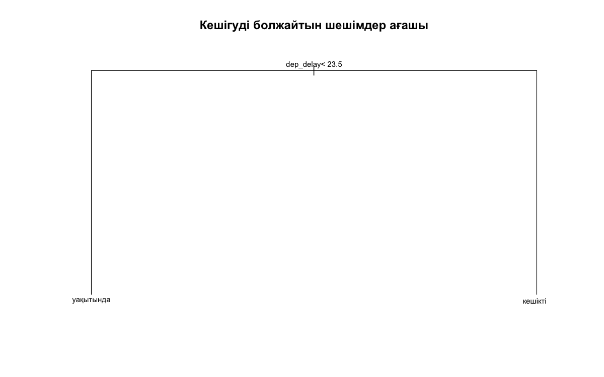
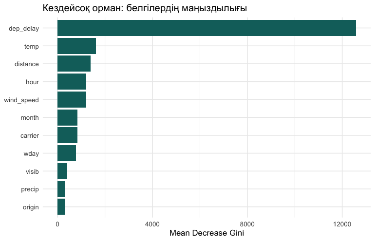
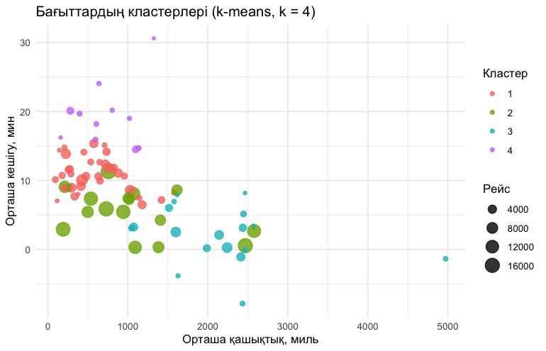

# Зертханалық сабақ №14

**Тақырыбы:** R көмегімен үлкен деректерге машиналық оқыту әдістерін қолдану

**Пәні:** Үлкен деректерді талдау  
**ББ:** <білім беру бағдарламасы, курс, топ>  
**Оқытушы:** <оқытушының аты-жөні>  
**Орындаушы:** <студенттің аты-жөні>  
**Күні:** 2026-10-05

---

## 1. Жұмыстың мақсаты

Рейстің 15 минуттан артық кешігуін болжайтын жіктеу модельдерін (логистикалық регрессия, шешімдер ағашы, кездейсоқ орман) құру, сапасын метрикалармен салыстыру және k-means арқылы оқытусыз кластерлеу жүргізу.

## 2. Теориялық бөлім

**Оқытумен оқыту** (supervised): модель белгілі жауаптары бар деректерден үйренеді. Жіктеу алгоритмдері: логистикалық регрессия (ықтималдықты сигмоида арқылы бағалайды), шешімдер ағашы (деректерді шарттар бойынша бөледі), кездейсоқ орман (көп ағаштың дауыс беруі, bagging).

Сапа метрикалары: accuracy (дұрыс жауаптар үлесі), precision (кешігеді деген болжамның дұрыстығы), recall (нақты кешігулердің қанша бөлігі табылды), F1 (precision мен recall-дың гармоникалық ортасы). **Оқытусыз оқыту** (unsupervised): k-means объектілерді ұқсастығы бойынша k кластерге бөледі, k «шынтақ» (elbow) әдісімен таңдалады.

## 3. Қолданылған құралдар

- **Орта:** R 4.6.1, RStudio, macOS (Apple M-series, 8 ядро)
- **Пакеттер:** rpart, randomForest, stats (glm, kmeans), dplyr, ggplot2, nycflights13
- **Скрипт:** `lab14.R` (толық нәтиже — `output.txt`)

## 4. Жұмыстың орындалу барысы

Скрипттің басы (пакеттерді қосу):

```r
# Зертханалық сабақ №14
# R көмегімен үлкен деректерге машиналық оқыту әдістерін қолдану.
# Міндет: рейстің 15 минуттан артық кешігуін болжау (классификация)
# және әуежайларды кластерлеу (k-means).

library(dplyr)
library(ggplot2)
library(rpart)
library(randomForest)
library(nycflights13)

dir.create("screenshots", showWarnings = FALSE)
set.seed(14)
```

### 4.1. 1-тапсырма. Деректерді дайындау (feature engineering)

```r
df <- flights %>%
  inner_join(weather, by = c("origin", "time_hour")) %>%
  filter(!is.na(arr_delay), !is.na(dep_delay), !is.na(temp), !is.na(wind_speed),
         !is.na(visib), !is.na(precip)) %>%
  transmute(late = factor(ifelse(arr_delay > 15, "кешікті", "уақытында"),
                          levels = c("уақытында", "кешікті")),
            dep_delay, hour = hour.x, month = month.x, distance,
            wday = as.integer(format(time_hour, "%u")),
            temp, wind_speed, visib, precip,
            origin = factor(origin), carrier = factor(carrier))
dim(df)
prop.table(table(df$late))
```

Нәтиже:

```text
[1] 325724     12

уақытында   кешікті 
0.7629987 0.2370013 
```

**Түсіндірме:** 325 724 рейс, 11 белгі. Кешіккен рейстер — 23,7% (сыныптар теңгерімсіз).

### 4.2. 2-тапсырма. Оқыту және тест жиындарына бөлу

```r
idx <- sample(nrow(df), 0.8 * nrow(df))
train <- df[idx, ]
test <- df[-idx, ]
c(train = nrow(train), test = nrow(test))

metrics <- function(pred, truth, name) {
  cm <- table(болжам = pred, нақты = truth)
  tp <- cm["кешікті", "кешікті"]; tn <- cm["уақытында", "уақытында"]
  fp <- cm["кешікті", "уақытында"]; fn <- cm["уақытында", "кешікті"]
  data.frame(model = name,
             accuracy = round((tp + tn) / sum(cm), 4),
             precision = round(tp / (tp + fp), 4),
             recall = round(tp / (tp + fn), 4),
             F1 = round(2 * tp / (2 * tp + fp + fn), 4))
}
```

Нәтиже:

```text
 train   test 
260579  65145 
```

**Түсіндірме:** 80% оқыту (260 579), 20% тест (65 145).

### 4.3. 3-тапсырма. Базалық модель

```r
base_pred <- factor(rep("уақытында", nrow(test)), levels = levels(df$late))
mean(base_pred == test$late)
```

Нәтиже:

```text
[1] 0.7632512
```

**Түсіндірме:** Базалық модель («бәрі уақытында») accuracy = 76,3% береді — модельдер одан жақсы болуы керек.

### 4.4. 4-тапсырма. Логистикалық регрессия

```r
glm_m <- glm(late ~ dep_delay + hour + month + distance + temp + wind_speed + visib + precip + origin,
             data = train, family = binomial)
summary(glm_m)$coefficients[, c(1, 4)] %>% round(4)
glm_prob <- predict(glm_m, test, type = "response")
glm_pred <- factor(ifelse(glm_prob > 0.5, "кешікті", "уақытында"), levels = levels(df$late))
table(болжам = glm_pred, нақты = test$late)
```

Нәтиже:

```text
Warning: glm.fit: fitted probabilities numerically 0 or 1 occurred
            Estimate Pr(>|z|)
(Intercept)  -1.5115   0.0000
dep_delay     0.1070   0.0000
hour          0.0150   0.0000
month         0.0113   0.0000
distance      0.0000   0.0000
temp         -0.0036   0.0000
wind_speed    0.0233   0.0000
visib        -0.1334   0.0000
precip        2.1105   0.0000
originJFK     0.0244   0.1592
originLGA     0.2219   0.0000
           нақты
болжам уақытында кешікті
  уақытында     48335    5043
  кешікті        1387   10380
```

**Түсіндірме:** Ең маңызды факторлар: dep_delay (+0,107 логит/мин), жауын-шашын, көріну. Ескерту «probabilities 0 or 1» ұзақ кешігулерде ықтималдық 1-ге жақын болатынын білдіреді.

### 4.5. 5-тапсырма. Шешімдер ағашы (rpart)

```r
tree <- rpart(late ~ ., data = train, method = "class", control = rpart.control(cp = 0.0004, maxdepth = 4))
printcp(tree)
tree_pred <- predict(tree, test, type = "class")
png("screenshots/01_tree.png", width = 1200, height = 750, res = 120)
plot(tree, uniform = TRUE, margin = 0.05, main = "Кешігуді болжайтын шешімдер ағашы")
text(tree, use.n = FALSE, cex = 0.75, pretty = 0)
dev.off()
```

Нәтиже:

```text
Classification tree:
rpart(formula = late ~ ., data = train, method = "class", control = rpart.control(cp = 4e-04, 
    maxdepth = 4))

Variables actually used in tree construction:
[1] dep_delay

Root node error: 61774/260579 = 0.23706

n= 260579 

       CP nsplit rel error  xerror      xstd
1 0.57806      0   1.00000 1.00000 0.0035143
2 0.00040      1   0.42194 0.42215 0.0024799
null device 
          1 
```

**Түсіндірме:** Ағаш тек бір шарт тапты: dep_delay < 23,5 мин. Бұл белгі қалғандарының бәрінен әлдеқайда күшті болғандықтан, басқа бөлулер сапаны жақсартпайды.

### 4.6. 6-тапсырма. Кездейсоқ орман (randomForest)

```r
train_rf <- train[sample(nrow(train), 60000), ]
t_rf <- system.time(
  rf <- randomForest(late ~ ., data = train_rf, ntree = 150, mtry = 4, importance = TRUE)
)[["elapsed"]]
t_rf
rf
rf_pred <- predict(rf, test)
```

Нәтиже:

```text
[1] 27.084

Call:
 randomForest(formula = late ~ ., data = train_rf, ntree = 150,      mtry = 4, importance = TRUE) 
               Type of random forest: classification
                     Number of trees: 150
No. of variables tried at each split: 4

        OOB estimate of  error rate: 9.66%
Confusion matrix:
          уақытында кешікті class.error
уақытында     44492    1386  0.03021056
кешікті        4412    9710  0.31242034
```

**Түсіндірме:** 60 мың рейсте 150 ағаш 27 секундта оқытылды, OOB қатесі 9,66%.

### 4.7. 7-тапсырма. Модельдерді салыстыру

```r
results <- rbind(
  metrics(glm_pred, test$late, "Логистикалық регрессия"),
  metrics(tree_pred, test$late, "Шешімдер ағашы"),
  metrics(rf_pred, test$late, "Кездейсоқ орман")
)
results
```

Нәтиже:

```text
                   model accuracy precision recall     F1
1 Логистикалық регрессия   0.9013    0.8821 0.6730 0.7635
2         Шешімдер ағашы   0.9004    0.8981 0.6535 0.7565
3        Кездейсоқ орман   0.9049    0.8835 0.6892 0.7743
```

**Түсіндірме:** Барлық модельдер базалықтан (76,3%) жақсы. Ең жақсы F1 — кездейсоқ орман (0,774, accuracy 90,5%).

### 4.8. 8-тапсырма. Белгілердің маңыздылығы

```r
imp <- importance(rf)[, "MeanDecreaseGini"]
imp <- sort(imp, decreasing = TRUE)
round(imp, 1)
p1 <- ggplot(data.frame(feature = names(imp), value = imp),
             aes(reorder(feature, value), value)) +
  geom_col(fill = "#0F6E6B") + coord_flip() +
  labs(title = "Кездейсоқ орман: белгілердің маңыздылығы", x = NULL, y = "Mean Decrease Gini") +
  theme_minimal()
ggsave("screenshots/02_importance.png", p1, width = 7, height = 4.5, dpi = 110)
```

Нәтиже:

```text
 dep_delay       temp   distance       hour wind_speed      month    carrier       wday      visib 
   12581.5     1621.2     1397.5     1214.8     1212.2      841.9      840.5      780.2      407.7 
    precip     origin 
     304.2      292.4 
```

**Түсіндірме:** dep_delay ең маңызды белгі, содан кейін температура, қашықтық, сағат, жел.

### 4.9. 9-тапсырма. Кешігусіз ақпаратпен модель (dep_delay жоқ)

```r
rf2 <- randomForest(late ~ . - dep_delay, data = train_rf, ntree = 150, mtry = 3)
metrics(predict(rf2, test), test$late, "Кездейсоқ орман, dep_delay-сіз")
```

Нәтиже:

```text
                           model accuracy precision recall     F1
1 Кездейсоқ орман, dep_delay-сіз   0.7923    0.6203  0.316 0.4187
```

**Түсіндірме:** dep_delay-сіз (тек жоспар және ауа райы бойынша) F1 0,42-ге дейін түседі: кешігуді алдын ала болжау әлдеқайда қиын.

### 4.10. 10-тапсырма. Оқытусыз оқыту: бағыттарды k-means арқылы кластерлеу

```r
dest_feat <- flights %>%
  filter(!is.na(arr_delay)) %>%
  group_by(dest) %>%
  summarise(n = n(), distance = mean(distance), delay = mean(arr_delay),
            late = mean(arr_delay > 15), .groups = "drop") %>%
  filter(n > 300)
X <- scale(dest_feat[, c("distance", "delay", "late", "n")])
wss <- sapply(1:8, function(k) kmeans(X, k, nstart = 20)$tot.withinss)
round(wss, 1)
km <- kmeans(X, centers = 4, nstart = 25)
dest_feat$cluster <- factor(km$cluster)
dest_feat %>% group_by(cluster) %>%
  summarise(destinations = n(), distance = round(mean(distance)), delay = round(mean(delay), 1),
            late_pct = round(100 * mean(late), 1), .groups = "drop")
p2 <- ggplot(dest_feat, aes(distance, delay, colour = cluster, size = n)) +
  geom_point(alpha = 0.8) +
  labs(title = "Бағыттардың кластерлері (k-means, k = 4)",
       x = "Орташа қашықтық, миль", y = "Орташа кешігу, мин", colour = "Кластер", size = "Рейс") +
  theme_minimal()
ggsave("screenshots/03_kmeans.png", p2, width = 7, height = 4.5, dpi = 110)
```

Нәтиже:

```text
[1] 320.0 194.7 138.2 102.3  85.9  73.2  63.6  54.1
# A tibble: 4 × 5
  cluster destinations distance delay late_pct
  <fct>          <int>    <dbl> <dbl>    <dbl>
1 1                 35      572  10.8     26.8
2 2                 16     1094   5.4     22.4
3 3                 19     2168   2.2     21.4
4 4                 11      733  19.4     35.5
```

**Түсіндірме:** Elbow графигі бойынша k = 4. 4-кластер — 11 бағыт, кешігуі ең жоғары (19,4 мин, 35,5%), 3-кластер — ұзақ (2 168 миль) және ең дәл бағыттар.

## 5. Скриншоттар

### 5.1. RStudio консолі











### 5.2. Графиктер

**1-сурет.** Шешімдер ағашы: dep_delay < 23,5 шарты



**2-сурет.** Кездейсоқ орман: белгілердің маңыздылығы



**3-сурет.** Бағыттардың k-means кластерлері



## 6. Бақылау сұрақтарына жауаптар

**1. Оқытумен және оқытусыз оқытудың айырмашылығы?**

Оқытумен оқытуда (supervised) модель белгілі жауаптары бар деректерден үйренеді (жіктеу, регрессия). Оқытусыз оқытуда (unsupervised) жауап жоқ, модель деректердегі құрылымды өзі табады (кластерлеу).

**2. Precision мен recall-дың айырмашылығы?**

Precision — модель «кешігеді» деген рейстердің қаншасы шынымен кешіккенін, recall — шынымен кешіккен рейстердің қаншасын модель тапқанын көрсетеді.

**3. Кездейсоқ орман неге жеке ағаштан жақсы?**

Кездейсоқ орман әртүрлі таңдамалар мен белгілер жиынында көп ағаш оқытып, олардың дауысын біріктіреді. Бұл жеке ағаштың қайта оқытылуын (overfitting) азайтып, тұрақтылықты арттырады.

**4. k-means-те k қалай таңдалады?**

«Шынтақ» (elbow) әдісімен: әр k үшін кластер ішіндегі квадраттар қосындысы (WSS) есептеліп, оның азаюы баяулай бастаған нүкте таңдалады. Силуэт коэффициенті де қолданылады.

## 7. Қорытынды

Үш жіктеу моделі құрылып, салыстырылды: кездейсоқ орман ең жоғары F1 (0,774) мен accuracy (90,5%) көрсетті. Негізгі болжаушы — ұшу кешігуі; онсыз болжам сапасы күрт төмендейді (F1 = 0,42), яғни кешігуді алдын ала болжау үшін қосымша деректер (диспетчерлік, ұшақ айналымы) қажет. k-means бағыттарды 4 кластерге бөліп, ең проблемалы 11 бағытты анықтады.

## 8. Қолданылған әдебиеттер

1. Черемухин А.Д. Большие данные: учебное пособие. — Москва: Ай Пи Ар Медиа, 2023. — 728 с.
2. Wickham H., Çetinkaya-Rundel M., Grolemund G. R for Data Science. 2nd ed. — O'Reilly, 2023. URL: https://r4ds.hadley.nz
3. R Core Team. R: A Language and Environment for Statistical Computing. — Vienna, 2026. URL: https://www.r-project.org
4. Сухобоков А.А., Лахвич Д.С. Влияние инструментария Big Data на развитие научных дисциплин, связанных с моделированием // Наука и образование: МГТУ им. Н.Э. Баумана.
5. James G., Witten D., Hastie T., Tibshirani R. An Introduction to Statistical Learning with Applications in R. 2nd ed. — Springer, 2021.
