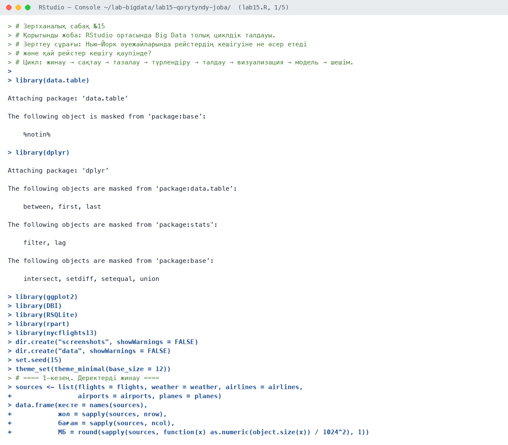
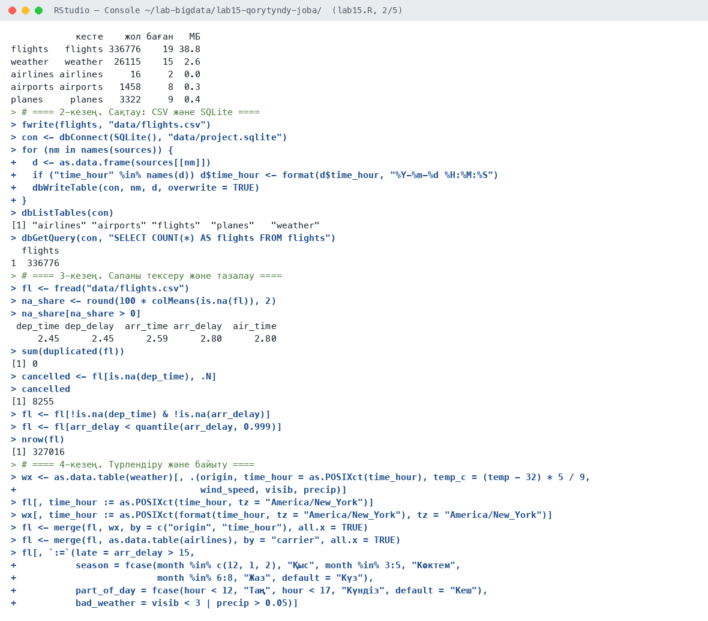
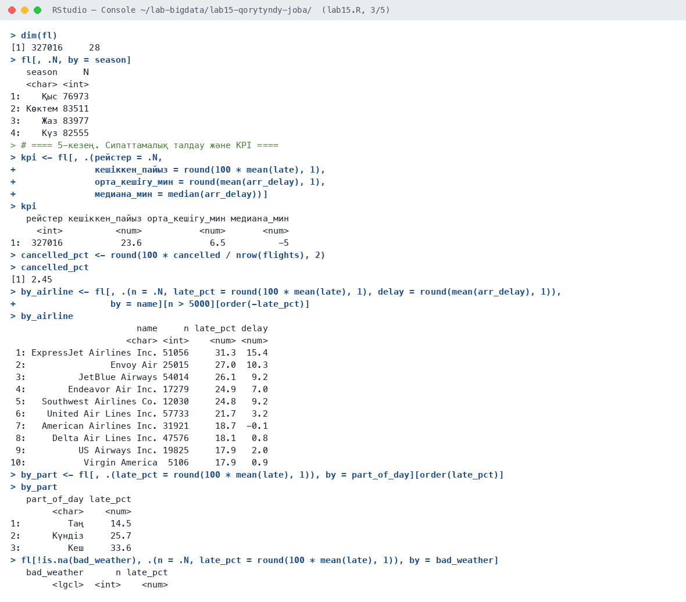
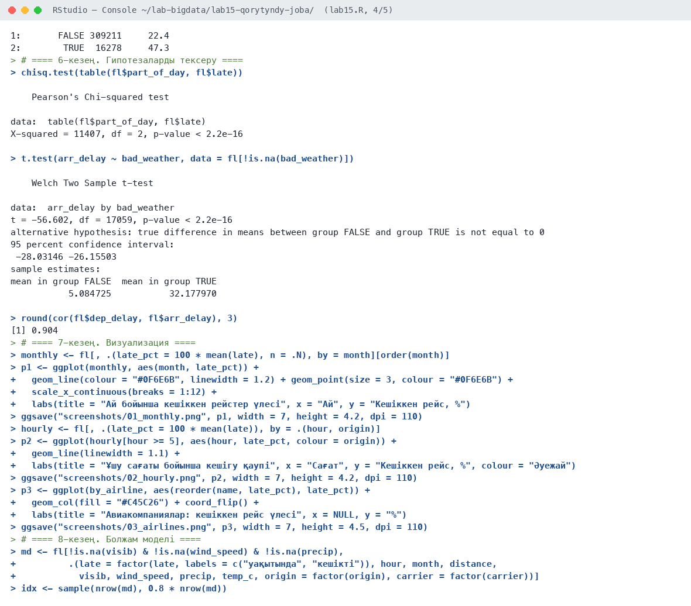
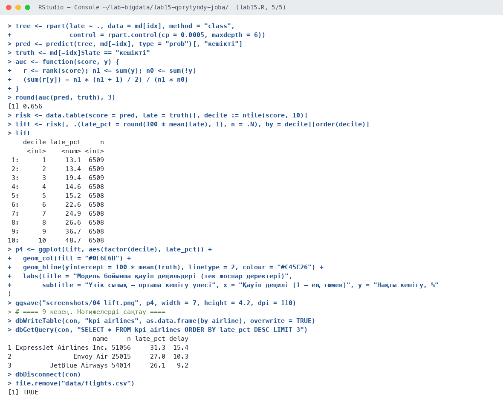
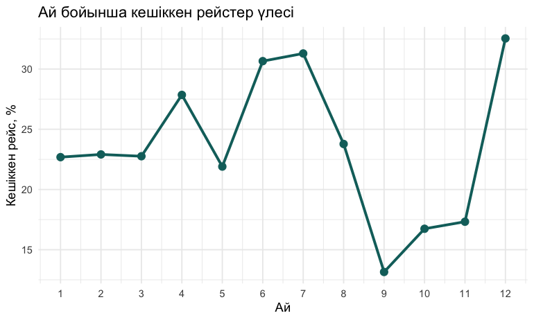
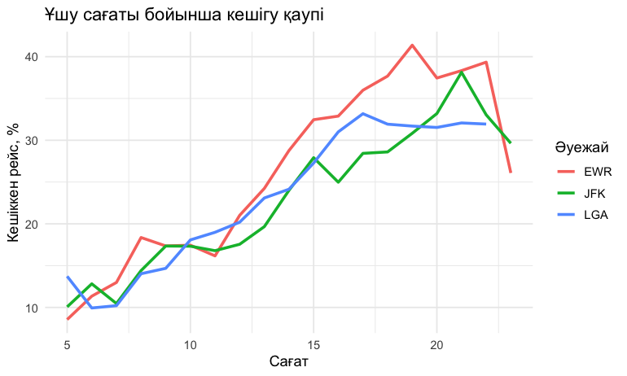
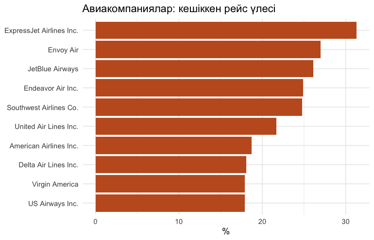
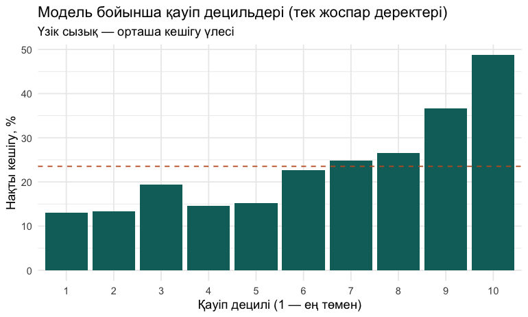

# Зертханалық сабақ №15

**Тақырыбы:** Қорытынды жоба: RStudio ортасында Big Data толық циклдік талдауы

**Пәні:** Үлкен деректерді талдау  
**ББ:** <білім беру бағдарламасы, курс, топ>  
**Оқытушы:** <оқытушының аты-жөні>  
**Орындаушы:** <студенттің аты-жөні>  
**Күні:** 2026-10-05

---

## 1. Жұмыстың мақсаты

Үлкен деректерді талдаудың толық циклін бір жобада орындау: деректерді жинау → сақтау → тазалау → түрлендіру → талдау → гипотезаларды тексеру → визуализация → болжам моделі → нәтижені сақтау және бизнес-ұсыныстар.

## 2. Теориялық бөлім

**Зерттеу сұрағы:** Нью-Йорк әуежайларында рейстердің кешігуіне не әсер етеді және қай рейстер кешігу қаупінде?

Деректер аналитикасының өмірлік циклі: (1) жинау — бірнеше дереккөзді анықтау; (2) сақтау — файл және ДҚ; (3) тазалау — сапаны тексеру; (4) түрлендіру — біріктіру, жаңа белгілер; (5) талдау — KPI, топтар; (6) гипотезаларды тексеру; (7) визуализация; (8) модель; (9) нәтижені сақтау және шешім қабылдау.

## 3. Қолданылған құралдар

- **Орта:** R 4.6.1, RStudio, macOS (Apple M-series, 8 ядро)
- **Пакеттер:** data.table, dplyr, ggplot2, DBI, RSQLite, rpart, nycflights13
- **Скрипт:** `lab15.R` (толық нәтиже — `output.txt`)

## 4. Жұмыстың орындалу барысы

Скрипттің басы (пакеттерді қосу):

```r
# Зертханалық сабақ №15
# Қорытынды жоба: RStudio ортасында Big Data толық циклдік талдауы.
# Зерттеу сұрағы: Нью-Йорк әуежайларында рейстердің кешігуіне не әсер етеді
# және қай рейстер кешігу қаупінде?
# Цикл: жинау → сақтау → тазалау → түрлендіру → талдау → визуализация → модель → шешім.

library(data.table)
library(dplyr)
library(ggplot2)
library(DBI)
library(RSQLite)
library(rpart)
library(nycflights13)

dir.create("screenshots", showWarnings = FALSE)
dir.create("data", showWarnings = FALSE)
set.seed(15)
theme_set(theme_minimal(base_size = 12))
```

### 4.1. 1-кезең. Деректерді жинау

```r
sources <- list(flights = flights, weather = weather, airlines = airlines,
                airports = airports, planes = planes)
data.frame(кесте = names(sources),
           жол = sapply(sources, nrow),
           баған = sapply(sources, ncol),
           МБ = round(sapply(sources, function(x) as.numeric(object.size(x)) / 1024^2), 1))
```

Нәтиже:

```text
            кесте    жол баған   МБ
flights   flights 336776    19 38.8
weather   weather  26115    15  2.6
airlines airlines     16     2  0.0
airports airports   1458     8  0.3
planes     planes   3322     9  0.4
```

**Түсіндірме:** Бес дереккөз: рейстер (336 776), ауа райы (26 115 сағаттық бақылау), авиакомпаниялар, әуежайлар, ұшақтар.

### 4.2. 2-кезең. Сақтау: CSV және SQLite

```r
fwrite(flights, "data/flights.csv")
con <- dbConnect(SQLite(), "data/project.sqlite")
for (nm in names(sources)) {
  d <- as.data.frame(sources[[nm]])
  if ("time_hour" %in% names(d)) d$time_hour <- format(d$time_hour, "%Y-%m-%d %H:%M:%S")
  dbWriteTable(con, nm, d, overwrite = TRUE)
}
dbListTables(con)
dbGetQuery(con, "SELECT COUNT(*) AS flights FROM flights")
```

Нәтиже:

```text
[1] "airlines" "airports" "flights"  "planes"   "weather" 
  flights
1  336776
```

**Түсіндірме:** Деректер CSV файлға және 5 кестелі SQLite ДҚ-ға сақталды.

### 4.3. 3-кезең. Сапаны тексеру және тазалау

```r
fl <- fread("data/flights.csv")
na_share <- round(100 * colMeans(is.na(fl)), 2)
na_share[na_share > 0]
sum(duplicated(fl))
cancelled <- fl[is.na(dep_time), .N]
cancelled
fl <- fl[!is.na(dep_time) & !is.na(arr_delay)]
fl <- fl[arr_delay < quantile(arr_delay, 0.999)]
nrow(fl)
```

Нәтиже:

```text
 dep_time dep_delay  arr_time arr_delay  air_time 
     2.45      2.45      2.59      2.80      2.80 
[1] 0
[1] 8255
[1] 327016
```

**Түсіндірме:** Бос мәндер 2,45–2,80%; қайталану жоқ; 8 255 рейс тоқтатылған (2,45%). Тоқтатылған рейстер мен 0,1% шекті шығарындылар алынды: 327 016 рейс қалды.

### 4.4. 4-кезең. Түрлендіру және байыту

```r
wx <- as.data.table(weather)[, .(origin, time_hour = as.POSIXct(time_hour), temp_c = (temp - 32) * 5 / 9,
                                 wind_speed, visib, precip)]
fl[, time_hour := as.POSIXct(time_hour, tz = "America/New_York")]
wx[, time_hour := as.POSIXct(format(time_hour, tz = "America/New_York"), tz = "America/New_York")]
fl <- merge(fl, wx, by = c("origin", "time_hour"), all.x = TRUE)
fl <- merge(fl, as.data.table(airlines), by = "carrier", all.x = TRUE)
fl[, `:=`(late = arr_delay > 15,
          season = fcase(month %in% c(12, 1, 2), "Қыс", month %in% 3:5, "Көктем",
                         month %in% 6:8, "Жаз", default = "Күз"),
          part_of_day = fcase(hour < 12, "Таң", hour < 17, "Күндіз", default = "Кеш"),
          bad_weather = visib < 3 | precip > 0.05)]
dim(fl)
fl[, .N, by = season]
```

Нәтиже:

```text
[1] 327016     28
   season     N
   <char> <int>
1:    Қыс 76973
2: Көктем 83511
3:    Жаз 83977
4:    Күз 82555
```

**Түсіндірме:** Рейстер сағаттық ауа райымен және авиакомпания атауымен біріктірілді; жаңа белгілер: маусым, тәулік бөлігі, нашар ауа райы (көріну < 3 миль немесе жауын-шашын).

### 4.5. 5-кезең. Сипаттамалық талдау және KPI

```r
kpi <- fl[, .(рейстер = .N,
              кешіккен_пайыз = round(100 * mean(late), 1),
              орта_кешігу_мин = round(mean(arr_delay), 1),
              медиана_мин = median(arr_delay))]
kpi
cancelled_pct <- round(100 * cancelled / nrow(flights), 2)
cancelled_pct
by_airline <- fl[, .(n = .N, late_pct = round(100 * mean(late), 1), delay = round(mean(arr_delay), 1)),
                 by = name][n > 5000][order(-late_pct)]
by_airline
by_part <- fl[, .(late_pct = round(100 * mean(late), 1)), by = part_of_day][order(late_pct)]
by_part
fl[!is.na(bad_weather), .(n = .N, late_pct = round(100 * mean(late), 1)), by = bad_weather]
```

Нәтиже:

```text
   рейстер кешіккен_пайыз орта_кешігу_мин медиана_мин
     <int>          <num>           <num>       <num>
1:  327016           23.6             6.5          -5
[1] 2.45
                        name     n late_pct delay
                      <char> <int>    <num> <num>
 1: ExpressJet Airlines Inc. 51056     31.3  15.4
 2:                Envoy Air 25015     27.0  10.3
 3:          JetBlue Airways 54014     26.1   9.2
 4:        Endeavor Air Inc. 17279     24.9   7.0
 5:   Southwest Airlines Co. 12030     24.8   9.2
 6:    United Air Lines Inc. 57733     21.7   3.2
 7:   American Airlines Inc. 31921     18.7  -0.1
 8:     Delta Air Lines Inc. 47576     18.1   0.8
 9:          US Airways Inc. 19825     17.9   2.0
10:           Virgin America  5106     17.9   0.9
   part_of_day late_pct
        <char>    <num>
1:         Таң     14.5
2:      Күндіз     25.7
3:         Кеш     33.6
   bad_weather      n late_pct
        <lgcl>  <int>    <num>
1:       FALSE 309211     22.4
2:        TRUE  16278     47.3
```

**Түсіндірме:** KPI: 23,6% рейс 15 минуттан артық кешігеді, орташа кешігу 6,5 мин, медиана −5 мин. Ең нашар авиакомпания — ExpressJet (31,3%), ең жақсылары — US Airways мен Virgin America (17,9%). Таңертең 14,5%, кешке 33,6%. Нашар ауа райында 47,3%, қалыпты ауа райында 22,4%.

### 4.6. 6-кезең. Гипотезаларды тексеру

```r
chisq.test(table(fl$part_of_day, fl$late))
t.test(arr_delay ~ bad_weather, data = fl[!is.na(bad_weather)])
round(cor(fl$dep_delay, fl$arr_delay), 3)
```

Нәтиже:

```text
    Pearson's Chi-squared test

data:  table(fl$part_of_day, fl$late)
X-squared = 11407, df = 2, p-value < 2.2e-16


    Welch Two Sample t-test

data:  arr_delay by bad_weather
t = -56.602, df = 17059, p-value < 2.2e-16
alternative hypothesis: true difference in means between group FALSE and group TRUE is not equal to 0
95 percent confidence interval:
 -28.03146 -26.15503
sample estimates:
mean in group FALSE  mean in group TRUE 
           5.084725           32.177970 

[1] 0.904
```

**Түсіндірме:** Тәулік бөлігі мен кешігу байланысы маңызды (χ² = 11 407). Нашар ауа райында орташа кешігу 27 минутқа артық (5,1 → 32,2 мин, p < 0,001).

### 4.7. 7-кезең. Визуализация

```r
monthly <- fl[, .(late_pct = 100 * mean(late), n = .N), by = month][order(month)]
p1 <- ggplot(monthly, aes(month, late_pct)) +
  geom_line(colour = "#0F6E6B", linewidth = 1.2) + geom_point(size = 3, colour = "#0F6E6B") +
  scale_x_continuous(breaks = 1:12) +
  labs(title = "Ай бойынша кешіккен рейстер үлесі", x = "Ай", y = "Кешіккен рейс, %")
ggsave("screenshots/01_monthly.png", p1, width = 7, height = 4.2, dpi = 110)

hourly <- fl[, .(late_pct = 100 * mean(late)), by = .(hour, origin)]
p2 <- ggplot(hourly[hour >= 5], aes(hour, late_pct, colour = origin)) +
  geom_line(linewidth = 1.1) +
  labs(title = "Ұшу сағаты бойынша кешігу қаупі", x = "Сағат", y = "Кешіккен рейс, %", colour = "Әуежай")
ggsave("screenshots/02_hourly.png", p2, width = 7, height = 4.2, dpi = 110)

p3 <- ggplot(by_airline, aes(reorder(name, late_pct), late_pct)) +
  geom_col(fill = "#C45C26") + coord_flip() +
  labs(title = "Авиакомпаниялар: кешіккен рейс үлесі", x = NULL, y = "%")
ggsave("screenshots/03_airlines.png", p3, width = 7, height = 4.5, dpi = 110)
```

**Түсіндірме:** Төрт график: ай, сағат, авиакомпания бойынша кешігу және модель децильдері.

### 4.8. 8-кезең. Болжам моделі

```r
md <- fl[!is.na(visib) & !is.na(wind_speed) & !is.na(precip),
         .(late = factor(late, labels = c("уақытында", "кешікті")), hour, month, distance,
           visib, wind_speed, precip, temp_c, origin = factor(origin), carrier = factor(carrier))]
idx <- sample(nrow(md), 0.8 * nrow(md))
tree <- rpart(late ~ ., data = md[idx], method = "class",
              control = rpart.control(cp = 0.0005, maxdepth = 6))
pred <- predict(tree, md[-idx], type = "prob")[, "кешікті"]
truth <- md[-idx]$late == "кешікті"
auc <- function(score, y) {
  r <- rank(score); n1 <- sum(y); n0 <- sum(!y)
  (sum(r[y]) - n1 * (n1 + 1) / 2) / (n1 * n0)
}
round(auc(pred, truth), 3)
risk <- data.table(score = pred, late = truth)[, decile := ntile(score, 10)]
lift <- risk[, .(late_pct = round(100 * mean(late), 1), n = .N), by = decile][order(decile)]
lift
p4 <- ggplot(lift, aes(factor(decile), late_pct)) +
  geom_col(fill = "#0F6E6B") +
  geom_hline(yintercept = 100 * mean(truth), linetype = 2, colour = "#C45C26") +
  labs(title = "Модель бойынша қауіп децильдері (тек жоспар деректері)",
       subtitle = "Үзік сызық — орташа кешігу үлесі", x = "Қауіп децилі (1 — ең төмен)", y = "Нақты кешігу, %")
ggsave("screenshots/04_lift.png", p4, width = 7, height = 4.2, dpi = 110)
```

Нәтиже:

```text
[1] 0.656
    decile late_pct     n
     <int>    <num> <int>
 1:      1     13.1  6509
 2:      2     13.4  6509
 3:      3     19.4  6509
 4:      4     14.6  6508
 5:      5     15.2  6508
 6:      6     22.6  6508
 7:      7     24.9  6508
 8:      8     26.6  6508
 9:      9     36.7  6508
10:     10     48.7  6508
```

**Түсіндірме:** Тек жоспарланған рейс деректері мен ауа райы бойынша шешімдер ағашы (ұшу кешігуін пайдаланбай): AUC = 0,656. Ең қауіпті 10% рейс 48,7% жағдайда кешігеді — орташадан 2 есе жоғары; ең қауіпсіз децильде тек 13,1%.

### 4.9. 9-кезең. Нәтижелерді сақтау

```r
dbWriteTable(con, "kpi_airlines", as.data.frame(by_airline), overwrite = TRUE)
dbGetQuery(con, "SELECT * FROM kpi_airlines ORDER BY late_pct DESC LIMIT 3")
dbDisconnect(con)
file.remove("data/flights.csv")
```

Нәтиже:

```text
                      name     n late_pct delay
1 ExpressJet Airlines Inc. 51056     31.3  15.4
2                Envoy Air 25015     27.0  10.3
3          JetBlue Airways 54014     26.1   9.2
[1] TRUE
```

**Түсіндірме:** Авиакомпаниялар KPI кестесі ДҚ-ға сақталды.

## 5. Скриншоттар

### 5.1. RStudio консолі











### 5.2. Графиктер

**1-сурет.** Ай бойынша кешіккен рейстер үлесі



**2-сурет.** Ұшу сағаты бойынша кешігу қаупі



**3-сурет.** Авиакомпаниялар бойынша кешіккен рейс үлесі



**4-сурет.** Модель бойынша қауіп децильдері



## 6. Бақылау сұрақтарына жауаптар

**1. Деректер аналитикасының өмірлік циклі қандай кезеңдерден тұрады?**

Деректерді жинау → сақтау → тазалау → түрлендіру және байыту → талдау (KPI, топтар) → гипотезаларды тексеру → визуализация → модель құру → нәтижені сақтау және шешім қабылдау.

**2. Неге модельде dep_delay қолданылмады?**

Ұшу кешігуі (dep_delay) рейс ұшқаннан кейін ғана белгілі болады. Кешігуді алдын ала (жоспарлау кезінде) болжау үшін тек кесте мен ауа райы деректері қолданылды.

**3. Лифт (децильдер) графигі нені көрсетеді?**

Модель рейстерді қауіп деңгейі бойынша 10 тең топқа бөледі. Жоғарғы децильде нақты кешігу үлесі орташадан 2 есе жоғары (48,7% vs 23,6%) — модель қауіпті рейстерді тиімді ажыратады.

**4. Талдау нәтижесінде қандай бизнес-шешімдер ұсынылады?**

Таңғы рейстерді таңдау, жазда және желтоқсанда кешкі рейстерге резерв уақыт қосу, нашар ауа райы болжамы бойынша кестені алдын ала өзгерту, ең көп кешігетін авиакомпаниялардың кешкі рейстерін бақылау.

## 7. Қорытынды

Толық цикл бойынша 336 мың рейс талданды. Негізгі қорытындылар: (1) рейстердің 23,6%-ы 15 минуттан артық кешігеді; (2) кешігу күн бойы жинақталады — кешкі рейстер таңғыдан 2,3 есе жиі кешігеді; (3) нашар ауа райы кешігу ықтималдығын 2 есе арттырады; (4) ең проблемалы айлар — желтоқсан, маусым, шілде, ең жақсысы — қыркүйек; (5) тек кесте мен ауа райы бойынша модель қауіпті рейстерді анықтай алады (жоғарғы децильде 48,7% кешігу).

**Ұсыныстар:** маңызды сапарларға таңғы рейстерді таңдау; жазда және желтоқсанда кешкі рейстерге резерв уақыт қосу; әуежайларға нашар ауа райы болжамы бойынша кешкі кестені алдын ала қайта құру; ExpressJet пен Envoy Air-дің кешкі рейстерін бақылауға алу.

## 8. Қолданылған әдебиеттер

1. Черемухин А.Д. Большие данные: учебное пособие. — Москва: Ай Пи Ар Медиа, 2023. — 728 с.
2. Wickham H., Çetinkaya-Rundel M., Grolemund G. R for Data Science. 2nd ed. — O'Reilly, 2023. URL: https://r4ds.hadley.nz
3. R Core Team. R: A Language and Environment for Statistical Computing. — Vienna, 2026. URL: https://www.r-project.org
4. Сухобоков А.А., Лахвич Д.С. Влияние инструментария Big Data на развитие научных дисциплин, связанных с моделированием // Наука и образование: МГТУ им. Н.Э. Баумана.
